## Introduction ##

I have been tasked with identifying the **five best starting players the Chicago
Bulls can afford**. The team has a budget of **$118 million** next season, the 
5th-lowest in the NBA.

In order to achieve this, this project aims to build a model to determine which 
metrics most contribute to winning matches in basketball. Then, we will fit each 
player in the league into this model, searching for the players who add the most 
value. Finally, we will determine whether or not these players are affordable 
within the confines of the Bulls' budget.

This project is significant to the success of the Bulls for several reasons. First,
it aims to identify and quantify what actions *actually* contribute to winning
games. Though different players and coaches may subjectively value different 
skills and prefer varying approaches to the game, data analysis has the potential
to present an alternative, objective point of view.

Second, the NBA employs a salary cap system (1). In this environment - where teams
must be built from a pool of finite resources - obtaining optimal value is important. For a
team such as the Bulls, whose roster budget is even lower than that of the salary
cap, maximising value is particularly crucial in order to be competitive. The success
of this project then, has the potential to contribute to the success of the organisation.

Before beginning, it is necessary to understand basic background information
about the sport. It is known that we are looking for **the best five starting 
players**. These starting players fill five positions on a basketball team. They are:

* **Point guard** - The primary playmaker, tasked with distributing the ball while
minimising turnovers;
* **Shooting guard** - A reliable shooter, who will take over distribution when the
point guard is unavailable;
* **Small Forward** - A diverse all-rounder, who must be strong on both offense
and defense;
* **Power Forward** - The second-tallest player in the line-up, generally - but
not necessarily - positioned near the rim; and
* **Center** - The tallest in the team, who spends most of the game positioned
near the rim both offensively and defensively, resulting in a high rebound total.(2)

Statistics available for measuring performance can vary from the relatively
simple counting statistics (eg. field goals attempted, field goals made), to the
more complex (eg. pace, defensive rating). Points are scored by either field goals -
 which can be further sub-divided into 2-pointers and 3-pointers - and free throws.
Accodingly, commonly reported scoring metrics for each type of shot include 
attempts, shots made and shot percentage. With a game's winner determined by the points
total, it seems intuitive that metrics related to point scoring or defending would
be key. However, given the wide range of available statistics, identification of
which statistics contribute the most is not immediately obvious. It is intended 
that by the end of this project we will have a better idea of which key metrics 
are the most important.

## Reading and Cleaning the Raw Data ##

Before beginning, we'll load up the packages required for this process. These
include the tidyverse, the broom package, the janitor package, corrplot, plotly,
and ggrepel.


```r
library(tidyverse)
```

```
## -- Attaching packages --------------------------------------- tidyverse 1.3.0 --
```

```
## v ggplot2 3.3.3     v purrr   0.3.4
## v tibble  3.1.0     v dplyr   1.0.4
## v tidyr   1.1.2     v stringr 1.4.0
## v readr   1.4.0     v forcats 0.5.1
```

```
## Warning: package 'tibble' was built under R version 4.0.4
```

```
## Warning: package 'tidyr' was built under R version 4.0.4
```

```
## Warning: package 'dplyr' was built under R version 4.0.4
```

```
## -- Conflicts ------------------------------------------ tidyverse_conflicts() --
## x dplyr::filter() masks stats::filter()
## x dplyr::lag()    masks stats::lag()
```

```r
library(broom)
```

```
## Warning: package 'broom' was built under R version 4.0.5
```

```r
library(janitor)
```

```
## Warning: package 'janitor' was built under R version 4.0.5
```

```
## 
## Attaching package: 'janitor'
```

```
## The following objects are masked from 'package:stats':
## 
##     chisq.test, fisher.test
```

```r
library(corrplot)
```

```
## Warning: package 'corrplot' was built under R version 4.0.5
```

```
## corrplot 0.84 loaded
```

```r
library(plotly)
```

```
## Warning: package 'plotly' was built under R version 4.0.5
```

```
## 
## Attaching package: 'plotly'
```

```
## The following object is masked from 'package:ggplot2':
## 
##     last_plot
```

```
## The following object is masked from 'package:stats':
## 
##     filter
```

```
## The following object is masked from 'package:graphics':
## 
##     layout
```

```r
library(ggrepel)
```

```
## Warning: package 'ggrepel' was built under R version 4.0.5
```

Now, we will import the raw data files. These include two csv files
containing team statistics (we'll call these **dat1** and **dat2**), one including 
player statistics (we'll call this **player**) and one including player salaries (we'll 
call this **salaries**). 

Within the team datasets, each observation represents eachof the 30 teams in the NBA, 
with each variable providing season totals from 2018-19. In the player dataset, 
each observation represents an individual player in the NBA, with each variable
providing cumulative season totals from 2018-19. In the salary dataset,
each observation is for each player, and contains each player's annual salary for
the current year.

**NOTE:** Full descriptions of each variable contained in the above files can be found at
[this link](https://unicanberra.instructure.com/courses/9531/pages/data-description-reproducible-data-analysis-project) (3).

Since we can see that the team stat file names are 
identical with sequential numbering, we can read these in with a loop, rather 
than writing them out in full twice.


```r
n <- 1:2 #create a vector with the file numbers

for(i in n){ #loop through the files
  assign(paste("dat", as.character(i), sep = ""), #assigns each file to an object named "dat[i]"
         read_csv(paste("data/raw/2018-19_nba_team-statistics_", as.character(i),
                        ".csv", sep = ""))) #reads in each file
}
```

```
## Warning: Missing column names filled in: 'X23' [23], 'X24' [24], 'X25' [25]
```

```
## 
## -- Column specification --------------------------------------------------------
## cols(
##   .default = col_double(),
##   Team = col_character(),
##   X23 = col_logical(),
##   X24 = col_logical(),
##   X25 = col_logical()
## )
## i Use `spec()` for the full column specifications.
```

```
## 
## -- Column specification --------------------------------------------------------
## cols(
##   .default = col_double(),
##   Team = col_character()
## )
## i Use `spec()` for the full column specifications.
```

```r
player <- read_csv("data/raw/2018-19_nba_player-statistics.csv")
```

```
## 
## -- Column specification --------------------------------------------------------
## cols(
##   .default = col_double(),
##   player_name = col_character(),
##   Pos = col_character(),
##   Tm = col_character()
## )
## i Use `spec()` for the full column specifications.
```

```r
salaries <- read_csv("data/raw/2018-19_nba_player-salaries.csv")
```

```
## 
## -- Column specification --------------------------------------------------------
## cols(
##   player_id = col_double(),
##   player_name = col_character(),
##   salary = col_double()
## )
```

A warning appeared informing us that empty column names have been filled in as
**'x23'**, **'x24'** and **'x25'** in our new **dat1** object. We'll look at the structure and
check for missing values to see what's going on.


```r
str(dat1)
```

```
## spec_tbl_df [30 x 25] (S3: spec_tbl_df/tbl_df/tbl/data.frame)
##  $ Rk    : num [1:30] 1 2 3 4 5 6 7 8 9 10 ...
##  $ Team  : chr [1:30] "Milwaukee Bucks" "Golden State Warriors" "Toronto Raptors" "Utah Jazz" ...
##  $ Age   : num [1:30] 26.9 28.4 27.3 27.3 29.2 26.2 24.9 25.7 25.7 27 ...
##  $ W     : num [1:30] 60 57 58 50 53 53 54 49 49 48 ...
##  $ L     : num [1:30] 22 25 24 32 29 29 28 33 33 34 ...
##  $ PW    : num [1:30] 61 56 56 54 53 51 51 52 50 50 ...
##  $ PL    : num [1:30] 21 26 26 28 29 31 31 30 32 32 ...
##  $ MOV   : num [1:30] 8.87 6.46 6.09 5.26 4.77 4.2 3.95 4.44 3.4 3.33 ...
##  $ SOS   : num [1:30] -0.82 -0.04 -0.6 0.03 0.19 0.24 0.24 -0.54 0.15 -0.57 ...
##  $ SRS   : num [1:30] 8.04 6.42 5.49 5.28 4.96 4.43 4.19 3.9 3.56 2.76 ...
##  $ ORtg  : num [1:30] 114 116 113 111 116 ...
##  $ DRtg  : num [1:30] 105 110 107 106 111 ...
##  $ NRtg  : num [1:30] 8.6 6.4 6 5.2 4.8 4.2 4.1 4.4 3.3 3.4 ...
##  $ Pace  : num [1:30] 103.3 100.9 100.2 100.3 97.9 ...
##  $ FTr   : num [1:30] 0.255 0.227 0.247 0.295 0.279 0.258 0.232 0.215 0.266 0.242 ...
##  $ 3PAr  : num [1:30] 0.419 0.384 0.379 0.394 0.519 0.339 0.348 0.381 0.347 0.292 ...
##  $ TS%   : num [1:30] 0.583 0.596 0.579 0.572 0.581 0.568 0.558 0.567 0.545 0.561 ...
##  $ eFG%  : num [1:30] 0.55 0.565 0.543 0.538 0.542 0.528 0.527 0.534 0.514 0.53 ...
##  $ TOV%  : num [1:30] 12 12.6 12.4 13.4 12 12.1 11.9 11.5 11.7 12.4 ...
##  $ ORB%  : num [1:30] 20.8 22.5 21.9 22.9 22.8 26.6 26.6 21.6 26 21.9 ...
##  $ FT/FGA: num [1:30] 0.197 0.182 0.198 0.217 0.221 0.21 0.175 0.173 0.19 0.182 ...
##  $ DRB%  : num [1:30] 80.3 77.1 77.1 80.3 74.4 77.9 78 77 78.2 76.2 ...
##  $ X23   : logi [1:30] NA NA NA NA NA NA ...
##  $ X24   : logi [1:30] NA NA NA NA NA NA ...
##  $ X25   : logi [1:30] NA NA NA NA NA NA ...
##  - attr(*, "spec")=
##   .. cols(
##   ..   Rk = col_double(),
##   ..   Team = col_character(),
##   ..   Age = col_double(),
##   ..   W = col_double(),
##   ..   L = col_double(),
##   ..   PW = col_double(),
##   ..   PL = col_double(),
##   ..   MOV = col_double(),
##   ..   SOS = col_double(),
##   ..   SRS = col_double(),
##   ..   ORtg = col_double(),
##   ..   DRtg = col_double(),
##   ..   NRtg = col_double(),
##   ..   Pace = col_double(),
##   ..   FTr = col_double(),
##   ..   `3PAr` = col_double(),
##   ..   `TS%` = col_double(),
##   ..   `eFG%` = col_double(),
##   ..   `TOV%` = col_double(),
##   ..   `ORB%` = col_double(),
##   ..   `FT/FGA` = col_double(),
##   ..   `DRB%` = col_double(),
##   ..   X23 = col_logical(),
##   ..   X24 = col_logical(),
##   ..   X25 = col_logical()
##   .. )
```

```r
head(dat1)
```

<div data-pagedtable="false">
  <script data-pagedtable-source type="application/json">
{"columns":[{"label":["Rk"],"name":[1],"type":["dbl"],"align":["right"]},{"label":["Team"],"name":[2],"type":["chr"],"align":["left"]},{"label":["Age"],"name":[3],"type":["dbl"],"align":["right"]},{"label":["W"],"name":[4],"type":["dbl"],"align":["right"]},{"label":["L"],"name":[5],"type":["dbl"],"align":["right"]},{"label":["PW"],"name":[6],"type":["dbl"],"align":["right"]},{"label":["PL"],"name":[7],"type":["dbl"],"align":["right"]},{"label":["MOV"],"name":[8],"type":["dbl"],"align":["right"]},{"label":["SOS"],"name":[9],"type":["dbl"],"align":["right"]},{"label":["SRS"],"name":[10],"type":["dbl"],"align":["right"]},{"label":["ORtg"],"name":[11],"type":["dbl"],"align":["right"]},{"label":["DRtg"],"name":[12],"type":["dbl"],"align":["right"]},{"label":["NRtg"],"name":[13],"type":["dbl"],"align":["right"]},{"label":["Pace"],"name":[14],"type":["dbl"],"align":["right"]},{"label":["FTr"],"name":[15],"type":["dbl"],"align":["right"]},{"label":["3PAr"],"name":[16],"type":["dbl"],"align":["right"]},{"label":["TS%"],"name":[17],"type":["dbl"],"align":["right"]},{"label":["eFG%"],"name":[18],"type":["dbl"],"align":["right"]},{"label":["TOV%"],"name":[19],"type":["dbl"],"align":["right"]},{"label":["ORB%"],"name":[20],"type":["dbl"],"align":["right"]},{"label":["FT/FGA"],"name":[21],"type":["dbl"],"align":["right"]},{"label":["DRB%"],"name":[22],"type":["dbl"],"align":["right"]},{"label":["X23"],"name":[23],"type":["lgl"],"align":["right"]},{"label":["X24"],"name":[24],"type":["lgl"],"align":["right"]},{"label":["X25"],"name":[25],"type":["lgl"],"align":["right"]}],"data":[{"1":"1","2":"Milwaukee Bucks","3":"26.9","4":"60","5":"22","6":"61","7":"21","8":"8.87","9":"-0.82","10":"8.04","11":"113.8","12":"105.2","13":"8.6","14":"103.3","15":"0.255","16":"0.419","17":"0.583","18":"0.550","19":"12.0","20":"20.8","21":"0.197","22":"80.3","23":"NA","24":"NA","25":"NA"},{"1":"2","2":"Golden State Warriors","3":"28.4","4":"57","5":"25","6":"56","7":"26","8":"6.46","9":"-0.04","10":"6.42","11":"115.9","12":"109.5","13":"6.4","14":"100.9","15":"0.227","16":"0.384","17":"0.596","18":"0.565","19":"12.6","20":"22.5","21":"0.182","22":"77.1","23":"NA","24":"NA","25":"NA"},{"1":"3","2":"Toronto Raptors","3":"27.3","4":"58","5":"24","6":"56","7":"26","8":"6.09","9":"-0.60","10":"5.49","11":"113.1","12":"107.1","13":"6.0","14":"100.2","15":"0.247","16":"0.379","17":"0.579","18":"0.543","19":"12.4","20":"21.9","21":"0.198","22":"77.1","23":"NA","24":"NA","25":"NA"},{"1":"4","2":"Utah Jazz","3":"27.3","4":"50","5":"32","6":"54","7":"28","8":"5.26","9":"0.03","10":"5.28","11":"110.9","12":"105.7","13":"5.2","14":"100.3","15":"0.295","16":"0.394","17":"0.572","18":"0.538","19":"13.4","20":"22.9","21":"0.217","22":"80.3","23":"NA","24":"NA","25":"NA"},{"1":"5","2":"Houston Rockets","3":"29.2","4":"53","5":"29","6":"53","7":"29","8":"4.77","9":"0.19","10":"4.96","11":"115.5","12":"110.7","13":"4.8","14":"97.9","15":"0.279","16":"0.519","17":"0.581","18":"0.542","19":"12.0","20":"22.8","21":"0.221","22":"74.4","23":"NA","24":"NA","25":"NA"},{"1":"6","2":"Portland Trail Blazers","3":"26.2","4":"53","5":"29","6":"51","7":"31","8":"4.20","9":"0.24","10":"4.43","11":"114.7","12":"110.5","13":"4.2","14":"99.1","15":"0.258","16":"0.339","17":"0.568","18":"0.528","19":"12.1","20":"26.6","21":"0.210","22":"77.9","23":"NA","24":"NA","25":"NA"}],"options":{"columns":{"min":{},"max":[10]},"rows":{"min":[10],"max":[10]},"pages":{}}}
  </script>
</div>

```r
tail(dat1)
```

<div data-pagedtable="false">
  <script data-pagedtable-source type="application/json">
{"columns":[{"label":["Rk"],"name":[1],"type":["dbl"],"align":["right"]},{"label":["Team"],"name":[2],"type":["chr"],"align":["left"]},{"label":["Age"],"name":[3],"type":["dbl"],"align":["right"]},{"label":["W"],"name":[4],"type":["dbl"],"align":["right"]},{"label":["L"],"name":[5],"type":["dbl"],"align":["right"]},{"label":["PW"],"name":[6],"type":["dbl"],"align":["right"]},{"label":["PL"],"name":[7],"type":["dbl"],"align":["right"]},{"label":["MOV"],"name":[8],"type":["dbl"],"align":["right"]},{"label":["SOS"],"name":[9],"type":["dbl"],"align":["right"]},{"label":["SRS"],"name":[10],"type":["dbl"],"align":["right"]},{"label":["ORtg"],"name":[11],"type":["dbl"],"align":["right"]},{"label":["DRtg"],"name":[12],"type":["dbl"],"align":["right"]},{"label":["NRtg"],"name":[13],"type":["dbl"],"align":["right"]},{"label":["Pace"],"name":[14],"type":["dbl"],"align":["right"]},{"label":["FTr"],"name":[15],"type":["dbl"],"align":["right"]},{"label":["3PAr"],"name":[16],"type":["dbl"],"align":["right"]},{"label":["TS%"],"name":[17],"type":["dbl"],"align":["right"]},{"label":["eFG%"],"name":[18],"type":["dbl"],"align":["right"]},{"label":["TOV%"],"name":[19],"type":["dbl"],"align":["right"]},{"label":["ORB%"],"name":[20],"type":["dbl"],"align":["right"]},{"label":["FT/FGA"],"name":[21],"type":["dbl"],"align":["right"]},{"label":["DRB%"],"name":[22],"type":["dbl"],"align":["right"]},{"label":["X23"],"name":[23],"type":["lgl"],"align":["right"]},{"label":["X24"],"name":[24],"type":["lgl"],"align":["right"]},{"label":["X25"],"name":[25],"type":["lgl"],"align":["right"]}],"data":[{"1":"25","2":"Washington Wizards","3":"26.5","4":"32","5":"50","6":"34","7":"48","8":"-2.90","9":"-0.40","10":"-3.30","11":"111.1","12":"113.9","13":"-2.8","14":"101.4","15":"0.266","16":"0.370","17":"0.567","18":"0.531","19":"12.3","20":"21.3","21":"0.204","22":"74.1","23":"NA","24":"NA","25":"NA"},{"1":"26","2":"Atlanta Hawks","3":"25.1","4":"29","5":"53","6":"27","7":"55","8":"-6.02","9":"-0.04","10":"-6.06","11":"108.1","12":"113.9","13":"-5.8","14":"103.9","15":"0.255","16":"0.403","17":"0.555","18":"0.522","19":"14.3","20":"24.7","21":"0.192","22":"76.4","23":"NA","24":"NA","25":"NA"},{"1":"27","2":"Chicago Bulls","3":"24.0","4":"22","5":"60","6":"21","7":"61","8":"-8.41","9":"0.10","10":"-8.32","11":"104.8","12":"113.2","13":"-8.4","14":"99.0","15":"0.235","16":"0.295","17":"0.541","18":"0.505","19":"12.7","20":"19.4","21":"0.184","22":"77.3","23":"NA","24":"NA","25":"NA"},{"1":"28","2":"Phoenix Suns","3":"24.0","4":"19","5":"63","6":"19","7":"63","8":"-9.34","9":"0.73","10":"-8.61","11":"105.9","12":"115.1","13":"-9.2","14":"100.5","15":"0.259","16":"0.335","17":"0.552","18":"0.514","19":"13.8","20":"20.5","21":"0.202","22":"72.5","23":"NA","24":"NA","25":"NA"},{"1":"29","2":"New York Knicks","3":"23.4","4":"17","5":"65","6":"19","7":"63","8":"-9.21","9":"0.28","10":"-8.93","11":"104.5","12":"113.7","13":"-9.2","14":"99.6","15":"0.270","16":"0.334","17":"0.529","18":"0.490","19":"12.4","20":"22.1","21":"0.205","22":"76.1","23":"NA","24":"NA","25":"NA"},{"1":"30","2":"Cleveland Cavaliers","3":"25.2","4":"19","5":"63","6":"19","7":"63","8":"-9.61","9":"0.22","10":"-9.39","11":"107.7","12":"117.6","13":"-9.9","14":"96.6","15":"0.236","16":"0.332","17":"0.540","18":"0.503","19":"12.2","20":"23.7","21":"0.187","22":"77.0","23":"NA","24":"NA","25":"NA"}],"options":{"columns":{"min":{},"max":[10]},"rows":{"min":[10],"max":[10]},"pages":{}}}
  </script>
</div>

```r
naniar::vis_miss(dat1)
```

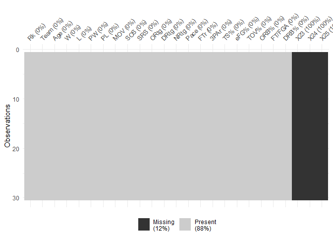<!-- -->

We can see that the **'Team'** column contains character variables (the team names),
while the rest contain numeric variables. However, the three 'new' columns
contain logical variables. Using naniar::vis_miss, we can see that these 
'logical' variables are just NAs, and these columns are effectively empty. So, 
we'll delete these columns entirely, and save it back into the **dat1** object.


```r
dat1 <- remove_empty(dat1, which = "cols") #remove empty columns
```

Now we'll examine the structure of **dat2**.


```r
str(dat2)
```

```
## spec_tbl_df [30 x 25] (S3: spec_tbl_df/tbl_df/tbl/data.frame)
##  $ Rk  : num [1:30] 1 2 3 4 5 6 7 8 9 10 ...
##  $ Team: chr [1:30] "Milwaukee Bucks" "Golden State Warriors" "New Orleans Pelicans" "Philadelphia 76ers" ...
##  $ G   : num [1:30] 82 82 82 82 82 82 82 82 82 82 ...
##  $ MP  : num [1:30] 19780 19805 19755 19805 19830 ...
##  $ FG  : num [1:30] 3555 3612 3581 3407 3384 ...
##  $ FGA : num [1:30] 7471 7361 7563 7233 7178 ...
##  $ FG% : num [1:30] 0.476 0.491 0.473 0.471 0.471 0.467 0.454 0.474 0.464 0.468 ...
##  $ 3P  : num [1:30] 1105 1087 842 889 821 ...
##  $ 3PA : num [1:30] 3134 2824 2449 2474 2118 ...
##  $ 3P% : num [1:30] 0.353 0.385 0.344 0.359 0.388 0.359 0.348 0.366 0.378 0.341 ...
##  $ 2P  : num [1:30] 2450 2525 2739 2518 2563 ...
##  $ 2PA : num [1:30] 4337 4537 5114 4759 5060 ...
##  $ 2P% : num [1:30] 0.565 0.557 0.536 0.529 0.507 0.523 0.51 0.539 0.504 0.543 ...
##  $ FT  : num [1:30] 1471 1339 1462 1742 1853 ...
##  $ FTA : num [1:30] 1904 1672 1921 2258 2340 ...
##  $ FT% : num [1:30] 0.773 0.801 0.761 0.771 0.792 0.814 0.713 0.804 0.726 0.768 ...
##  $ ORB : num [1:30] 762 797 909 892 796 ...
##  $ DRB : num [1:30] 3316 2990 2969 3025 2936 ...
##  $ TRB : num [1:30] 4078 3787 3878 3917 3732 ...
##  $ AST : num [1:30] 2136 2413 2216 2207 1970 ...
##  $ STL : num [1:30] 615 625 610 606 561 546 766 680 679 683 ...
##  $ BLK : num [1:30] 486 525 441 432 385 413 425 437 363 379 ...
##  $ TOV : num [1:30] 1137 1169 1215 1223 1193 ...
##  $ PF  : num [1:30] 1608 1757 1732 1745 1913 ...
##  $ PTS : num [1:30] 9686 9650 9466 9445 9442 ...
##  - attr(*, "spec")=
##   .. cols(
##   ..   Rk = col_double(),
##   ..   Team = col_character(),
##   ..   G = col_double(),
##   ..   MP = col_double(),
##   ..   FG = col_double(),
##   ..   FGA = col_double(),
##   ..   `FG%` = col_double(),
##   ..   `3P` = col_double(),
##   ..   `3PA` = col_double(),
##   ..   `3P%` = col_double(),
##   ..   `2P` = col_double(),
##   ..   `2PA` = col_double(),
##   ..   `2P%` = col_double(),
##   ..   FT = col_double(),
##   ..   FTA = col_double(),
##   ..   `FT%` = col_double(),
##   ..   ORB = col_double(),
##   ..   DRB = col_double(),
##   ..   TRB = col_double(),
##   ..   AST = col_double(),
##   ..   STL = col_double(),
##   ..   BLK = col_double(),
##   ..   TOV = col_double(),
##   ..   PF = col_double(),
##   ..   PTS = col_double()
##   .. )
```

```r
head(dat2)
```

<div data-pagedtable="false">
  <script data-pagedtable-source type="application/json">
{"columns":[{"label":["Rk"],"name":[1],"type":["dbl"],"align":["right"]},{"label":["Team"],"name":[2],"type":["chr"],"align":["left"]},{"label":["G"],"name":[3],"type":["dbl"],"align":["right"]},{"label":["MP"],"name":[4],"type":["dbl"],"align":["right"]},{"label":["FG"],"name":[5],"type":["dbl"],"align":["right"]},{"label":["FGA"],"name":[6],"type":["dbl"],"align":["right"]},{"label":["FG%"],"name":[7],"type":["dbl"],"align":["right"]},{"label":["3P"],"name":[8],"type":["dbl"],"align":["right"]},{"label":["3PA"],"name":[9],"type":["dbl"],"align":["right"]},{"label":["3P%"],"name":[10],"type":["dbl"],"align":["right"]},{"label":["2P"],"name":[11],"type":["dbl"],"align":["right"]},{"label":["2PA"],"name":[12],"type":["dbl"],"align":["right"]},{"label":["2P%"],"name":[13],"type":["dbl"],"align":["right"]},{"label":["FT"],"name":[14],"type":["dbl"],"align":["right"]},{"label":["FTA"],"name":[15],"type":["dbl"],"align":["right"]},{"label":["FT%"],"name":[16],"type":["dbl"],"align":["right"]},{"label":["ORB"],"name":[17],"type":["dbl"],"align":["right"]},{"label":["DRB"],"name":[18],"type":["dbl"],"align":["right"]},{"label":["TRB"],"name":[19],"type":["dbl"],"align":["right"]},{"label":["AST"],"name":[20],"type":["dbl"],"align":["right"]},{"label":["STL"],"name":[21],"type":["dbl"],"align":["right"]},{"label":["BLK"],"name":[22],"type":["dbl"],"align":["right"]},{"label":["TOV"],"name":[23],"type":["dbl"],"align":["right"]},{"label":["PF"],"name":[24],"type":["dbl"],"align":["right"]},{"label":["PTS"],"name":[25],"type":["dbl"],"align":["right"]}],"data":[{"1":"1","2":"Milwaukee Bucks","3":"82","4":"19780","5":"3555","6":"7471","7":"0.476","8":"1105","9":"3134","10":"0.353","11":"2450","12":"4337","13":"0.565","14":"1471","15":"1904","16":"0.773","17":"762","18":"3316","19":"4078","20":"2136","21":"615","22":"486","23":"1137","24":"1608","25":"9686"},{"1":"2","2":"Golden State Warriors","3":"82","4":"19805","5":"3612","6":"7361","7":"0.491","8":"1087","9":"2824","10":"0.385","11":"2525","12":"4537","13":"0.557","14":"1339","15":"1672","16":"0.801","17":"797","18":"2990","19":"3787","20":"2413","21":"625","22":"525","23":"1169","24":"1757","25":"9650"},{"1":"3","2":"New Orleans Pelicans","3":"82","4":"19755","5":"3581","6":"7563","7":"0.473","8":"842","9":"2449","10":"0.344","11":"2739","12":"5114","13":"0.536","14":"1462","15":"1921","16":"0.761","17":"909","18":"2969","19":"3878","20":"2216","21":"610","22":"441","23":"1215","24":"1732","25":"9466"},{"1":"4","2":"Philadelphia 76ers","3":"82","4":"19805","5":"3407","6":"7233","7":"0.471","8":"889","9":"2474","10":"0.359","11":"2518","12":"4759","13":"0.529","14":"1742","15":"2258","16":"0.771","17":"892","18":"3025","19":"3917","20":"2207","21":"606","22":"432","23":"1223","24":"1745","25":"9445"},{"1":"5","2":"Los Angeles Clippers","3":"82","4":"19830","5":"3384","6":"7178","7":"0.471","8":"821","9":"2118","10":"0.388","11":"2563","12":"5060","13":"0.507","14":"1853","15":"2340","16":"0.792","17":"796","18":"2936","19":"3732","20":"1970","21":"561","22":"385","23":"1193","24":"1913","25":"9442"},{"1":"6","2":"Portland Trail Blazers","3":"82","4":"19855","5":"3470","6":"7427","7":"0.467","8":"904","9":"2520","10":"0.359","11":"2566","12":"4907","13":"0.523","14":"1558","15":"1914","16":"0.814","17":"967","18":"2968","19":"3935","20":"1887","21":"546","22":"413","23":"1135","24":"1669","25":"9402"}],"options":{"columns":{"min":{},"max":[10]},"rows":{"min":[10],"max":[10]},"pages":{}}}
  </script>
</div>

```r
tail(dat2)
```

<div data-pagedtable="false">
  <script data-pagedtable-source type="application/json">
{"columns":[{"label":["Rk"],"name":[1],"type":["dbl"],"align":["right"]},{"label":["Team"],"name":[2],"type":["chr"],"align":["left"]},{"label":["G"],"name":[3],"type":["dbl"],"align":["right"]},{"label":["MP"],"name":[4],"type":["dbl"],"align":["right"]},{"label":["FG"],"name":[5],"type":["dbl"],"align":["right"]},{"label":["FGA"],"name":[6],"type":["dbl"],"align":["right"]},{"label":["FG%"],"name":[7],"type":["dbl"],"align":["right"]},{"label":["3P"],"name":[8],"type":["dbl"],"align":["right"]},{"label":["3PA"],"name":[9],"type":["dbl"],"align":["right"]},{"label":["3P%"],"name":[10],"type":["dbl"],"align":["right"]},{"label":["2P"],"name":[11],"type":["dbl"],"align":["right"]},{"label":["2PA"],"name":[12],"type":["dbl"],"align":["right"]},{"label":["2P%"],"name":[13],"type":["dbl"],"align":["right"]},{"label":["FT"],"name":[14],"type":["dbl"],"align":["right"]},{"label":["FTA"],"name":[15],"type":["dbl"],"align":["right"]},{"label":["FT%"],"name":[16],"type":["dbl"],"align":["right"]},{"label":["ORB"],"name":[17],"type":["dbl"],"align":["right"]},{"label":["DRB"],"name":[18],"type":["dbl"],"align":["right"]},{"label":["TRB"],"name":[19],"type":["dbl"],"align":["right"]},{"label":["AST"],"name":[20],"type":["dbl"],"align":["right"]},{"label":["STL"],"name":[21],"type":["dbl"],"align":["right"]},{"label":["BLK"],"name":[22],"type":["dbl"],"align":["right"]},{"label":["TOV"],"name":[23],"type":["dbl"],"align":["right"]},{"label":["PF"],"name":[24],"type":["dbl"],"align":["right"]},{"label":["PTS"],"name":[25],"type":["dbl"],"align":["right"]}],"data":[{"1":"25","2":"Detroit Pistons","3":"82","4":"19855","5":"3185","6":"7238","7":"0.440","8":"993","9":"2854","10":"0.348","11":"2192","12":"4384","13":"0.500","14":"1415","15":"1893","16":"0.747","17":"936","18":"2752","19":"3688","20":"1845","21":"569","22":"331","23":"1135","24":"1811","25":"8778"},{"1":"26","2":"Miami Heat","3":"82","4":"19730","5":"3251","6":"7218","7":"0.450","8":"928","9":"2658","10":"0.349","11":"2323","12":"4560","13":"0.509","14":"1238","15":"1782","16":"0.695","17":"921","18":"2879","19":"3800","20":"1991","21":"627","22":"448","23":"1208","24":"1712","25":"8668"},{"1":"27","2":"Chicago Bulls","3":"82","4":"19905","5":"3266","6":"7205","7":"0.453","8":"745","9":"2123","10":"0.351","11":"2521","12":"5082","13":"0.496","14":"1328","15":"1695","16":"0.783","17":"718","18":"2799","19":"3517","20":"1796","21":"603","22":"351","23":"1159","24":"1663","25":"8605"},{"1":"28","2":"New York Knicks","3":"82","4":"19780","5":"3134","6":"7241","7":"0.433","8":"823","9":"2421","10":"0.340","11":"2311","12":"4820","13":"0.479","14":"1484","15":"1956","16":"0.759","17":"857","18":"2811","19":"3668","20":"1646","21":"557","22":"422","23":"1151","24":"1713","25":"8575"},{"1":"29","2":"Cleveland Cavaliers","3":"82","4":"19755","5":"3189","6":"7184","7":"0.444","8":"847","9":"2388","10":"0.355","11":"2342","12":"4796","13":"0.488","14":"1342","15":"1694","16":"0.792","17":"879","18":"2619","19":"3498","20":"1698","21":"534","22":"195","23":"1106","24":"1642","25":"8567"},{"1":"30","2":"Memphis Grizzlies","3":"82","4":"19880","5":"3113","6":"6924","7":"0.450","8":"811","9":"2368","10":"0.342","11":"2302","12":"4556","13":"0.505","14":"1453","15":"1882","16":"0.772","17":"723","18":"2703","19":"3426","20":"1963","21":"684","22":"448","23":"1147","24":"1801","25":"8490"}],"options":{"columns":{"min":{},"max":[10]},"rows":{"min":[10],"max":[10]},"pages":{}}}
  </script>
</div>

Here, it can be seen that the data takes the same format as **dat1** (that is, it
contains a single character vector containing the team names, and the rest are 
all continuous). Since they both contain team statistics, we will merge them into 
a single object to make analysis easier, which we will simply call **team**. Then,
we will delete the duplicated **Rank** column.


```r
team <- full_join(dat1, dat2, by = "Team")
team <- subset(team, select = -c(Rk.y)) #remove the Rk.y variable
str(team)
```

```
## tibble [30 x 45] (S3: tbl_df/tbl/data.frame)
##  $ Rk.x  : num [1:30] 1 2 3 4 5 6 7 8 9 10 ...
##  $ Team  : chr [1:30] "Milwaukee Bucks" "Golden State Warriors" "Toronto Raptors" "Utah Jazz" ...
##  $ Age   : num [1:30] 26.9 28.4 27.3 27.3 29.2 26.2 24.9 25.7 25.7 27 ...
##  $ W     : num [1:30] 60 57 58 50 53 53 54 49 49 48 ...
##  $ L     : num [1:30] 22 25 24 32 29 29 28 33 33 34 ...
##  $ PW    : num [1:30] 61 56 56 54 53 51 51 52 50 50 ...
##  $ PL    : num [1:30] 21 26 26 28 29 31 31 30 32 32 ...
##  $ MOV   : num [1:30] 8.87 6.46 6.09 5.26 4.77 4.2 3.95 4.44 3.4 3.33 ...
##  $ SOS   : num [1:30] -0.82 -0.04 -0.6 0.03 0.19 0.24 0.24 -0.54 0.15 -0.57 ...
##  $ SRS   : num [1:30] 8.04 6.42 5.49 5.28 4.96 4.43 4.19 3.9 3.56 2.76 ...
##  $ ORtg  : num [1:30] 114 116 113 111 116 ...
##  $ DRtg  : num [1:30] 105 110 107 106 111 ...
##  $ NRtg  : num [1:30] 8.6 6.4 6 5.2 4.8 4.2 4.1 4.4 3.3 3.4 ...
##  $ Pace  : num [1:30] 103.3 100.9 100.2 100.3 97.9 ...
##  $ FTr   : num [1:30] 0.255 0.227 0.247 0.295 0.279 0.258 0.232 0.215 0.266 0.242 ...
##  $ 3PAr  : num [1:30] 0.419 0.384 0.379 0.394 0.519 0.339 0.348 0.381 0.347 0.292 ...
##  $ TS%   : num [1:30] 0.583 0.596 0.579 0.572 0.581 0.568 0.558 0.567 0.545 0.561 ...
##  $ eFG%  : num [1:30] 0.55 0.565 0.543 0.538 0.542 0.528 0.527 0.534 0.514 0.53 ...
##  $ TOV%  : num [1:30] 12 12.6 12.4 13.4 12 12.1 11.9 11.5 11.7 12.4 ...
##  $ ORB%  : num [1:30] 20.8 22.5 21.9 22.9 22.8 26.6 26.6 21.6 26 21.9 ...
##  $ FT/FGA: num [1:30] 0.197 0.182 0.198 0.217 0.221 0.21 0.175 0.173 0.19 0.182 ...
##  $ DRB%  : num [1:30] 80.3 77.1 77.1 80.3 74.4 77.9 78 77 78.2 76.2 ...
##  $ G     : num [1:30] 82 82 82 82 82 82 82 82 82 82 ...
##  $ MP    : num [1:30] 19780 19805 19880 19755 19830 ...
##  $ FG    : num [1:30] 3555 3612 3460 3314 3218 ...
##  $ FGA   : num [1:30] 7471 7361 7305 7082 7163 ...
##  $ FG%   : num [1:30] 0.476 0.491 0.474 0.468 0.449 0.467 0.466 0.465 0.454 0.475 ...
##  $ 3P    : num [1:30] 1105 1087 1015 993 1323 ...
##  $ 3PA   : num [1:30] 3134 2824 2771 2789 3721 ...
##  $ 3P%   : num [1:30] 0.353 0.385 0.366 0.356 0.356 0.359 0.351 0.365 0.348 0.374 ...
##  $ 2P    : num [1:30] 2450 2525 2445 2321 1895 ...
##  $ 2PA   : num [1:30] 4337 4537 4534 4293 3442 ...
##  $ 2P%   : num [1:30] 0.565 0.557 0.539 0.541 0.551 0.523 0.527 0.527 0.51 0.517 ...
##  $ FT    : num [1:30] 1471 1339 1449 1540 1582 ...
##  $ FTA   : num [1:30] 1904 1672 1803 2092 2001 ...
##  $ FT%   : num [1:30] 0.773 0.801 0.804 0.736 0.791 0.814 0.755 0.802 0.713 0.752 ...
##  $ ORB   : num [1:30] 762 797 786 820 836 ...
##  $ DRB   : num [1:30] 3316 2990 2920 2981 2613 ...
##  $ TRB   : num [1:30] 4078 3787 3706 3801 3449 ...
##  $ AST   : num [1:30] 2136 2413 2085 2133 1741 ...
##  $ STL   : num [1:30] 615 625 680 663 700 546 634 706 766 713 ...
##  $ BLK   : num [1:30] 486 525 437 483 405 413 363 435 425 404 ...
##  $ TOV   : num [1:30] 1137 1169 1150 1240 1094 ...
##  $ PF    : num [1:30] 1608 1757 1724 1728 1803 ...
##  $ PTS   : num [1:30] 9686 9650 9384 9161 9341 ...
```

We now have our team stats all contained in a single tibble, however looking at 
the structure, we notice that several columns contain illegal variable names 
(that is, they either contain a '%', or begin with a number). So before 
moving on, we will rename these columns.


```r
team <- rename(team,
               x3PAr = '3PAr', TSp = 'TS%', eFGp = 'eFG%', TOVp = 'TOV%', 
               ORBp = 'ORB%',DRBp = 'DRB%', FGp = 'FG%', x3P = '3P', 
               x3PA = '3PA', x3Pp = '3P%', x2P = '2P', x2PA = '2PA', 
               x2Pp = '2P%', FTp = 'FT%')
```

Next, we will convert all the variable names to lowercase.


```r
names(team) <- tolower(names(team)) #convert variable names to lowercase
```


Now that the team stats look tidy, we will check the structure of our player
statistics.


```r
str(player)
```

```
## spec_tbl_df [708 x 29] (S3: spec_tbl_df/tbl_df/tbl/data.frame)
##  $ player_name: chr [1:708] "Alex Abrines" "Quincy Acy" "Jaylen Adams" "Steven Adams" ...
##  $ Pos        : chr [1:708] "SG" "PF" "PG" "C" ...
##  $ Age        : num [1:708] 25 28 22 25 21 21 25 33 21 23 ...
##  $ Tm         : chr [1:708] "OKC" "PHO" "ATL" "OKC" ...
##  $ G          : num [1:708] 31 10 34 80 82 19 7 81 10 38 ...
##  $ GS         : num [1:708] 2 0 1 80 28 3 0 81 1 2 ...
##  $ MP         : num [1:708] 588 123 428 2669 1913 ...
##  $ FG         : num [1:708] 56 4 38 481 280 11 3 684 13 67 ...
##  $ FGA        : num [1:708] 157 18 110 809 486 ...
##  $ FG%        : num [1:708] 0.357 0.222 0.345 0.595 0.576 0.306 0.3 0.519 0.333 0.376 ...
##  $ 3P         : num [1:708] 41 2 25 0 3 6 0 10 3 32 ...
##  $ 3PA        : num [1:708] 127 15 74 2 15 23 4 42 12 99 ...
##  $ 3P%        : num [1:708] 0.323 0.133 0.338 0 0.2 0.261 0 0.238 0.25 0.323 ...
##  $ 2P         : num [1:708] 15 2 13 481 277 5 3 674 10 35 ...
##  $ 2PA        : num [1:708] 30 3 36 807 471 ...
##  $ 2P%        : num [1:708] 0.5 0.667 0.361 0.596 0.588 0.385 0.5 0.528 0.37 0.443 ...
##  $ eFG%       : num [1:708] 0.487 0.278 0.459 0.595 0.579 0.389 0.3 0.522 0.372 0.466 ...
##  $ FT         : num [1:708] 12 7 7 146 166 4 1 349 8 45 ...
##  $ FTA        : num [1:708] 13 10 9 292 226 4 2 412 12 60 ...
##  $ FT%        : num [1:708] 0.923 0.7 0.778 0.5 0.735 1 0.5 0.847 0.667 0.75 ...
##  $ ORB        : num [1:708] 5 3 11 391 165 3 1 251 11 3 ...
##  $ DRB        : num [1:708] 43 22 49 369 432 16 3 493 15 20 ...
##  $ TRB        : num [1:708] 48 25 60 760 597 19 4 744 26 23 ...
##  $ AST        : num [1:708] 20 8 65 124 184 5 6 194 13 25 ...
##  $ STL        : num [1:708] 17 1 14 117 71 1 2 43 1 6 ...
##  $ BLK        : num [1:708] 6 4 5 76 65 4 0 107 0 6 ...
##  $ TOV        : num [1:708] 14 4 28 135 121 6 2 144 8 33 ...
##  $ PF         : num [1:708] 53 24 45 204 203 13 4 179 7 47 ...
##  $ PTS        : num [1:708] 165 17 108 1108 729 ...
##  - attr(*, "spec")=
##   .. cols(
##   ..   player_name = col_character(),
##   ..   Pos = col_character(),
##   ..   Age = col_double(),
##   ..   Tm = col_character(),
##   ..   G = col_double(),
##   ..   GS = col_double(),
##   ..   MP = col_double(),
##   ..   FG = col_double(),
##   ..   FGA = col_double(),
##   ..   `FG%` = col_double(),
##   ..   `3P` = col_double(),
##   ..   `3PA` = col_double(),
##   ..   `3P%` = col_double(),
##   ..   `2P` = col_double(),
##   ..   `2PA` = col_double(),
##   ..   `2P%` = col_double(),
##   ..   `eFG%` = col_double(),
##   ..   FT = col_double(),
##   ..   FTA = col_double(),
##   ..   `FT%` = col_double(),
##   ..   ORB = col_double(),
##   ..   DRB = col_double(),
##   ..   TRB = col_double(),
##   ..   AST = col_double(),
##   ..   STL = col_double(),
##   ..   BLK = col_double(),
##   ..   TOV = col_double(),
##   ..   PF = col_double(),
##   ..   PTS = col_double()
##   .. )
```

```r
head(player)
```

<div data-pagedtable="false">
  <script data-pagedtable-source type="application/json">
{"columns":[{"label":["player_name"],"name":[1],"type":["chr"],"align":["left"]},{"label":["Pos"],"name":[2],"type":["chr"],"align":["left"]},{"label":["Age"],"name":[3],"type":["dbl"],"align":["right"]},{"label":["Tm"],"name":[4],"type":["chr"],"align":["left"]},{"label":["G"],"name":[5],"type":["dbl"],"align":["right"]},{"label":["GS"],"name":[6],"type":["dbl"],"align":["right"]},{"label":["MP"],"name":[7],"type":["dbl"],"align":["right"]},{"label":["FG"],"name":[8],"type":["dbl"],"align":["right"]},{"label":["FGA"],"name":[9],"type":["dbl"],"align":["right"]},{"label":["FG%"],"name":[10],"type":["dbl"],"align":["right"]},{"label":["3P"],"name":[11],"type":["dbl"],"align":["right"]},{"label":["3PA"],"name":[12],"type":["dbl"],"align":["right"]},{"label":["3P%"],"name":[13],"type":["dbl"],"align":["right"]},{"label":["2P"],"name":[14],"type":["dbl"],"align":["right"]},{"label":["2PA"],"name":[15],"type":["dbl"],"align":["right"]},{"label":["2P%"],"name":[16],"type":["dbl"],"align":["right"]},{"label":["eFG%"],"name":[17],"type":["dbl"],"align":["right"]},{"label":["FT"],"name":[18],"type":["dbl"],"align":["right"]},{"label":["FTA"],"name":[19],"type":["dbl"],"align":["right"]},{"label":["FT%"],"name":[20],"type":["dbl"],"align":["right"]},{"label":["ORB"],"name":[21],"type":["dbl"],"align":["right"]},{"label":["DRB"],"name":[22],"type":["dbl"],"align":["right"]},{"label":["TRB"],"name":[23],"type":["dbl"],"align":["right"]},{"label":["AST"],"name":[24],"type":["dbl"],"align":["right"]},{"label":["STL"],"name":[25],"type":["dbl"],"align":["right"]},{"label":["BLK"],"name":[26],"type":["dbl"],"align":["right"]},{"label":["TOV"],"name":[27],"type":["dbl"],"align":["right"]},{"label":["PF"],"name":[28],"type":["dbl"],"align":["right"]},{"label":["PTS"],"name":[29],"type":["dbl"],"align":["right"]}],"data":[{"1":"Alex Abrines","2":"SG","3":"25","4":"OKC","5":"31","6":"2","7":"588","8":"56","9":"157","10":"0.357","11":"41","12":"127","13":"0.323","14":"15","15":"30","16":"0.500","17":"0.487","18":"12","19":"13","20":"0.923","21":"5","22":"43","23":"48","24":"20","25":"17","26":"6","27":"14","28":"53","29":"165"},{"1":"Quincy Acy","2":"PF","3":"28","4":"PHO","5":"10","6":"0","7":"123","8":"4","9":"18","10":"0.222","11":"2","12":"15","13":"0.133","14":"2","15":"3","16":"0.667","17":"0.278","18":"7","19":"10","20":"0.700","21":"3","22":"22","23":"25","24":"8","25":"1","26":"4","27":"4","28":"24","29":"17"},{"1":"Jaylen Adams","2":"PG","3":"22","4":"ATL","5":"34","6":"1","7":"428","8":"38","9":"110","10":"0.345","11":"25","12":"74","13":"0.338","14":"13","15":"36","16":"0.361","17":"0.459","18":"7","19":"9","20":"0.778","21":"11","22":"49","23":"60","24":"65","25":"14","26":"5","27":"28","28":"45","29":"108"},{"1":"Steven Adams","2":"C","3":"25","4":"OKC","5":"80","6":"80","7":"2669","8":"481","9":"809","10":"0.595","11":"0","12":"2","13":"0.000","14":"481","15":"807","16":"0.596","17":"0.595","18":"146","19":"292","20":"0.500","21":"391","22":"369","23":"760","24":"124","25":"117","26":"76","27":"135","28":"204","29":"1108"},{"1":"Bam Adebayo","2":"C","3":"21","4":"MIA","5":"82","6":"28","7":"1913","8":"280","9":"486","10":"0.576","11":"3","12":"15","13":"0.200","14":"277","15":"471","16":"0.588","17":"0.579","18":"166","19":"226","20":"0.735","21":"165","22":"432","23":"597","24":"184","25":"71","26":"65","27":"121","28":"203","29":"729"},{"1":"Deng Adel","2":"SF","3":"21","4":"CLE","5":"19","6":"3","7":"194","8":"11","9":"36","10":"0.306","11":"6","12":"23","13":"0.261","14":"5","15":"13","16":"0.385","17":"0.389","18":"4","19":"4","20":"1.000","21":"3","22":"16","23":"19","24":"5","25":"1","26":"4","27":"6","28":"13","29":"32"}],"options":{"columns":{"min":{},"max":[10]},"rows":{"min":[10],"max":[10]},"pages":{}}}
  </script>
</div>

```r
tail(player)
```

<div data-pagedtable="false">
  <script data-pagedtable-source type="application/json">
{"columns":[{"label":["player_name"],"name":[1],"type":["chr"],"align":["left"]},{"label":["Pos"],"name":[2],"type":["chr"],"align":["left"]},{"label":["Age"],"name":[3],"type":["dbl"],"align":["right"]},{"label":["Tm"],"name":[4],"type":["chr"],"align":["left"]},{"label":["G"],"name":[5],"type":["dbl"],"align":["right"]},{"label":["GS"],"name":[6],"type":["dbl"],"align":["right"]},{"label":["MP"],"name":[7],"type":["dbl"],"align":["right"]},{"label":["FG"],"name":[8],"type":["dbl"],"align":["right"]},{"label":["FGA"],"name":[9],"type":["dbl"],"align":["right"]},{"label":["FG%"],"name":[10],"type":["dbl"],"align":["right"]},{"label":["3P"],"name":[11],"type":["dbl"],"align":["right"]},{"label":["3PA"],"name":[12],"type":["dbl"],"align":["right"]},{"label":["3P%"],"name":[13],"type":["dbl"],"align":["right"]},{"label":["2P"],"name":[14],"type":["dbl"],"align":["right"]},{"label":["2PA"],"name":[15],"type":["dbl"],"align":["right"]},{"label":["2P%"],"name":[16],"type":["dbl"],"align":["right"]},{"label":["eFG%"],"name":[17],"type":["dbl"],"align":["right"]},{"label":["FT"],"name":[18],"type":["dbl"],"align":["right"]},{"label":["FTA"],"name":[19],"type":["dbl"],"align":["right"]},{"label":["FT%"],"name":[20],"type":["dbl"],"align":["right"]},{"label":["ORB"],"name":[21],"type":["dbl"],"align":["right"]},{"label":["DRB"],"name":[22],"type":["dbl"],"align":["right"]},{"label":["TRB"],"name":[23],"type":["dbl"],"align":["right"]},{"label":["AST"],"name":[24],"type":["dbl"],"align":["right"]},{"label":["STL"],"name":[25],"type":["dbl"],"align":["right"]},{"label":["BLK"],"name":[26],"type":["dbl"],"align":["right"]},{"label":["TOV"],"name":[27],"type":["dbl"],"align":["right"]},{"label":["PF"],"name":[28],"type":["dbl"],"align":["right"]},{"label":["PTS"],"name":[29],"type":["dbl"],"align":["right"]}],"data":[{"1":"Ivica Zubac","2":"C","3":"21","4":"LAL","5":"33","6":"12","7":"516","8":"112","9":"193","10":"0.580","11":"0","12":"0","13":"NA","14":"112","15":"193","16":"0.580","17":"0.580","18":"57","19":"66","20":"0.864","21":"54","22":"108","23":"162","24":"25","25":"4","26":"27","27":"33","28":"73","29":"281"},{"1":"Ivica Zubac","2":"C","3":"21","4":"TOT","5":"59","6":"37","7":"1040","8":"212","9":"379","10":"0.559","11":"0","12":"0","13":"NA","14":"212","15":"379","16":"0.559","17":"0.559","18":"101","19":"126","20":"0.802","21":"115","22":"247","23":"362","24":"63","25":"14","26":"51","27":"70","28":"137","29":"525"},{"1":"Dario Saric","2":"PF","3":"24","4":"PHI","5":"13","6":"13","7":"396","8":"48","9":"132","10":"0.364","11":"21","12":"70","13":"0.300","14":"27","15":"62","16":"0.435","17":"0.443","18":"27","19":"30","20":"0.900","21":"21","22":"65","23":"86","24":"26","25":"4","26":"3","27":"25","28":"39","29":"144"},{"1":"Dario Saric","2":"PF","3":"24","4":"MIN","5":"68","6":"28","7":"1627","8":"256","9":"564","10":"0.454","11":"97","12":"253","13":"0.383","14":"159","15":"311","16":"0.511","17":"0.540","18":"105","19":"120","20":"0.875","21":"105","22":"266","23":"371","24":"101","25":"41","26":"6","27":"72","28":"143","29":"714"},{"1":"Dario Saric","2":"PF","3":"24","4":"TOT","5":"81","6":"41","7":"2023","8":"304","9":"696","10":"0.437","11":"118","12":"323","13":"0.365","14":"186","15":"373","16":"0.499","17":"0.522","18":"132","19":"150","20":"0.880","21":"126","22":"331","23":"457","24":"127","25":"45","26":"9","27":"97","28":"182","29":"858"},{"1":"Ante Zizic","2":"C","3":"22","4":"CLE","5":"59","6":"25","7":"1082","8":"183","9":"331","10":"0.553","11":"0","12":"0","13":"NA","14":"183","15":"331","16":"0.553","17":"0.553","18":"93","19":"132","20":"0.705","21":"108","22":"212","23":"320","24":"53","25":"13","26":"22","27":"61","28":"113","29":"459"}],"options":{"columns":{"min":{},"max":[10]},"rows":{"min":[10],"max":[10]},"pages":{}}}
  </script>
</div>

Here, we have noticed the same problem of illegal column names. We will address
these now, too, and again convert the variable names to lowercase.


```r
player <- rename(player,
               eFGp = 'eFG%', FGp = 'FG%', x3P = '3P', 
               x3PA = '3PA', x3Pp = '3P%', x2P = '2P', x2PA = '2PA', 
               x2Pp = '2P%', FTp = 'FT%')
names(player) <- tolower(names(player)) #convert variable names to lowercase
```

There are duplicate entries for players who have been traded during the season. 
We will take a closer look at these entries to understand what is going on.


```r
n_occur <- data.frame(table(player$player_name)) #counts number of observations per player

n_occur[n_occur$Freq > 1,] #select those appearing more than once
```

<div data-pagedtable="false">
  <script data-pagedtable-source type="application/json">
{"columns":[{"label":[""],"name":["_rn_"],"type":[""],"align":["left"]},{"label":["Var1"],"name":[1],"type":["fct"],"align":["left"]},{"label":["Freq"],"name":[2],"type":["int"],"align":["right"]}],"data":[{"1":"Alec Burks","2":"4","_rn_":"7"},{"1":"Andrew Harrison","2":"4","_rn_":"22"},{"1":"Austin Rivers","2":"3","_rn_":"31"},{"1":"Avery Bradley","2":"3","_rn_":"32"},{"1":"BJ Johnson","2":"3","_rn_":"38"},{"1":"Boban Marjanovic","2":"3","_rn_":"40"},{"1":"Bobby Portis","2":"3","_rn_":"41"},{"1":"Brandon Knight","2":"3","_rn_":"49"},{"1":"Caleb Swanigan","2":"3","_rn_":"56"},{"1":"Cameron Payne","2":"3","_rn_":"57"},{"1":"Christian Wood","2":"3","_rn_":"71"},{"1":"CJ Miles","2":"3","_rn_":"73"},{"1":"Corey Brewer","2":"3","_rn_":"78"},{"1":"Courtney Lee","2":"3","_rn_":"80"},{"1":"Dario Saric","2":"3","_rn_":"95"},{"1":"DeAndre Jordan","2":"3","_rn_":"106"},{"1":"Delon Wright","2":"3","_rn_":"107"},{"1":"Dennis Smith","2":"3","_rn_":"114"},{"1":"Emanuel Terry","2":"3","_rn_":"156"},{"1":"Enes Kanter","2":"3","_rn_":"158"},{"1":"Eric Moreland","2":"3","_rn_":"161"},{"1":"Garrett Temple","2":"3","_rn_":"171"},{"1":"George Hill","2":"3","_rn_":"176"},{"1":"Greg Monroe","2":"4","_rn_":"186"},{"1":"Harrison Barnes","2":"3","_rn_":"189"},{"1":"Henry Ellenson","2":"3","_rn_":"193"},{"1":"Iman Shumpert","2":"3","_rn_":"197"},{"1":"Isaiah Canaan","2":"4","_rn_":"201"},{"1":"Ivica Zubac","2":"3","_rn_":"207"},{"1":"Jabari Parker","2":"3","_rn_":"208"},{"1":"James Ennis","2":"3","_rn_":"219"},{"1":"James Nunnally","2":"3","_rn_":"222"},{"1":"JaMychal Green","2":"3","_rn_":"223"},{"1":"Jason Smith","2":"4","_rn_":"231"},{"1":"Jawun Evans","2":"3","_rn_":"233"},{"1":"Jeremy Lin","2":"3","_rn_":"243"},{"1":"Jimmy Butler","2":"3","_rn_":"249"},{"1":"John Jenkins","2":"3","_rn_":"261"},{"1":"Jonas Valanciunas","2":"3","_rn_":"268"},{"1":"Jonathon Simmons","2":"3","_rn_":"270"},{"1":"Justin Holiday","2":"3","_rn_":"288"},{"1":"Justin Jackson","2":"3","_rn_":"289"},{"1":"Kelly Oubre","2":"3","_rn_":"299"},{"1":"Kenneth Faried","2":"3","_rn_":"301"},{"1":"Kyle Korver","2":"3","_rn_":"319"},{"1":"Landry Shamet","2":"3","_rn_":"327"},{"1":"Marc Gasol","2":"3","_rn_":"346"},{"1":"Markieff Morris","2":"3","_rn_":"354"},{"1":"Marquese Chriss","2":"3","_rn_":"355"},{"1":"Matthew Dellavedova","2":"3","_rn_":"360"},{"1":"Michael Carter-Williams","2":"3","_rn_":"366"},{"1":"Mike Muscala","2":"3","_rn_":"370"},{"1":"Mike Scott","2":"3","_rn_":"371"},{"1":"Mitch Creek","2":"3","_rn_":"375"},{"1":"Nik Stauskas","2":"3","_rn_":"388"},{"1":"Nikola Mirotic","2":"3","_rn_":"390"},{"1":"Otto Porter","2":"3","_rn_":"398"},{"1":"Patrick McCaw","2":"3","_rn_":"402"},{"1":"Pau Gasol","2":"3","_rn_":"405"},{"1":"Ray Spalding","2":"3","_rn_":"416"},{"1":"Reggie Bullock","2":"3","_rn_":"418"},{"1":"Robert Covington","2":"3","_rn_":"423"},{"1":"Rodney Hood","2":"3","_rn_":"427"},{"1":"Ron Baker","2":"3","_rn_":"429"},{"1":"Ryan Anderson","2":"3","_rn_":"435"},{"1":"Sam Dekker","2":"3","_rn_":"439"},{"1":"Shelvin Mack","2":"3","_rn_":"449"},{"1":"Skal Labissiere","2":"3","_rn_":"451"},{"1":"Stanley Johnson","2":"3","_rn_":"454"},{"1":"Sviatoslav Mykhailiuk","2":"3","_rn_":"458"},{"1":"Thon Maker","2":"3","_rn_":"471"},{"1":"Tim Frazier","2":"3","_rn_":"472"},{"1":"Tim Hardaway","2":"3","_rn_":"473"},{"1":"Timothe Luwawu-Cabarrot","2":"3","_rn_":"474"},{"1":"Tobias Harris","2":"3","_rn_":"478"},{"1":"Trevor Ariza","2":"3","_rn_":"487"},{"1":"Trey Burke","2":"3","_rn_":"488"},{"1":"Tyler Dorsey","2":"3","_rn_":"497"},{"1":"Tyler Johnson","2":"3","_rn_":"498"},{"1":"Tyler Zeller","2":"3","_rn_":"501"},{"1":"Tyson Chandler","2":"3","_rn_":"504"},{"1":"Wayne Ellington","2":"3","_rn_":"512"},{"1":"Wayne Selden","2":"3","_rn_":"513"},{"1":"Wesley Johnson","2":"3","_rn_":"516"},{"1":"Wesley Matthews","2":"4","_rn_":"517"},{"1":"Wilson Chandler","2":"3","_rn_":"521"}],"options":{"columns":{"min":{},"max":[10]},"rows":{"min":[10],"max":[10]},"pages":{}}}
  </script>
</div>

```r
player[player$player_name %in% n_occur$Var1[n_occur$Freq > 1],] #subset the players identified above
```

<div data-pagedtable="false">
  <script data-pagedtable-source type="application/json">
{"columns":[{"label":["player_name"],"name":[1],"type":["chr"],"align":["left"]},{"label":["pos"],"name":[2],"type":["chr"],"align":["left"]},{"label":["age"],"name":[3],"type":["dbl"],"align":["right"]},{"label":["tm"],"name":[4],"type":["chr"],"align":["left"]},{"label":["g"],"name":[5],"type":["dbl"],"align":["right"]},{"label":["gs"],"name":[6],"type":["dbl"],"align":["right"]},{"label":["mp"],"name":[7],"type":["dbl"],"align":["right"]},{"label":["fg"],"name":[8],"type":["dbl"],"align":["right"]},{"label":["fga"],"name":[9],"type":["dbl"],"align":["right"]},{"label":["fgp"],"name":[10],"type":["dbl"],"align":["right"]},{"label":["x3p"],"name":[11],"type":["dbl"],"align":["right"]},{"label":["x3pa"],"name":[12],"type":["dbl"],"align":["right"]},{"label":["x3pp"],"name":[13],"type":["dbl"],"align":["right"]},{"label":["x2p"],"name":[14],"type":["dbl"],"align":["right"]},{"label":["x2pa"],"name":[15],"type":["dbl"],"align":["right"]},{"label":["x2pp"],"name":[16],"type":["dbl"],"align":["right"]},{"label":["efgp"],"name":[17],"type":["dbl"],"align":["right"]},{"label":["ft"],"name":[18],"type":["dbl"],"align":["right"]},{"label":["fta"],"name":[19],"type":["dbl"],"align":["right"]},{"label":["ftp"],"name":[20],"type":["dbl"],"align":["right"]},{"label":["orb"],"name":[21],"type":["dbl"],"align":["right"]},{"label":["drb"],"name":[22],"type":["dbl"],"align":["right"]},{"label":["trb"],"name":[23],"type":["dbl"],"align":["right"]},{"label":["ast"],"name":[24],"type":["dbl"],"align":["right"]},{"label":["stl"],"name":[25],"type":["dbl"],"align":["right"]},{"label":["blk"],"name":[26],"type":["dbl"],"align":["right"]},{"label":["tov"],"name":[27],"type":["dbl"],"align":["right"]},{"label":["pf"],"name":[28],"type":["dbl"],"align":["right"]},{"label":["pts"],"name":[29],"type":["dbl"],"align":["right"]}],"data":[{"1":"Ryan Anderson","2":"PF","3":"30","4":"MIA","5":"10","6":"0","7":"44","8":"2","9":"9","10":"0.222","11":"2","12":"6","13":"0.333","14":"0","15":"3","16":"0.000","17":"0.333","18":"1","19":"2","20":"0.500","21":"4","22":"5","23":"9","24":"2","25":"1","26":"0","27":"2","28":"2","29":"7"},{"1":"Ryan Anderson","2":"PF","3":"30","4":"PHO","5":"15","6":"8","7":"278","8":"19","9":"60","10":"0.317","11":"7","12":"34","13":"0.206","14":"12","15":"26","16":"0.462","17":"0.375","18":"11","19":"14","20":"0.786","21":"14","22":"31","23":"45","24":"17","25":"3","26":"1","27":"12","28":"23","29":"56"},{"1":"Ryan Anderson","2":"PF","3":"30","4":"TOT","5":"25","6":"8","7":"322","8":"21","9":"69","10":"0.304","11":"9","12":"40","13":"0.225","14":"12","15":"29","16":"0.414","17":"0.370","18":"12","19":"16","20":"0.750","21":"18","22":"36","23":"54","24":"19","25":"4","26":"1","27":"14","28":"25","29":"63"},{"1":"Trevor Ariza","2":"SF","3":"33","4":"PHO","5":"26","6":"26","7":"884","8":"86","9":"227","10":"0.379","11":"50","12":"139","13":"0.360","14":"36","15":"88","16":"0.409","17":"0.489","18":"36","19":"43","20":"0.837","21":"16","22":"129","23":"145","24":"87","25":"38","26":"8","27":"39","28":"44","29":"258"},{"1":"Trevor Ariza","2":"SF","3":"33","4":"WAS","5":"43","6":"43","7":"1465","8":"208","9":"509","10":"0.409","11":"95","12":"295","13":"0.322","14":"113","15":"214","16":"0.528","17":"0.502","18":"94","19":"121","20":"0.777","21":"34","22":"192","23":"226","24":"165","25":"53","26":"13","27":"67","28":"86","29":"605"},{"1":"Trevor Ariza","2":"SF","3":"33","4":"TOT","5":"69","6":"69","7":"2349","8":"294","9":"736","10":"0.399","11":"145","12":"434","13":"0.334","14":"149","15":"302","16":"0.493","17":"0.498","18":"130","19":"164","20":"0.793","21":"50","22":"321","23":"371","24":"252","25":"91","26":"21","27":"106","28":"130","29":"863"},{"1":"Ron Baker","2":"SG","3":"25","4":"WAS","5":"4","6":"0","7":"45","8":"0","9":"4","10":"0.000","11":"0","12":"4","13":"0.000","14":"0","15":"0","16":"NA","17":"0.000","18":"0","19":"0","20":"NA","21":"0","22":"4","23":"4","24":"2","25":"1","26":"1","27":"2","28":"2","29":"0"},{"1":"Ron Baker","2":"SG","3":"25","4":"TOT","5":"15","6":"0","7":"152","8":"4","9":"20","10":"0.200","11":"1","12":"13","13":"0.077","14":"3","15":"7","16":"0.429","17":"0.225","18":"5","19":"6","20":"0.833","21":"1","22":"10","23":"11","24":"15","25":"6","26":"1","27":"5","28":"18","29":"14"},{"1":"Ron Baker","2":"SG","3":"25","4":"NYK","5":"11","6":"0","7":"107","8":"4","9":"16","10":"0.250","11":"1","12":"9","13":"0.111","14":"3","15":"7","16":"0.429","17":"0.281","18":"5","19":"6","20":"0.833","21":"1","22":"6","23":"7","24":"13","25":"5","26":"0","27":"3","28":"16","29":"14"},{"1":"Harrison Barnes","2":"SF","3":"26","4":"SAC","5":"28","6":"28","7":"949","8":"141","9":"310","10":"0.455","11":"53","12":"130","13":"0.408","14":"88","15":"180","16":"0.489","17":"0.540","18":"64","19":"80","20":"0.800","21":"21","22":"133","23":"154","24":"53","25":"17","26":"2","27":"30","28":"43","29":"399"},{"1":"Harrison Barnes","2":"PF","3":"26","4":"DAL","5":"49","6":"49","7":"1584","8":"290","9":"717","10":"0.404","11":"121","12":"311","13":"0.389","14":"169","15":"406","16":"0.416","17":"0.489","18":"165","19":"198","20":"0.833","21":"36","22":"171","23":"207","24":"62","25":"33","26":"11","27":"68","28":"79","29":"866"},{"1":"Harrison Barnes","2":"PF-SF","3":"26","4":"TOT","5":"77","6":"77","7":"2533","8":"431","9":"1027","10":"0.420","11":"174","12":"441","13":"0.395","14":"257","15":"586","16":"0.439","17":"0.504","18":"229","19":"278","20":"0.824","21":"57","22":"304","23":"361","24":"115","25":"50","26":"13","27":"98","28":"122","29":"1265"},{"1":"Avery Bradley","2":"SG","3":"28","4":"MEM","5":"14","6":"14","7":"442","8":"87","9":"188","10":"0.463","11":"28","12":"73","13":"0.384","14":"59","15":"115","16":"0.513","17":"0.537","18":"23","19":"25","20":"0.920","21":"8","22":"36","23":"44","24":"56","25":"14","26":"0","27":"28","28":"34","29":"225"},{"1":"Avery Bradley","2":"SG","3":"28","4":"LAC","5":"49","6":"49","7":"1463","8":"161","9":"420","10":"0.383","11":"58","12":"172","13":"0.337","14":"103","15":"248","16":"0.415","17":"0.452","18":"20","19":"25","20":"0.800","21":"35","22":"96","23":"131","24":"96","25":"27","26":"16","27":"61","28":"133","29":"400"},{"1":"Avery Bradley","2":"SG","3":"28","4":"TOT","5":"63","6":"63","7":"1905","8":"248","9":"608","10":"0.408","11":"86","12":"245","13":"0.351","14":"162","15":"363","16":"0.446","17":"0.479","18":"43","19":"50","20":"0.860","21":"43","22":"132","23":"175","24":"152","25":"41","26":"16","27":"89","28":"167","29":"625"},{"1":"Corey Brewer","2":"SF","3":"32","4":"PHI","5":"7","6":"3","7":"140","8":"20","9":"49","10":"0.408","11":"4","12":"14","13":"0.286","14":"16","15":"35","16":"0.457","17":"0.449","18":"9","19":"13","20":"0.692","21":"4","22":"13","23":"17","24":"10","25":"12","26":"2","27":"8","28":"16","29":"53"},{"1":"Corey Brewer","2":"SF","3":"32","4":"SAC","5":"24","6":"0","7":"352","8":"33","9":"74","10":"0.446","11":"10","12":"30","13":"0.333","14":"23","15":"44","16":"0.523","17":"0.514","18":"22","19":"30","20":"0.733","21":"22","22":"37","23":"59","24":"29","25":"20","26":"5","27":"11","28":"47","29":"98"},{"1":"Corey Brewer","2":"SF","3":"32","4":"TOT","5":"31","6":"3","7":"492","8":"53","9":"123","10":"0.431","11":"14","12":"44","13":"0.318","14":"39","15":"79","16":"0.494","17":"0.488","18":"31","19":"43","20":"0.721","21":"26","22":"50","23":"76","24":"39","25":"32","26":"7","27":"19","28":"63","29":"151"},{"1":"Reggie Bullock","2":"SG","3":"27","4":"LAL","5":"19","6":"16","7":"524","8":"63","9":"153","10":"0.412","11":"34","12":"99","13":"0.343","14":"29","15":"54","16":"0.537","17":"0.523","18":"17","19":"21","20":"0.810","21":"2","22":"48","23":"50","24":"20","25":"16","26":"7","27":"11","28":"30","29":"177"},{"1":"Reggie Bullock","2":"SG","3":"27","4":"DET","5":"44","6":"44","7":"1355","8":"182","9":"441","10":"0.413","11":"114","12":"294","13":"0.388","14":"68","15":"147","16":"0.463","17":"0.542","18":"56","19":"64","20":"0.875","21":"20","22":"103","23":"123","24":"109","25":"24","26":"5","27":"54","28":"79","29":"534"},{"1":"Reggie Bullock","2":"SG","3":"27","4":"TOT","5":"63","6":"60","7":"1879","8":"245","9":"594","10":"0.412","11":"148","12":"393","13":"0.377","14":"97","15":"201","16":"0.483","17":"0.537","18":"73","19":"85","20":"0.859","21":"22","22":"151","23":"173","24":"129","25":"40","26":"12","27":"65","28":"109","29":"711"},{"1":"Trey Burke","2":"PG","3":"26","4":"DAL","5":"25","6":"1","7":"436","8":"88","9":"190","10":"0.463","11":"26","12":"73","13":"0.356","14":"62","15":"117","16":"0.530","17":"0.532","18":"41","19":"49","20":"0.837","21":"13","22":"24","23":"37","24":"65","25":"12","26":"2","27":"20","28":"25","29":"243"},{"1":"Trey Burke","2":"PG","3":"26","4":"NYK","5":"33","6":"7","7":"689","8":"148","9":"358","10":"0.413","11":"30","12":"86","13":"0.349","14":"118","15":"272","16":"0.434","17":"0.455","18":"62","19":"75","20":"0.827","21":"15","22":"47","23":"62","24":"94","25":"21","26":"5","27":"29","28":"33","29":"388"},{"1":"Trey Burke","2":"PG","3":"26","4":"TOT","5":"58","6":"8","7":"1125","8":"236","9":"548","10":"0.431","11":"56","12":"159","13":"0.352","14":"180","15":"389","16":"0.463","17":"0.482","18":"103","19":"124","20":"0.831","21":"28","22":"71","23":"99","24":"159","25":"33","26":"7","27":"49","28":"58","29":"631"},{"1":"Alec Burks","2":"SG","3":"27","4":"SAC","5":"13","6":"0","7":"127","8":"9","9":"20","10":"0.450","11":"0","12":"6","13":"0.000","14":"9","15":"14","16":"0.643","17":"0.450","18":"4","19":"5","20":"0.800","21":"2","22":"20","23":"22","24":"10","25":"8","26":"1","27":"4","28":"7","29":"22"},{"1":"Alec Burks","2":"SG","3":"27","4":"UTA","5":"17","6":"0","7":"269","8":"47","9":"114","10":"0.412","11":"16","12":"43","13":"0.372","14":"31","15":"71","16":"0.437","17":"0.482","18":"33","19":"38","20":"0.868","21":"2","22":"25","23":"27","24":"20","25":"6","26":"4","27":"15","28":"22","29":"143"},{"1":"Alec Burks","2":"SG","3":"27","4":"CLE","5":"34","6":"24","7":"979","8":"136","9":"340","10":"0.400","11":"45","12":"119","13":"0.378","14":"91","15":"221","16":"0.412","17":"0.466","18":"79","19":"98","20":"0.806","21":"26","22":"160","23":"186","24":"98","25":"25","26":"16","27":"46","28":"62","29":"396"},{"1":"Alec Burks","2":"SG","3":"27","4":"TOT","5":"64","6":"24","7":"1375","8":"192","9":"474","10":"0.405","11":"61","12":"168","13":"0.363","14":"131","15":"306","16":"0.428","17":"0.469","18":"116","19":"141","20":"0.823","21":"30","22":"205","23":"235","24":"128","25":"39","26":"21","27":"65","28":"91","29":"561"},{"1":"Jimmy Butler","2":"SG","3":"29","4":"MIN","5":"10","6":"10","7":"361","8":"74","9":"157","10":"0.471","11":"17","12":"45","13":"0.378","14":"57","15":"112","16":"0.509","17":"0.525","18":"48","19":"61","20":"0.787","21":"16","22":"36","23":"52","24":"43","25":"24","26":"10","27":"14","28":"18","29":"213"},{"1":"Jimmy Butler","2":"SF","3":"29","4":"PHI","5":"55","6":"55","7":"1824","8":"344","9":"747","10":"0.461","11":"50","12":"148","13":"0.338","14":"294","15":"599","16":"0.491","17":"0.494","18":"264","19":"304","20":"0.868","21":"105","22":"185","23":"290","24":"220","25":"99","26":"29","27":"81","28":"93","29":"1002"},{"1":"Jimmy Butler","2":"SF-SG","3":"29","4":"TOT","5":"65","6":"65","7":"2185","8":"418","9":"904","10":"0.462","11":"67","12":"193","13":"0.347","14":"351","15":"711","16":"0.494","17":"0.499","18":"312","19":"365","20":"0.855","21":"121","22":"221","23":"342","24":"263","25":"123","26":"39","27":"95","28":"111","29":"1215"},{"1":"Isaiah Canaan","2":"PG","3":"27","4":"MIL","5":"4","6":"0","7":"31","8":"2","9":"6","10":"0.333","11":"2","12":"5","13":"0.400","14":"0","15":"1","16":"0.000","17":"0.500","18":"0","19":"0","20":"NA","21":"1","22":"3","23":"4","24":"3","25":"0","26":"1","27":"2","28":"2","29":"6"},{"1":"Isaiah Canaan","2":"PG","3":"27","4":"MIN","5":"7","6":"1","7":"95","8":"11","9":"29","10":"0.379","11":"7","12":"19","13":"0.368","14":"4","15":"10","16":"0.400","17":"0.500","18":"4","19":"4","20":"1.000","21":"0","22":"5","23":"5","24":"19","25":"2","26":"1","27":"4","28":"4","29":"33"},{"1":"Isaiah Canaan","2":"PG","3":"27","4":"PHO","5":"19","6":"15","7":"503","8":"51","9":"129","10":"0.395","11":"25","12":"72","13":"0.347","14":"26","15":"57","16":"0.456","17":"0.492","18":"15","19":"20","20":"0.750","21":"5","22":"44","23":"49","24":"62","25":"12","26":"0","27":"29","28":"46","29":"142"},{"1":"Isaiah Canaan","2":"PG","3":"27","4":"TOT","5":"30","6":"16","7":"629","8":"64","9":"164","10":"0.390","11":"34","12":"96","13":"0.354","14":"30","15":"68","16":"0.441","17":"0.494","18":"19","19":"24","20":"0.792","21":"6","22":"52","23":"58","24":"84","25":"14","26":"2","27":"35","28":"52","29":"181"},{"1":"Michael Carter-Williams","2":"PG","3":"27","4":"ORL","5":"12","6":"0","7":"227","8":"21","9":"62","10":"0.339","11":"3","12":"19","13":"0.158","14":"18","15":"43","16":"0.419","17":"0.363","18":"20","19":"27","20":"0.741","21":"16","22":"41","23":"57","24":"49","25":"11","26":"9","27":"10","28":"21","29":"65"},{"1":"Michael Carter-Williams","2":"PG","3":"27","4":"HOU","5":"16","6":"1","7":"145","8":"25","9":"61","10":"0.410","11":"7","12":"19","13":"0.368","14":"18","15":"42","16":"0.429","17":"0.467","18":"12","19":"26","20":"0.462","21":"3","22":"10","23":"13","24":"21","25":"9","26":"6","27":"10","28":"27","29":"69"},{"1":"Michael Carter-Williams","2":"PG","3":"27","4":"TOT","5":"28","6":"1","7":"372","8":"46","9":"123","10":"0.374","11":"10","12":"38","13":"0.263","14":"36","15":"85","16":"0.424","17":"0.415","18":"32","19":"53","20":"0.604","21":"19","22":"51","23":"70","24":"70","25":"20","26":"15","27":"20","28":"48","29":"134"},{"1":"Tyson Chandler","2":"C","3":"36","4":"PHO","5":"7","6":"0","7":"89","8":"8","9":"12","10":"0.667","11":"0","12":"0","13":"NA","14":"8","15":"12","16":"0.667","17":"0.667","18":"10","19":"18","20":"0.556","21":"7","22":"32","23":"39","24":"6","25":"2","26":"1","27":"7","28":"21","29":"26"},{"1":"Tyson Chandler","2":"C","3":"36","4":"LAL","5":"48","6":"6","7":"786","8":"53","9":"87","10":"0.609","11":"0","12":"1","13":"0.000","14":"53","15":"86","16":"0.616","17":"0.609","18":"41","19":"69","20":"0.594","21":"85","22":"183","23":"268","24":"31","25":"19","26":"22","27":"35","28":"89","29":"147"},{"1":"Tyson Chandler","2":"C","3":"36","4":"TOT","5":"55","6":"6","7":"875","8":"61","9":"99","10":"0.616","11":"0","12":"1","13":"0.000","14":"61","15":"98","16":"0.622","17":"0.616","18":"51","19":"87","20":"0.586","21":"92","22":"215","23":"307","24":"37","25":"21","26":"23","27":"42","28":"110","29":"173"},{"1":"Wilson Chandler","2":"SF","3":"31","4":"LAC","5":"15","6":"1","7":"226","8":"23","9":"66","10":"0.348","11":"13","12":"40","13":"0.325","14":"10","15":"26","16":"0.385","17":"0.447","18":"5","19":"7","20":"0.714","21":"4","22":"43","23":"47","24":"10","25":"3","26":"3","27":"7","28":"29","29":"64"},{"1":"Wilson Chandler","2":"PF","3":"31","4":"PHI","5":"36","6":"32","7":"951","8":"91","9":"207","10":"0.440","11":"46","12":"118","13":"0.390","14":"45","15":"89","16":"0.506","17":"0.551","18":"13","19":"18","20":"0.722","21":"44","22":"124","23":"168","24":"72","25":"22","26":"18","27":"39","28":"94","29":"241"},{"1":"Wilson Chandler","2":"PF-SF","3":"31","4":"TOT","5":"51","6":"33","7":"1177","8":"114","9":"273","10":"0.418","11":"59","12":"158","13":"0.373","14":"55","15":"115","16":"0.478","17":"0.526","18":"18","19":"25","20":"0.720","21":"48","22":"167","23":"215","24":"82","25":"25","26":"21","27":"46","28":"123","29":"305"},{"1":"Marquese Chriss","2":"PF","3":"21","4":"HOU","5":"16","6":"0","7":"104","8":"11","9":"34","10":"0.324","11":"1","12":"15","13":"0.067","14":"10","15":"19","16":"0.526","17":"0.338","18":"6","19":"7","20":"0.857","21":"7","22":"21","23":"28","24":"6","25":"2","26":"4","27":"12","28":"17","29":"29"},{"1":"Marquese Chriss","2":"PF","3":"21","4":"CLE","5":"27","6":"2","7":"395","8":"56","9":"146","10":"0.384","11":"15","12":"57","13":"0.263","14":"41","15":"89","16":"0.461","17":"0.435","18":"26","19":"38","20":"0.684","21":"33","22":"81","23":"114","24":"16","25":"15","26":"7","27":"24","28":"64","29":"153"},{"1":"Marquese Chriss","2":"PF","3":"21","4":"TOT","5":"43","6":"2","7":"499","8":"67","9":"180","10":"0.372","11":"16","12":"72","13":"0.222","14":"51","15":"108","16":"0.472","17":"0.417","18":"32","19":"45","20":"0.711","21":"40","22":"102","23":"142","24":"22","25":"17","26":"11","27":"36","28":"81","29":"182"},{"1":"Robert Covington","2":"SF","3":"28","4":"PHI","5":"13","6":"13","7":"440","8":"50","9":"117","10":"0.427","11":"30","12":"77","13":"0.390","14":"20","15":"40","16":"0.500","17":"0.556","18":"17","19":"23","20":"0.739","21":"7","22":"60","23":"67","24":"14","25":"24","26":"23","27":"22","28":"45","29":"147"},{"1":"Robert Covington","2":"SF","3":"28","4":"MIN","5":"22","6":"22","7":"763","8":"106","9":"245","10":"0.433","11":"55","12":"148","13":"0.372","14":"51","15":"97","16":"0.526","17":"0.545","18":"51","19":"66","20":"0.773","21":"21","22":"105","23":"126","24":"32","25":"50","26":"24","27":"25","28":"81","29":"318"},{"1":"Robert Covington","2":"SF","3":"28","4":"TOT","5":"35","6":"35","7":"1203","8":"156","9":"362","10":"0.431","11":"85","12":"225","13":"0.378","14":"71","15":"137","16":"0.518","17":"0.548","18":"68","19":"89","20":"0.764","21":"28","22":"165","23":"193","24":"46","25":"74","26":"47","27":"47","28":"126","29":"465"},{"1":"Mitch Creek","2":"SF","3":"26","4":"MIN","5":"1","6":"0","7":"12","8":"3","9":"6","10":"0.500","11":"0","12":"1","13":"0.000","14":"3","15":"5","16":"0.600","17":"0.500","18":"0","19":"0","20":"NA","21":"1","22":"1","23":"2","24":"1","25":"1","26":"0","27":"1","28":"0","29":"6"},{"1":"Mitch Creek","2":"SF","3":"26","4":"BRK","5":"4","6":"0","7":"36","8":"5","9":"10","10":"0.500","11":"0","12":"1","13":"0.000","14":"5","15":"9","16":"0.556","17":"0.500","18":"5","19":"7","20":"0.714","21":"5","22":"5","23":"10","24":"5","25":"1","26":"0","27":"0","28":"3","29":"15"},{"1":"Mitch Creek","2":"SF","3":"26","4":"TOT","5":"5","6":"0","7":"48","8":"8","9":"16","10":"0.500","11":"0","12":"2","13":"0.000","14":"8","15":"14","16":"0.571","17":"0.500","18":"5","19":"7","20":"0.714","21":"6","22":"6","23":"12","24":"6","25":"2","26":"0","27":"1","28":"3","29":"21"},{"1":"Sam Dekker","2":"PF","3":"24","4":"CLE","5":"9","6":"5","7":"169","8":"22","9":"48","10":"0.458","11":"5","12":"13","13":"0.385","14":"17","15":"35","16":"0.486","17":"0.510","18":"8","19":"10","20":"0.800","21":"9","22":"24","23":"33","24":"9","25":"11","26":"0","27":"5","28":"13","29":"57"},{"1":"Sam Dekker","2":"PF","3":"24","4":"WAS","5":"38","6":"0","7":"619","8":"98","9":"208","10":"0.471","11":"14","12":"49","13":"0.286","14":"84","15":"159","16":"0.528","17":"0.505","18":"20","19":"36","20":"0.556","21":"44","22":"71","23":"115","24":"37","25":"27","26":"7","27":"19","28":"34","29":"230"},{"1":"Sam Dekker","2":"PF","3":"24","4":"TOT","5":"47","6":"5","7":"788","8":"120","9":"256","10":"0.469","11":"19","12":"62","13":"0.306","14":"101","15":"194","16":"0.521","17":"0.506","18":"28","19":"46","20":"0.609","21":"53","22":"95","23":"148","24":"46","25":"38","26":"7","27":"24","28":"47","29":"287"},{"1":"Matthew Dellavedova","2":"PG","3":"28","4":"MIL","5":"12","6":"0","7":"97","8":"6","9":"19","10":"0.316","11":"4","12":"11","13":"0.364","14":"2","15":"8","16":"0.250","17":"0.421","18":"4","19":"4","20":"1.000","21":"0","22":"10","23":"10","24":"29","25":"2","26":"0","27":"11","28":"9","29":"20"},{"1":"Matthew Dellavedova","2":"PG","3":"28","4":"CLE","5":"36","6":"0","7":"715","8":"92","9":"223","10":"0.413","11":"40","12":"119","13":"0.336","14":"52","15":"104","16":"0.500","17":"0.502","18":"38","19":"48","20":"0.792","21":"6","22":"61","23":"67","24":"152","25":"12","26":"2","27":"57","28":"66","29":"262"},{"1":"Matthew Dellavedova","2":"PG","3":"28","4":"TOT","5":"48","6":"0","7":"812","8":"98","9":"242","10":"0.405","11":"44","12":"130","13":"0.338","14":"54","15":"112","16":"0.482","17":"0.496","18":"42","19":"52","20":"0.808","21":"6","22":"71","23":"77","24":"181","25":"14","26":"2","27":"68","28":"75","29":"282"},{"1":"Tyler Dorsey","2":"SG","3":"22","4":"ATL","5":"27","6":"0","7":"251","8":"32","9":"89","10":"0.360","11":"10","12":"39","13":"0.256","14":"22","15":"50","16":"0.440","17":"0.416","18":"16","19":"26","20":"0.615","21":"9","22":"34","23":"43","24":"17","25":"7","26":"1","27":"10","28":"20","29":"90"},{"1":"Tyler Dorsey","2":"SG","3":"22","4":"MEM","5":"21","6":"11","7":"447","8":"75","9":"175","10":"0.429","11":"34","12":"93","13":"0.366","14":"41","15":"82","16":"0.500","17":"0.526","18":"22","19":"35","20":"0.629","21":"18","22":"52","23":"70","24":"39","25":"7","26":"1","27":"17","28":"33","29":"206"},{"1":"Tyler Dorsey","2":"SG","3":"22","4":"TOT","5":"48","6":"11","7":"698","8":"107","9":"264","10":"0.405","11":"44","12":"132","13":"0.333","14":"63","15":"132","16":"0.477","17":"0.489","18":"38","19":"61","20":"0.623","21":"27","22":"86","23":"113","24":"56","25":"14","26":"2","27":"27","28":"53","29":"296"},{"1":"Henry Ellenson","2":"PF","3":"22","4":"DET","5":"2","6":"0","7":"25","8":"4","9":"10","10":"0.400","11":"2","12":"4","13":"0.500","14":"2","15":"6","16":"0.333","17":"0.500","18":"2","19":"2","20":"1.000","21":"0","22":"9","23":"9","24":"1","25":"0","26":"0","27":"0","28":"2","29":"12"},{"1":"Henry Ellenson","2":"PF","3":"22","4":"NYK","5":"17","6":"0","7":"234","8":"35","9":"85","10":"0.412","11":"15","12":"34","13":"0.441","14":"20","15":"51","16":"0.392","17":"0.500","18":"17","19":"23","20":"0.739","21":"5","22":"52","23":"57","24":"15","25":"7","26":"2","27":"9","28":"25","29":"102"},{"1":"Henry Ellenson","2":"PF","3":"22","4":"TOT","5":"19","6":"0","7":"259","8":"39","9":"95","10":"0.411","11":"17","12":"38","13":"0.447","14":"22","15":"57","16":"0.386","17":"0.500","18":"19","19":"25","20":"0.760","21":"5","22":"61","23":"66","24":"16","25":"7","26":"2","27":"9","28":"27","29":"114"},{"1":"Wayne Ellington","2":"SG","3":"31","4":"MIA","5":"25","6":"12","7":"533","8":"69","9":"184","10":"0.375","11":"57","12":"155","13":"0.368","14":"12","15":"29","16":"0.414","17":"0.530","18":"14","19":"16","20":"0.875","21":"6","22":"41","23":"47","24":"29","25":"24","26":"3","27":"14","28":"40","29":"209"},{"1":"Wayne Ellington","2":"SG","3":"31","4":"DET","5":"28","6":"26","7":"764","8":"115","9":"273","10":"0.421","11":"81","12":"217","13":"0.373","14":"34","15":"56","16":"0.607","17":"0.570","18":"25","19":"33","20":"0.758","21":"8","22":"52","23":"60","24":"43","25":"30","26":"3","27":"26","28":"52","29":"336"},{"1":"Wayne Ellington","2":"SG","3":"31","4":"TOT","5":"53","6":"38","7":"1297","8":"184","9":"457","10":"0.403","11":"138","12":"372","13":"0.371","14":"46","15":"85","16":"0.541","17":"0.554","18":"39","19":"49","20":"0.796","21":"14","22":"93","23":"107","24":"72","25":"54","26":"6","27":"40","28":"92","29":"545"},{"1":"James Ennis","2":"SF","3":"28","4":"PHI","5":"18","6":"2","7":"281","8":"34","9":"83","10":"0.410","11":"11","12":"36","13":"0.306","14":"23","15":"47","16":"0.489","17":"0.476","18":"16","19":"23","20":"0.696","21":"23","22":"42","23":"65","24":"14","25":"3","26":"7","27":"11","28":"39","29":"95"},{"1":"James Ennis","2":"SF","3":"28","4":"HOU","5":"40","6":"25","7":"949","8":"104","9":"211","10":"0.493","11":"44","12":"120","13":"0.367","14":"60","15":"91","16":"0.659","17":"0.597","18":"42","19":"58","20":"0.724","21":"37","22":"80","23":"117","24":"27","25":"38","26":"16","27":"23","28":"111","29":"294"},{"1":"James Ennis","2":"SF","3":"28","4":"TOT","5":"58","6":"27","7":"1230","8":"138","9":"294","10":"0.469","11":"55","12":"156","13":"0.353","14":"83","15":"138","16":"0.601","17":"0.563","18":"58","19":"81","20":"0.716","21":"60","22":"122","23":"182","24":"41","25":"41","26":"23","27":"34","28":"150","29":"389"},{"1":"Jawun Evans","2":"PG","3":"22","4":"OKC","5":"1","6":"0","7":"1","8":"0","9":"1","10":"0.000","11":"0","12":"1","13":"0.000","14":"0","15":"0","16":"NA","17":"0.000","18":"0","19":"0","20":"NA","21":"0","22":"0","23":"0","24":"0","25":"0","26":"0","27":"0","28":"0","29":"0"},{"1":"Jawun Evans","2":"PG","3":"22","4":"TOT","5":"8","6":"0","7":"65","8":"3","9":"14","10":"0.214","11":"0","12":"3","13":"0.000","14":"3","15":"11","16":"0.273","17":"0.214","18":"0","19":"0","20":"NA","21":"1","22":"11","23":"12","24":"10","25":"3","26":"0","27":"6","28":"8","29":"6"},{"1":"Jawun Evans","2":"PG","3":"22","4":"PHO","5":"7","6":"0","7":"64","8":"3","9":"13","10":"0.231","11":"0","12":"2","13":"0.000","14":"3","15":"11","16":"0.273","17":"0.231","18":"0","19":"0","20":"NA","21":"1","22":"11","23":"12","24":"10","25":"3","26":"0","27":"6","28":"8","29":"6"},{"1":"Kenneth Faried","2":"C","3":"29","4":"BRK","5":"12","6":"0","7":"118","8":"25","9":"42","10":"0.595","11":"1","12":"5","13":"0.200","14":"24","15":"37","16":"0.649","17":"0.607","18":"10","19":"16","20":"0.625","21":"15","22":"29","23":"44","24":"2","25":"2","26":"4","27":"6","28":"8","29":"61"},{"1":"Kenneth Faried","2":"C","3":"29","4":"HOU","5":"25","6":"13","7":"610","8":"131","9":"223","10":"0.587","11":"7","12":"20","13":"0.350","14":"124","15":"203","16":"0.611","17":"0.603","18":"54","19":"83","20":"0.651","21":"82","22":"124","23":"206","24":"18","25":"15","26":"19","27":"27","28":"74","29":"323"},{"1":"Kenneth Faried","2":"C","3":"29","4":"TOT","5":"37","6":"13","7":"728","8":"156","9":"265","10":"0.589","11":"8","12":"25","13":"0.320","14":"148","15":"240","16":"0.617","17":"0.604","18":"64","19":"99","20":"0.646","21":"97","22":"153","23":"250","24":"20","25":"17","26":"23","27":"33","28":"82","29":"384"},{"1":"Tim Frazier","2":"PG","3":"28","4":"MIL","5":"12","6":"2","7":"211","8":"28","9":"66","10":"0.424","11":"10","12":"24","13":"0.417","14":"18","15":"42","16":"0.429","17":"0.500","18":"9","19":"13","20":"0.692","21":"9","22":"22","23":"31","24":"42","25":"5","26":"1","27":"16","28":"19","29":"75"},{"1":"Tim Frazier","2":"PG","3":"28","4":"NOP","5":"47","6":"17","7":"909","8":"88","9":"195","10":"0.451","11":"27","12":"77","13":"0.351","14":"61","15":"118","16":"0.517","17":"0.521","18":"32","19":"41","20":"0.780","21":"32","22":"105","23":"137","24":"206","25":"25","26":"4","27":"60","28":"93","29":"235"},{"1":"Tim Frazier","2":"PG","3":"28","4":"TOT","5":"59","6":"19","7":"1120","8":"116","9":"261","10":"0.444","11":"37","12":"101","13":"0.366","14":"79","15":"160","16":"0.494","17":"0.515","18":"41","19":"54","20":"0.759","21":"41","22":"127","23":"168","24":"248","25":"30","26":"5","27":"76","28":"112","29":"310"},{"1":"Marc Gasol","2":"C","3":"34","4":"TOR","5":"26","6":"19","7":"648","8":"87","9":"187","10":"0.465","11":"23","12":"52","13":"0.442","14":"64","15":"135","16":"0.474","17":"0.527","18":"40","19":"52","20":"0.769","21":"24","22":"148","23":"172","24":"101","25":"24","26":"23","27":"36","28":"70","29":"237"},{"1":"Marc Gasol","2":"C","3":"34","4":"MEM","5":"53","6":"53","7":"1788","8":"303","9":"683","10":"0.444","11":"76","12":"221","13":"0.344","14":"227","15":"462","16":"0.491","17":"0.499","18":"152","19":"201","20":"0.756","21":"56","22":"399","23":"455","24":"248","25":"60","26":"63","27":"119","28":"147","29":"834"},{"1":"Marc Gasol","2":"C","3":"34","4":"TOT","5":"79","6":"72","7":"2436","8":"390","9":"870","10":"0.448","11":"99","12":"273","13":"0.363","14":"291","15":"597","16":"0.487","17":"0.505","18":"192","19":"253","20":"0.759","21":"80","22":"547","23":"627","24":"349","25":"84","26":"86","27":"155","28":"217","29":"1071"},{"1":"Pau Gasol","2":"C","3":"38","4":"MIL","5":"3","6":"0","7":"30","8":"1","9":"6","10":"0.167","11":"1","12":"3","13":"0.333","14":"0","15":"3","16":"0.000","17":"0.250","18":"1","19":"2","20":"0.500","21":"0","22":"10","23":"10","24":"2","25":"0","26":"1","27":"2","28":"1","29":"4"},{"1":"Pau Gasol","2":"C","3":"38","4":"SAS","5":"27","6":"6","7":"330","8":"41","9":"88","10":"0.466","11":"5","12":"10","13":"0.500","14":"36","15":"78","16":"0.462","17":"0.494","18":"27","19":"38","20":"0.711","21":"22","22":"105","23":"127","24":"50","25":"5","26":"14","27":"14","28":"28","29":"114"},{"1":"Pau Gasol","2":"C","3":"38","4":"TOT","5":"30","6":"6","7":"360","8":"42","9":"94","10":"0.447","11":"6","12":"13","13":"0.462","14":"36","15":"81","16":"0.444","17":"0.479","18":"28","19":"40","20":"0.700","21":"22","22":"115","23":"137","24":"52","25":"5","26":"15","27":"16","28":"29","29":"118"},{"1":"JaMychal Green","2":"PF","3":"28","4":"LAC","5":"24","6":"2","7":"471","8":"79","9":"164","10":"0.482","11":"33","12":"80","13":"0.413","14":"46","15":"84","16":"0.548","17":"0.582","18":"17","19":"21","20":"0.810","21":"32","22":"125","23":"157","24":"14","25":"12","26":"8","27":"23","28":"70","29":"208"},{"1":"JaMychal Green","2":"PF","3":"28","4":"MEM","5":"41","6":"4","7":"900","8":"151","9":"312","10":"0.484","11":"38","12":"96","13":"0.396","14":"113","15":"216","16":"0.523","17":"0.545","18":"63","19":"80","20":"0.788","21":"72","22":"180","23":"252","24":"36","25":"33","26":"26","27":"64","28":"123","29":"403"},{"1":"JaMychal Green","2":"PF","3":"28","4":"TOT","5":"65","6":"6","7":"1371","8":"230","9":"476","10":"0.483","11":"71","12":"176","13":"0.403","14":"159","15":"300","16":"0.530","17":"0.558","18":"80","19":"101","20":"0.792","21":"104","22":"305","23":"409","24":"50","25":"45","26":"34","27":"87","28":"193","29":"611"},{"1":"Tim Hardaway","2":"SG","3":"26","4":"DAL","5":"19","6":"17","7":"558","8":"108","9":"267","10":"0.404","11":"45","12":"140","13":"0.321","14":"63","15":"127","16":"0.496","17":"0.489","18":"33","19":"43","20":"0.767","21":"7","22":"54","23":"61","24":"37","25":"12","26":"2","27":"24","28":"35","29":"294"},{"1":"Tim Hardaway","2":"SG","3":"26","4":"NYK","5":"46","6":"46","7":"1499","8":"282","9":"726","10":"0.388","11":"117","12":"337","13":"0.347","14":"165","15":"389","16":"0.424","17":"0.469","18":"199","19":"233","20":"0.854","21":"26","22":"135","23":"161","24":"122","25":"42","26":"6","27":"81","28":"106","29":"880"},{"1":"Tim Hardaway","2":"SG","3":"26","4":"TOT","5":"65","6":"63","7":"2057","8":"390","9":"993","10":"0.393","11":"162","12":"477","13":"0.340","14":"228","15":"516","16":"0.442","17":"0.474","18":"232","19":"276","20":"0.841","21":"33","22":"189","23":"222","24":"159","25":"54","26":"8","27":"105","28":"141","29":"1174"},{"1":"Tobias Harris","2":"PF","3":"26","4":"PHI","5":"27","6":"27","7":"944","8":"187","9":"399","10":"0.469","11":"44","12":"135","13":"0.326","14":"143","15":"264","16":"0.542","17":"0.524","18":"74","19":"88","20":"0.841","21":"32","22":"181","23":"213","24":"79","25":"11","26":"13","27":"42","28":"61","29":"492"},{"1":"Tobias Harris","2":"PF","3":"26","4":"LAC","5":"55","6":"55","7":"1903","8":"424","9":"855","10":"0.496","11":"112","12":"258","13":"0.434","14":"312","15":"597","16":"0.523","17":"0.561","18":"192","19":"219","20":"0.877","21":"37","22":"395","23":"432","24":"150","25":"40","26":"24","27":"109","28":"123","29":"1152"},{"1":"Tobias Harris","2":"PF","3":"26","4":"TOT","5":"82","6":"82","7":"2847","8":"611","9":"1254","10":"0.487","11":"156","12":"393","13":"0.397","14":"455","15":"861","16":"0.528","17":"0.549","18":"266","19":"307","20":"0.866","21":"69","22":"576","23":"645","24":"229","25":"51","26":"37","27":"151","28":"184","29":"1644"},{"1":"Andrew Harrison","2":"PG","3":"24","4":"MEM","5":"1","6":"0","7":"5","8":"1","9":"2","10":"0.500","11":"0","12":"1","13":"0.000","14":"1","15":"1","16":"1.000","17":"0.500","18":"0","19":"0","20":"NA","21":"0","22":"0","23":"0","24":"0","25":"0","26":"0","27":"0","28":"1","29":"2"},{"1":"Andrew Harrison","2":"PG","3":"24","4":"NOP","5":"6","6":"0","7":"38","8":"3","9":"12","10":"0.250","11":"2","12":"10","13":"0.200","14":"1","15":"2","16":"0.500","17":"0.333","18":"1","19":"2","20":"0.500","21":"2","22":"3","23":"5","24":"7","25":"0","26":"0","27":"2","28":"7","29":"9"},{"1":"Andrew Harrison","2":"PG","3":"24","4":"CLE","5":"10","6":"0","7":"144","8":"12","9":"39","10":"0.308","11":"3","12":"14","13":"0.214","14":"9","15":"25","16":"0.360","17":"0.346","18":"16","19":"16","20":"1.000","21":"4","22":"11","23":"15","24":"17","25":"4","26":"2","27":"10","28":"26","29":"43"},{"1":"Andrew Harrison","2":"PG","3":"24","4":"TOT","5":"17","6":"0","7":"187","8":"16","9":"53","10":"0.302","11":"5","12":"25","13":"0.200","14":"11","15":"28","16":"0.393","17":"0.349","18":"17","19":"18","20":"0.944","21":"6","22":"14","23":"20","24":"24","25":"4","26":"2","27":"12","28":"34","29":"54"},{"1":"George Hill","2":"PG","3":"32","4":"CLE","5":"13","6":"13","7":"344","8":"55","9":"107","10":"0.514","11":"13","12":"28","13":"0.464","14":"42","15":"79","16":"0.532","17":"0.575","18":"17","19":"20","20":"0.850","21":"12","22":"15","23":"27","24":"36","25":"12","26":"1","27":"20","28":"35","29":"140"},{"1":"George Hill","2":"PG","3":"32","4":"MIL","5":"47","6":"0","7":"958","8":"115","9":"269","10":"0.428","11":"35","12":"125","13":"0.280","14":"80","15":"144","16":"0.556","17":"0.493","18":"53","19":"65","20":"0.815","21":"27","22":"94","23":"121","24":"99","25":"40","26":"7","27":"31","28":"67","29":"318"},{"1":"George Hill","2":"PG","3":"32","4":"TOT","5":"60","6":"13","7":"1302","8":"170","9":"376","10":"0.452","11":"48","12":"153","13":"0.314","14":"122","15":"223","16":"0.547","17":"0.516","18":"70","19":"85","20":"0.824","21":"39","22":"109","23":"148","24":"135","25":"52","26":"8","27":"51","28":"102","29":"458"},{"1":"Justin Holiday","2":"SG","3":"29","4":"MEM","5":"44","6":"39","7":"1282","8":"149","9":"383","10":"0.389","11":"65","12":"195","13":"0.333","14":"84","15":"188","16":"0.447","17":"0.474","18":"54","19":"60","20":"0.900","21":"27","22":"127","23":"154","24":"61","25":"54","26":"15","27":"57","28":"85","29":"417"},{"1":"Justin Holiday","2":"SG","3":"29","4":"CHI","5":"38","6":"38","7":"1325","8":"151","9":"394","10":"0.383","11":"97","12":"270","13":"0.359","14":"54","15":"124","16":"0.435","17":"0.506","18":"41","19":"46","20":"0.891","21":"19","22":"150","23":"169","24":"85","25":"67","26":"21","27":"47","28":"79","29":"440"},{"1":"Justin Holiday","2":"SG","3":"29","4":"TOT","5":"82","6":"77","7":"2607","8":"300","9":"777","10":"0.386","11":"162","12":"465","13":"0.348","14":"138","15":"312","16":"0.442","17":"0.490","18":"95","19":"106","20":"0.896","21":"46","22":"277","23":"323","24":"146","25":"121","26":"36","27":"104","28":"164","29":"857"},{"1":"Rodney Hood","2":"SG","3":"26","4":"POR","5":"27","6":"4","7":"659","8":"98","9":"217","10":"0.452","11":"29","12":"84","13":"0.345","14":"69","15":"133","16":"0.519","17":"0.518","18":"33","19":"41","20":"0.805","21":"7","22":"38","23":"45","24":"34","25":"21","26":"7","27":"19","28":"45","29":"258"},{"1":"Rodney Hood","2":"SG","3":"26","4":"CLE","5":"45","6":"45","7":"1234","8":"194","9":"454","10":"0.427","11":"55","12":"152","13":"0.362","14":"139","15":"302","16":"0.460","17":"0.488","18":"104","19":"114","20":"0.912","21":"18","22":"94","23":"112","24":"92","25":"38","26":"5","27":"36","28":"101","29":"547"},{"1":"Rodney Hood","2":"SG","3":"26","4":"TOT","5":"72","6":"49","7":"1893","8":"292","9":"671","10":"0.435","11":"84","12":"236","13":"0.356","14":"208","15":"435","16":"0.478","17":"0.498","18":"137","19":"155","20":"0.884","21":"25","22":"132","23":"157","24":"126","25":"59","26":"12","27":"55","28":"146","29":"805"},{"1":"Justin Jackson","2":"SF","3":"23","4":"DAL","5":"29","6":"11","7":"531","8":"92","9":"190","10":"0.484","11":"32","12":"86","13":"0.372","14":"60","15":"104","16":"0.577","17":"0.568","18":"21","19":"29","20":"0.724","21":"19","22":"47","23":"66","24":"28","25":"9","26":"1","27":"7","28":"32","29":"237"},{"1":"Justin Jackson","2":"SF","3":"23","4":"SAC","5":"52","6":"3","7":"1083","8":"125","9":"295","10":"0.424","11":"55","12":"159","13":"0.346","14":"70","15":"136","16":"0.515","17":"0.517","18":"41","19":"50","20":"0.820","21":"25","22":"121","23":"146","24":"68","25":"23","26":"13","27":"22","28":"67","29":"346"},{"1":"Justin Jackson","2":"SF","3":"23","4":"TOT","5":"81","6":"14","7":"1614","8":"217","9":"485","10":"0.447","11":"87","12":"245","13":"0.355","14":"130","15":"240","16":"0.542","17":"0.537","18":"62","19":"79","20":"0.785","21":"44","22":"168","23":"212","24":"96","25":"32","26":"14","27":"29","28":"99","29":"583"},{"1":"John Jenkins","2":"SG","3":"27","4":"WAS","5":"4","6":"0","7":"14","8":"2","9":"2","10":"1.000","11":"2","12":"2","13":"1.000","14":"0","15":"0","16":"NA","17":"1.500","18":"0","19":"0","20":"NA","21":"0","22":"1","23":"1","24":"1","25":"0","26":"0","27":"0","28":"0","29":"6"},{"1":"John Jenkins","2":"SG","3":"27","4":"NYK","5":"22","6":"0","7":"319","8":"40","9":"103","10":"0.388","11":"20","12":"56","13":"0.357","14":"20","15":"47","16":"0.426","17":"0.485","18":"15","19":"18","20":"0.833","21":"6","22":"30","23":"36","24":"21","25":"0","26":"2","27":"9","28":"10","29":"115"},{"1":"John Jenkins","2":"SG","3":"27","4":"TOT","5":"26","6":"0","7":"333","8":"42","9":"105","10":"0.400","11":"22","12":"58","13":"0.379","14":"20","15":"47","16":"0.426","17":"0.505","18":"15","19":"18","20":"0.833","21":"6","22":"31","23":"37","24":"22","25":"0","26":"2","27":"9","28":"10","29":"121"},{"1":"BJ Johnson","2":"SF","3":"23","4":"SAC","5":"1","6":"0","7":"6","8":"1","9":"2","10":"0.500","11":"0","12":"1","13":"0.000","14":"1","15":"1","16":"1.000","17":"0.500","18":"0","19":"0","20":"NA","21":"0","22":"0","23":"0","24":"0","25":"0","26":"0","27":"0","28":"1","29":"2"},{"1":"BJ Johnson","2":"SF","3":"23","4":"ATL","5":"6","6":"0","7":"43","8":"8","9":"16","10":"0.500","11":"3","12":"6","13":"0.500","14":"5","15":"10","16":"0.500","17":"0.594","18":"2","19":"2","20":"1.000","21":"2","22":"6","23":"8","24":"0","25":"2","26":"0","27":"2","28":"3","29":"21"},{"1":"BJ Johnson","2":"SF","3":"23","4":"TOT","5":"7","6":"0","7":"49","8":"9","9":"18","10":"0.500","11":"3","12":"7","13":"0.429","14":"6","15":"11","16":"0.545","17":"0.583","18":"2","19":"2","20":"1.000","21":"2","22":"6","23":"8","24":"0","25":"2","26":"0","27":"2","28":"4","29":"23"},{"1":"Stanley Johnson","2":"SF","3":"22","4":"NOP","5":"18","6":"0","7":"247","8":"38","9":"91","10":"0.418","11":"11","12":"34","13":"0.324","14":"27","15":"57","16":"0.474","17":"0.478","18":"9","19":"13","20":"0.692","21":"9","22":"33","23":"42","24":"28","25":"12","26":"1","27":"26","28":"22","29":"96"},{"1":"Stanley Johnson","2":"SF","3":"22","4":"DET","5":"48","6":"7","7":"961","8":"133","9":"349","10":"0.381","11":"51","12":"181","13":"0.282","14":"82","15":"168","16":"0.488","17":"0.454","18":"41","19":"51","20":"0.804","21":"25","22":"150","23":"175","24":"60","25":"48","26":"13","27":"55","28":"92","29":"358"},{"1":"Stanley Johnson","2":"SF","3":"22","4":"TOT","5":"66","6":"7","7":"1208","8":"171","9":"440","10":"0.389","11":"62","12":"215","13":"0.288","14":"109","15":"225","16":"0.484","17":"0.459","18":"50","19":"64","20":"0.781","21":"34","22":"183","23":"217","24":"88","25":"60","26":"14","27":"81","28":"114","29":"454"},{"1":"Tyler Johnson","2":"PG","3":"26","4":"PHO","5":"13","6":"12","7":"406","8":"46","9":"125","10":"0.368","11":"18","12":"56","13":"0.321","14":"28","15":"69","16":"0.406","17":"0.440","18":"34","19":"39","20":"0.872","21":"15","22":"37","23":"52","24":"54","25":"14","26":"6","27":"14","28":"25","29":"144"},{"1":"Tyler Johnson","2":"PG","3":"26","4":"MIA","5":"44","6":"10","7":"1123","8":"171","9":"401","10":"0.426","11":"72","12":"204","13":"0.353","14":"99","15":"197","16":"0.503","17":"0.516","18":"61","19":"88","20":"0.693","21":"19","22":"102","23":"121","24":"112","25":"40","26":"21","27":"63","28":"72","29":"475"},{"1":"Tyler Johnson","2":"PG","3":"26","4":"TOT","5":"57","6":"22","7":"1529","8":"217","9":"526","10":"0.413","11":"90","12":"260","13":"0.346","14":"127","15":"266","16":"0.477","17":"0.498","18":"95","19":"127","20":"0.748","21":"34","22":"139","23":"173","24":"166","25":"54","26":"27","27":"77","28":"97","29":"619"},{"1":"Wesley Johnson","2":"SF","3":"31","4":"WAS","5":"12","6":"0","7":"157","8":"10","9":"40","10":"0.250","11":"6","12":"26","13":"0.231","14":"4","15":"14","16":"0.286","17":"0.325","18":"7","19":"10","20":"0.700","21":"2","22":"16","23":"18","24":"7","25":"2","26":"5","27":"6","28":"18","29":"33"},{"1":"Wesley Johnson","2":"SF","3":"31","4":"NOP","5":"26","6":"13","7":"377","8":"35","9":"88","10":"0.398","11":"19","12":"50","13":"0.380","14":"16","15":"38","16":"0.421","17":"0.506","18":"6","19":"9","20":"0.667","21":"10","22":"44","23":"54","24":"16","25":"12","26":"7","27":"12","28":"45","29":"95"},{"1":"Wesley Johnson","2":"SF","3":"31","4":"TOT","5":"38","6":"13","7":"534","8":"45","9":"128","10":"0.352","11":"25","12":"76","13":"0.329","14":"20","15":"52","16":"0.385","17":"0.449","18":"13","19":"19","20":"0.684","21":"12","22":"60","23":"72","24":"23","25":"14","26":"12","27":"18","28":"63","29":"128"},{"1":"DeAndre Jordan","2":"C","3":"30","4":"NYK","5":"19","6":"19","7":"493","8":"78","9":"123","10":"0.634","11":"0","12":"0","13":"NA","14":"78","15":"123","16":"0.634","17":"0.634","18":"51","19":"66","20":"0.773","21":"64","22":"152","23":"216","24":"57","25":"9","26":"20","27":"42","28":"42","29":"207"},{"1":"DeAndre Jordan","2":"C","3":"30","4":"DAL","5":"50","6":"50","7":"1554","8":"208","9":"323","10":"0.644","11":"0","12":"0","13":"NA","14":"208","15":"323","16":"0.644","17":"0.644","18":"135","19":"198","20":"0.682","21":"161","22":"525","23":"686","24":"99","25":"33","26":"53","27":"111","28":"125","29":"551"},{"1":"DeAndre Jordan","2":"C","3":"30","4":"TOT","5":"69","6":"69","7":"2047","8":"286","9":"446","10":"0.641","11":"0","12":"0","13":"NA","14":"286","15":"446","16":"0.641","17":"0.641","18":"186","19":"264","20":"0.705","21":"225","22":"677","23":"902","24":"156","25":"42","26":"73","27":"153","28":"167","29":"758"},{"1":"Enes Kanter","2":"C","3":"26","4":"POR","5":"23","6":"8","7":"512","8":"124","9":"215","10":"0.577","11":"3","12":"12","13":"0.250","14":"121","15":"203","16":"0.596","17":"0.584","18":"50","19":"68","20":"0.735","21":"86","22":"112","23":"198","24":"32","25":"14","26":"9","27":"39","28":"61","29":"301"},{"1":"Enes Kanter","2":"C","3":"26","4":"NYK","5":"44","6":"23","7":"1128","8":"251","9":"468","10":"0.536","11":"7","12":"22","13":"0.318","14":"244","15":"446","16":"0.547","17":"0.544","18":"105","19":"129","20":"0.814","21":"171","22":"290","23":"461","24":"84","25":"18","26":"17","27":"79","28":"106","29":"614"},{"1":"Enes Kanter","2":"C","3":"26","4":"TOT","5":"67","6":"31","7":"1640","8":"375","9":"683","10":"0.549","11":"10","12":"34","13":"0.294","14":"365","15":"649","16":"0.562","17":"0.556","18":"155","19":"197","20":"0.787","21":"257","22":"402","23":"659","24":"116","25":"32","26":"26","27":"118","28":"167","29":"915"},{"1":"Brandon Knight","2":"PG","3":"27","4":"HOU","5":"12","6":"0","7":"118","8":"11","9":"47","10":"0.234","11":"5","12":"32","13":"0.156","14":"6","15":"15","16":"0.400","17":"0.287","18":"9","19":"11","20":"0.818","21":"1","22":"8","23":"9","24":"9","25":"2","26":"0","27":"5","28":"14","29":"36"},{"1":"Brandon Knight","2":"PG","3":"27","4":"CLE","5":"27","6":"26","7":"618","8":"88","9":"213","10":"0.413","11":"36","12":"97","13":"0.371","14":"52","15":"116","16":"0.448","17":"0.498","18":"18","19":"23","20":"0.783","21":"9","22":"41","23":"50","24":"62","25":"19","26":"2","27":"25","28":"48","29":"230"},{"1":"Brandon Knight","2":"PG","3":"27","4":"TOT","5":"39","6":"26","7":"736","8":"99","9":"260","10":"0.381","11":"41","12":"129","13":"0.318","14":"58","15":"131","16":"0.443","17":"0.460","18":"27","19":"34","20":"0.794","21":"10","22":"49","23":"59","24":"71","25":"21","26":"2","27":"30","28":"62","29":"266"},{"1":"Kyle Korver","2":"PF","3":"37","4":"CLE","5":"16","6":"0","7":"251","8":"35","9":"76","10":"0.461","11":"25","12":"54","13":"0.463","14":"10","15":"22","16":"0.455","17":"0.625","18":"13","19":"16","20":"0.813","21":"0","22":"29","23":"29","24":"17","25":"3","26":"2","27":"17","28":"22","29":"108"},{"1":"Kyle Korver","2":"SG","3":"37","4":"UTA","5":"54","6":"0","7":"1083","8":"166","9":"407","10":"0.408","11":"113","12":"294","13":"0.384","14":"53","15":"113","16":"0.469","17":"0.547","18":"47","19":"57","20":"0.825","21":"9","22":"124","23":"133","24":"64","25":"22","26":"10","27":"42","28":"84","29":"492"},{"1":"Kyle Korver","2":"SG-PF","3":"37","4":"TOT","5":"70","6":"0","7":"1334","8":"201","9":"483","10":"0.416","11":"138","12":"348","13":"0.397","14":"63","15":"135","16":"0.467","17":"0.559","18":"60","19":"73","20":"0.822","21":"9","22":"153","23":"162","24":"81","25":"25","26":"12","27":"59","28":"106","29":"600"},{"1":"Skal Labissiere","2":"PF","3":"22","4":"POR","5":"9","6":"1","7":"63","8":"13","9":"19","10":"0.684","11":"2","12":"2","13":"1.000","14":"11","15":"17","16":"0.647","17":"0.737","18":"3","19":"6","20":"0.500","21":"5","22":"14","23":"19","24":"5","25":"3","26":"3","27":"4","28":"8","29":"31"},{"1":"Skal Labissiere","2":"PF","3":"22","4":"SAC","5":"13","6":"0","7":"113","8":"13","9":"30","10":"0.433","11":"4","12":"11","13":"0.364","14":"9","15":"19","16":"0.474","17":"0.500","18":"6","19":"11","20":"0.545","21":"4","22":"20","23":"24","24":"6","25":"2","26":"3","27":"7","28":"21","29":"36"},{"1":"Skal Labissiere","2":"PF","3":"22","4":"TOT","5":"22","6":"1","7":"176","8":"26","9":"49","10":"0.531","11":"6","12":"13","13":"0.462","14":"20","15":"36","16":"0.556","17":"0.592","18":"9","19":"17","20":"0.529","21":"9","22":"34","23":"43","24":"11","25":"5","26":"6","27":"11","28":"29","29":"67"},{"1":"Courtney Lee","2":"SG","3":"33","4":"NYK","5":"12","6":"2","7":"160","8":"21","9":"47","10":"0.447","11":"5","12":"16","13":"0.313","14":"16","15":"31","16":"0.516","17":"0.500","18":"9","19":"14","20":"0.643","21":"6","22":"21","23":"27","24":"16","25":"8","26":"2","27":"5","28":"13","29":"56"},{"1":"Courtney Lee","2":"SG","3":"33","4":"DAL","5":"22","6":"4","7":"268","8":"32","9":"82","10":"0.390","11":"11","12":"39","13":"0.282","14":"21","15":"43","16":"0.488","17":"0.457","18":"5","19":"7","20":"0.714","21":"3","22":"24","23":"27","24":"21","25":"13","26":"1","27":"9","28":"19","29":"80"},{"1":"Courtney Lee","2":"SG","3":"33","4":"TOT","5":"34","6":"6","7":"428","8":"53","9":"129","10":"0.411","11":"16","12":"55","13":"0.291","14":"37","15":"74","16":"0.500","17":"0.473","18":"14","19":"21","20":"0.667","21":"9","22":"45","23":"54","24":"37","25":"21","26":"3","27":"14","28":"32","29":"136"},{"1":"Jeremy Lin","2":"PG","3":"30","4":"TOR","5":"23","6":"3","7":"433","8":"58","9":"155","10":"0.374","11":"11","12":"55","13":"0.200","14":"47","15":"100","16":"0.470","17":"0.410","18":"34","19":"42","20":"0.810","21":"6","22":"54","23":"60","24":"50","25":"9","26":"6","27":"26","28":"48","29":"161"},{"1":"Jeremy Lin","2":"PG","3":"30","4":"ATL","5":"51","6":"1","7":"1003","8":"180","9":"386","10":"0.466","11":"44","12":"132","13":"0.333","14":"136","15":"254","16":"0.535","17":"0.523","18":"142","19":"168","20":"0.845","21":"16","22":"103","23":"119","24":"181","25":"38","26":"7","27":"98","28":"96","29":"546"},{"1":"Jeremy Lin","2":"PG","3":"30","4":"TOT","5":"74","6":"4","7":"1436","8":"238","9":"541","10":"0.440","11":"55","12":"187","13":"0.294","14":"183","15":"354","16":"0.517","17":"0.491","18":"176","19":"210","20":"0.838","21":"22","22":"157","23":"179","24":"231","25":"47","26":"13","27":"124","28":"144","29":"707"},{"1":"Timothe Luwawu-Cabarrot","2":"SF","3":"23","4":"OKC","5":"21","6":"1","7":"123","8":"13","9":"43","10":"0.302","11":"5","12":"22","13":"0.227","14":"8","15":"21","16":"0.381","17":"0.360","18":"4","19":"6","20":"0.667","21":"4","22":"14","23":"18","24":"4","25":"4","26":"1","27":"5","28":"14","29":"35"},{"1":"Timothe Luwawu-Cabarrot","2":"SF","3":"23","4":"CHI","5":"29","6":"6","7":"546","8":"69","9":"175","10":"0.394","11":"31","12":"94","13":"0.330","14":"38","15":"81","16":"0.469","17":"0.483","18":"27","19":"35","20":"0.771","21":"7","22":"72","23":"79","24":"22","25":"15","26":"7","27":"16","28":"59","29":"196"},{"1":"Timothe Luwawu-Cabarrot","2":"SF","3":"23","4":"TOT","5":"50","6":"7","7":"669","8":"82","9":"218","10":"0.376","11":"36","12":"116","13":"0.310","14":"46","15":"102","16":"0.451","17":"0.459","18":"31","19":"41","20":"0.756","21":"11","22":"86","23":"97","24":"26","25":"19","26":"8","27":"21","28":"73","29":"231"},{"1":"Shelvin Mack","2":"PG","3":"28","4":"CHO","5":"4","6":"0","7":"42","8":"2","9":"14","10":"0.143","11":"0","12":"2","13":"0.000","14":"2","15":"12","16":"0.167","17":"0.143","18":"5","19":"9","20":"0.556","21":"0","22":"2","23":"2","24":"1","25":"2","26":"0","27":"4","28":"3","29":"9"},{"1":"Shelvin Mack","2":"PG","3":"28","4":"MEM","5":"53","6":"3","7":"1204","8":"161","9":"389","10":"0.414","11":"46","12":"128","13":"0.359","14":"115","15":"261","16":"0.441","17":"0.473","18":"53","19":"75","20":"0.707","21":"18","22":"84","23":"102","24":"182","25":"45","26":"4","27":"62","28":"81","29":"421"},{"1":"Shelvin Mack","2":"PG","3":"28","4":"TOT","5":"57","6":"3","7":"1246","8":"163","9":"403","10":"0.404","11":"46","12":"130","13":"0.354","14":"117","15":"273","16":"0.429","17":"0.462","18":"58","19":"84","20":"0.690","21":"18","22":"86","23":"104","24":"183","25":"47","26":"4","27":"66","28":"84","29":"430"},{"1":"Thon Maker","2":"PF","3":"21","4":"DET","5":"29","6":"5","7":"563","8":"50","9":"134","10":"0.373","11":"23","12":"75","13":"0.307","14":"27","15":"59","16":"0.458","17":"0.459","18":"36","19":"47","20":"0.766","21":"24","22":"82","23":"106","24":"27","25":"11","26":"33","27":"24","28":"50","29":"159"},{"1":"Thon Maker","2":"C","3":"21","4":"MIL","5":"35","6":"0","7":"409","8":"59","9":"134","10":"0.440","11":"26","12":"78","13":"0.333","14":"33","15":"56","16":"0.589","17":"0.537","18":"20","19":"37","20":"0.541","21":"17","22":"79","23":"96","24":"18","25":"10","26":"18","27":"9","28":"55","29":"164"},{"1":"Thon Maker","2":"C-PF","3":"21","4":"TOT","5":"64","6":"5","7":"972","8":"109","9":"268","10":"0.407","11":"49","12":"153","13":"0.320","14":"60","15":"115","16":"0.522","17":"0.498","18":"56","19":"84","20":"0.667","21":"41","22":"161","23":"202","24":"45","25":"21","26":"51","27":"33","28":"105","29":"323"},{"1":"Boban Marjanovic","2":"C","3":"30","4":"PHI","5":"22","6":"3","7":"305","8":"75","9":"120","10":"0.625","11":"4","12":"8","13":"0.500","14":"71","15":"112","16":"0.634","17":"0.642","18":"26","19":"36","20":"0.722","21":"32","22":"81","23":"113","24":"32","25":"5","26":"10","27":"22","28":"33","29":"180"},{"1":"Boban Marjanovic","2":"C","3":"30","4":"LAC","5":"36","6":"9","7":"376","8":"85","9":"140","10":"0.607","11":"0","12":"2","13":"0.000","14":"85","15":"138","16":"0.616","17":"0.607","18":"72","19":"95","20":"0.758","21":"55","22":"97","23":"152","24":"22","25":"11","26":"17","27":"37","28":"57","29":"242"},{"1":"Boban Marjanovic","2":"C","3":"30","4":"TOT","5":"58","6":"12","7":"681","8":"160","9":"260","10":"0.615","11":"4","12":"10","13":"0.400","14":"156","15":"250","16":"0.624","17":"0.623","18":"98","19":"131","20":"0.748","21":"87","22":"178","23":"265","24":"54","25":"16","26":"27","27":"59","28":"90","29":"422"},{"1":"Wesley Matthews","2":"SG","3":"32","4":"NYK","5":"2","6":"1","7":"54","8":"4","9":"19","10":"0.211","11":"2","12":"10","13":"0.200","14":"2","15":"9","16":"0.222","17":"0.263","18":"4","19":"5","20":"0.800","21":"1","22":"2","23":"3","24":"5","25":"1","26":"1","27":"2","28":"2","29":"14"},{"1":"Wesley Matthews","2":"SG","3":"32","4":"IND","5":"23","6":"23","7":"725","8":"81","9":"210","10":"0.386","11":"48","12":"130","13":"0.369","14":"33","15":"80","16":"0.413","17":"0.500","18":"41","19":"48","20":"0.854","21":"11","22":"54","23":"65","24":"55","25":"20","26":"4","27":"31","28":"56","29":"251"},{"1":"Wesley Matthews","2":"SF","3":"32","4":"DAL","5":"44","6":"44","7":"1312","8":"194","9":"469","10":"0.414","11":"100","12":"263","13":"0.380","14":"94","15":"206","16":"0.456","17":"0.520","18":"87","19":"110","20":"0.791","21":"20","22":"82","23":"102","24":"100","25":"33","26":"12","27":"58","28":"102","29":"575"},{"1":"Wesley Matthews","2":"SF-SG","3":"32","4":"TOT","5":"69","6":"68","7":"2091","8":"279","9":"698","10":"0.400","11":"150","12":"403","13":"0.372","14":"129","15":"295","16":"0.437","17":"0.507","18":"132","19":"163","20":"0.810","21":"32","22":"138","23":"170","24":"160","25":"54","26":"17","27":"91","28":"160","29":"840"},{"1":"Patrick McCaw","2":"SG","3":"23","4":"CLE","5":"3","6":"0","7":"53","8":"2","9":"9","10":"0.222","11":"1","12":"4","13":"0.250","14":"1","15":"5","16":"0.200","17":"0.278","18":"0","19":"0","20":"NA","21":"0","22":"3","23":"3","24":"2","25":"2","26":"0","27":"3","28":"1","29":"5"},{"1":"Patrick McCaw","2":"SG","3":"23","4":"TOR","5":"26","6":"1","7":"344","8":"24","9":"54","10":"0.444","11":"8","12":"24","13":"0.333","14":"16","15":"30","16":"0.533","17":"0.519","18":"13","19":"15","20":"0.867","21":"7","22":"38","23":"45","24":"27","25":"21","26":"2","27":"14","28":"37","29":"69"},{"1":"Patrick McCaw","2":"SG","3":"23","4":"TOT","5":"29","6":"1","7":"397","8":"26","9":"63","10":"0.413","11":"9","12":"28","13":"0.321","14":"17","15":"35","16":"0.486","17":"0.484","18":"13","19":"15","20":"0.867","21":"7","22":"41","23":"48","24":"29","25":"23","26":"2","27":"17","28":"38","29":"74"},{"1":"CJ Miles","2":"SF","3":"31","4":"MEM","5":"13","6":"0","7":"294","8":"42","9":"105","10":"0.400","11":"24","12":"66","13":"0.364","14":"18","15":"39","16":"0.462","17":"0.514","18":"13","19":"14","20":"0.929","21":"1","22":"26","23":"27","24":"14","25":"8","26":"5","27":"9","28":"17","29":"121"},{"1":"CJ Miles","2":"SF","3":"31","4":"TOR","5":"40","6":"1","7":"562","8":"70","9":"206","10":"0.340","11":"43","12":"137","13":"0.314","14":"27","15":"69","16":"0.391","17":"0.444","18":"35","19":"44","20":"0.795","21":"12","22":"56","23":"68","24":"22","25":"18","26":"10","27":"21","28":"62","29":"218"},{"1":"CJ Miles","2":"SF","3":"31","4":"TOT","5":"53","6":"1","7":"856","8":"112","9":"311","10":"0.360","11":"67","12":"203","13":"0.330","14":"45","15":"108","16":"0.417","17":"0.468","18":"48","19":"58","20":"0.828","21":"13","22":"82","23":"95","24":"36","25":"26","26":"15","27":"30","28":"79","29":"339"},{"1":"Nikola Mirotic","2":"PF","3":"27","4":"MIL","5":"14","6":"3","7":"320","8":"56","9":"135","10":"0.415","11":"31","12":"87","13":"0.356","14":"25","15":"48","16":"0.521","17":"0.530","18":"20","19":"23","20":"0.870","21":"14","22":"61","23":"75","24":"20","25":"10","26":"9","27":"11","28":"21","29":"163"},{"1":"Nikola Mirotic","2":"PF","3":"27","4":"NOP","5":"32","6":"22","7":"925","8":"182","9":"407","10":"0.447","11":"85","12":"231","13":"0.368","14":"97","15":"176","16":"0.551","17":"0.552","18":"85","19":"101","20":"0.842","21":"46","22":"218","23":"264","24":"35","25":"21","26":"25","27":"37","28":"86","29":"534"},{"1":"Nikola Mirotic","2":"PF","3":"27","4":"TOT","5":"46","6":"25","7":"1245","8":"238","9":"542","10":"0.439","11":"116","12":"318","13":"0.365","14":"122","15":"224","16":"0.545","17":"0.546","18":"105","19":"124","20":"0.847","21":"60","22":"279","23":"339","24":"55","25":"31","26":"34","27":"48","28":"107","29":"697"},{"1":"Greg Monroe","2":"C","3":"28","4":"BOS","5":"2","6":"0","7":"5","8":"3","9":"5","10":"0.600","11":"0","12":"0","13":"NA","14":"3","15":"5","16":"0.600","17":"0.600","18":"0","19":"0","20":"NA","21":"3","22":"0","23":"3","24":"1","25":"0","26":"0","27":"0","28":"0","29":"6"},{"1":"Greg Monroe","2":"C","3":"28","4":"PHI","5":"3","6":"0","7":"52","8":"15","9":"23","10":"0.652","11":"1","12":"1","13":"1.000","14":"14","15":"22","16":"0.636","17":"0.674","18":"10","19":"11","20":"0.909","21":"4","22":"9","23":"13","24":"7","25":"1","26":"0","27":"1","28":"5","29":"41"},{"1":"Greg Monroe","2":"C","3":"28","4":"TOR","5":"38","6":"2","7":"423","8":"74","9":"161","10":"0.460","11":"0","12":"4","13":"0.000","14":"74","15":"157","16":"0.471","17":"0.460","18":"35","19":"61","20":"0.574","21":"60","22":"96","23":"156","24":"16","25":"13","26":"8","27":"31","28":"61","29":"183"},{"1":"Greg Monroe","2":"C","3":"28","4":"TOT","5":"43","6":"2","7":"480","8":"92","9":"189","10":"0.487","11":"1","12":"5","13":"0.200","14":"91","15":"184","16":"0.495","17":"0.489","18":"45","19":"72","20":"0.625","21":"67","22":"105","23":"172","24":"24","25":"14","26":"8","27":"32","28":"66","29":"230"},{"1":"Eric Moreland","2":"PF","3":"27","4":"PHO","5":"1","6":"0","7":"5","8":"0","9":"0","10":"NA","11":"0","12":"0","13":"NA","14":"0","15":"0","16":"NA","17":"NA","18":"0","19":"0","20":"NA","21":"0","22":"3","23":"3","24":"0","25":"0","26":"0","27":"0","28":"1","29":"0"},{"1":"Eric Moreland","2":"PF","3":"27","4":"TOT","5":"5","6":"0","7":"43","8":"3","9":"7","10":"0.429","11":"1","12":"1","13":"1.000","14":"2","15":"6","16":"0.333","17":"0.500","18":"0","19":"0","20":"NA","21":"4","22":"16","23":"20","24":"4","25":"1","26":"1","27":"5","28":"9","29":"7"},{"1":"Eric Moreland","2":"PF","3":"27","4":"TOR","5":"4","6":"0","7":"38","8":"3","9":"7","10":"0.429","11":"1","12":"1","13":"1.000","14":"2","15":"6","16":"0.333","17":"0.500","18":"0","19":"0","20":"NA","21":"4","22":"13","23":"17","24":"4","25":"1","26":"1","27":"5","28":"8","29":"7"},{"1":"Markieff Morris","2":"PF","3":"29","4":"OKC","5":"24","6":"1","7":"387","8":"61","9":"156","10":"0.391","11":"20","12":"59","13":"0.339","14":"41","15":"97","16":"0.423","17":"0.455","18":"14","19":"19","20":"0.737","21":"20","22":"71","23":"91","24":"19","25":"11","26":"2","27":"7","28":"58","29":"156"},{"1":"Markieff Morris","2":"PF","3":"29","4":"WAS","5":"34","6":"15","7":"883","8":"143","9":"328","10":"0.436","11":"48","12":"144","13":"0.333","14":"95","15":"184","16":"0.516","17":"0.509","18":"57","19":"73","20":"0.781","21":"41","22":"133","23":"174","24":"60","25":"25","26":"20","27":"47","28":"117","29":"391"},{"1":"Markieff Morris","2":"PF","3":"29","4":"TOT","5":"58","6":"16","7":"1270","8":"204","9":"484","10":"0.421","11":"68","12":"203","13":"0.335","14":"136","15":"281","16":"0.484","17":"0.492","18":"71","19":"92","20":"0.772","21":"61","22":"204","23":"265","24":"79","25":"36","26":"22","27":"54","28":"175","29":"547"},{"1":"Mike Muscala","2":"PF","3":"27","4":"LAL","5":"17","6":"4","7":"265","8":"36","9":"83","10":"0.434","11":"21","12":"57","13":"0.368","14":"15","15":"26","16":"0.577","17":"0.560","18":"7","19":"8","20":"0.875","21":"6","22":"38","23":"44","24":"14","25":"4","26":"11","27":"5","28":"18","29":"100"},{"1":"Mike Muscala","2":"PF","3":"27","4":"PHI","5":"47","6":"6","7":"1041","8":"109","9":"278","10":"0.392","11":"68","12":"199","13":"0.342","14":"41","15":"79","16":"0.519","17":"0.514","18":"63","19":"77","20":"0.818","21":"51","22":"149","23":"200","24":"62","25":"18","26":"27","27":"43","28":"112","29":"349"},{"1":"Mike Muscala","2":"PF","3":"27","4":"TOT","5":"64","6":"10","7":"1306","8":"145","9":"361","10":"0.402","11":"89","12":"256","13":"0.348","14":"56","15":"105","16":"0.533","17":"0.525","18":"70","19":"85","20":"0.824","21":"57","22":"187","23":"244","24":"76","25":"22","26":"38","27":"48","28":"130","29":"449"},{"1":"Sviatoslav Mykhailiuk","2":"SF","3":"21","4":"DET","5":"3","6":"0","7":"20","8":"2","9":"8","10":"0.250","11":"2","12":"4","13":"0.500","14":"0","15":"4","16":"0.000","17":"0.375","18":"0","19":"0","20":"NA","21":"1","22":"1","23":"2","24":"4","25":"1","26":"0","27":"1","28":"0","29":"6"},{"1":"Sviatoslav Mykhailiuk","2":"SF","3":"21","4":"LAL","5":"39","6":"0","7":"420","8":"44","9":"132","10":"0.333","11":"27","12":"85","13":"0.318","14":"17","15":"47","16":"0.362","17":"0.436","18":"12","19":"20","20":"0.600","21":"8","22":"26","23":"34","24":"33","25":"13","26":"1","27":"20","28":"25","29":"127"},{"1":"Sviatoslav Mykhailiuk","2":"SF","3":"21","4":"TOT","5":"42","6":"0","7":"440","8":"46","9":"140","10":"0.329","11":"29","12":"89","13":"0.326","14":"17","15":"51","16":"0.333","17":"0.432","18":"12","19":"20","20":"0.600","21":"9","22":"27","23":"36","24":"37","25":"14","26":"1","27":"21","28":"25","29":"133"},{"1":"James Nunnally","2":"SF","3":"28","4":"HOU","5":"2","6":"0","7":"38","8":"3","9":"13","10":"0.231","11":"3","12":"12","13":"0.250","14":"0","15":"1","16":"0.000","17":"0.346","18":"0","19":"0","20":"NA","21":"0","22":"1","23":"1","24":"2","25":"0","26":"0","27":"0","28":"6","29":"9"},{"1":"James Nunnally","2":"SF","3":"28","4":"MIN","5":"13","6":"0","7":"64","8":"9","9":"21","10":"0.429","11":"5","12":"13","13":"0.385","14":"4","15":"8","16":"0.500","17":"0.548","18":"4","19":"4","20":"1.000","21":"0","22":"4","23":"4","24":"5","25":"1","26":"0","27":"1","28":"4","29":"27"},{"1":"James Nunnally","2":"SF","3":"28","4":"TOT","5":"15","6":"0","7":"102","8":"12","9":"34","10":"0.353","11":"8","12":"25","13":"0.320","14":"4","15":"9","16":"0.444","17":"0.471","18":"4","19":"4","20":"1.000","21":"0","22":"5","23":"5","24":"7","25":"1","26":"0","27":"1","28":"10","29":"36"},{"1":"Kelly Oubre","2":"SF","3":"23","4":"WAS","5":"29","6":"7","7":"755","8":"132","9":"305","10":"0.433","11":"41","12":"132","13":"0.311","14":"91","15":"173","16":"0.526","17":"0.500","18":"68","19":"85","20":"0.800","21":"24","22":"105","23":"129","24":"20","25":"27","26":"20","27":"30","28":"71","29":"373"},{"1":"Kelly Oubre","2":"SF","3":"23","4":"PHO","5":"40","6":"12","7":"1180","8":"243","9":"537","10":"0.453","11":"67","12":"206","13":"0.325","14":"176","15":"331","16":"0.532","17":"0.515","18":"121","19":"159","20":"0.761","21":"47","22":"149","23":"196","24":"64","25":"57","26":"39","27":"73","28":"110","29":"674"},{"1":"Kelly Oubre","2":"SF","3":"23","4":"TOT","5":"69","6":"19","7":"1935","8":"375","9":"842","10":"0.445","11":"108","12":"338","13":"0.320","14":"267","15":"504","16":"0.530","17":"0.510","18":"189","19":"244","20":"0.775","21":"71","22":"254","23":"325","24":"84","25":"84","26":"59","27":"103","28":"181","29":"1047"},{"1":"Jabari Parker","2":"PF","3":"23","4":"WAS","5":"25","6":"0","7":"682","8":"149","9":"285","10":"0.523","11":"24","12":"81","13":"0.296","14":"125","15":"204","16":"0.613","17":"0.565","18":"52","19":"76","20":"0.684","21":"38","22":"142","23":"180","24":"68","25":"23","26":"16","27":"67","28":"58","29":"374"},{"1":"Jabari Parker","2":"PF","3":"23","4":"CHI","5":"39","6":"17","7":"1042","8":"220","9":"464","10":"0.474","11":"37","12":"114","13":"0.325","14":"183","15":"350","16":"0.523","17":"0.514","18":"79","19":"108","20":"0.731","21":"41","22":"200","23":"241","24":"84","25":"23","26":"14","27":"84","28":"87","29":"556"},{"1":"Jabari Parker","2":"PF","3":"23","4":"TOT","5":"64","6":"17","7":"1724","8":"369","9":"749","10":"0.493","11":"61","12":"195","13":"0.313","14":"308","15":"554","16":"0.556","17":"0.533","18":"131","19":"184","20":"0.712","21":"79","22":"342","23":"421","24":"152","25":"46","26":"30","27":"151","28":"145","29":"930"},{"1":"Cameron Payne","2":"PG","3":"24","4":"CLE","5":"9","6":"1","7":"176","8":"27","9":"55","10":"0.491","11":"9","12":"25","13":"0.360","14":"18","15":"30","16":"0.600","17":"0.573","18":"11","19":"16","20":"0.688","21":"3","22":"16","23":"19","24":"23","25":"8","26":"3","27":"11","28":"15","29":"74"},{"1":"Cameron Payne","2":"PG","3":"24","4":"CHI","5":"31","6":"12","7":"536","8":"69","9":"168","10":"0.411","11":"16","12":"59","13":"0.271","14":"53","15":"109","16":"0.486","17":"0.458","18":"22","19":"25","20":"0.880","21":"10","22":"43","23":"53","24":"83","25":"20","26":"6","27":"34","28":"49","29":"176"},{"1":"Cameron Payne","2":"PG","3":"24","4":"TOT","5":"40","6":"13","7":"712","8":"96","9":"223","10":"0.430","11":"25","12":"84","13":"0.298","14":"71","15":"139","16":"0.511","17":"0.487","18":"33","19":"41","20":"0.805","21":"13","22":"59","23":"72","24":"106","25":"28","26":"9","27":"45","28":"64","29":"250"},{"1":"Otto Porter","2":"SF","3":"25","4":"CHI","5":"15","6":"15","7":"492","8":"97","9":"201","10":"0.483","11":"39","12":"80","13":"0.488","14":"58","15":"121","16":"0.479","17":"0.580","18":"29","19":"32","20":"0.906","21":"14","22":"69","23":"83","24":"40","25":"18","26":"9","27":"25","28":"29","29":"262"},{"1":"Otto Porter","2":"SF","3":"25","4":"WAS","5":"41","6":"28","7":"1191","8":"202","9":"442","10":"0.457","11":"65","12":"176","13":"0.369","14":"137","15":"266","16":"0.515","17":"0.531","18":"49","19":"64","20":"0.766","21":"40","22":"191","23":"231","24":"80","25":"64","26":"22","27":"40","28":"79","29":"518"},{"1":"Otto Porter","2":"SF","3":"25","4":"TOT","5":"56","6":"43","7":"1683","8":"299","9":"643","10":"0.465","11":"104","12":"256","13":"0.406","14":"195","15":"387","16":"0.504","17":"0.546","18":"78","19":"96","20":"0.813","21":"54","22":"260","23":"314","24":"120","25":"82","26":"31","27":"65","28":"108","29":"780"},{"1":"Bobby Portis","2":"PF","3":"23","4":"CHI","5":"22","6":"6","7":"531","8":"122","9":"271","10":"0.450","11":"27","12":"72","13":"0.375","14":"95","15":"199","16":"0.477","17":"0.500","18":"39","19":"50","20":"0.780","21":"46","22":"115","23":"161","24":"29","25":"11","26":"8","27":"29","28":"61","29":"310"},{"1":"Bobby Portis","2":"PF","3":"23","4":"WAS","5":"28","6":"22","7":"768","8":"157","9":"357","10":"0.440","11":"48","12":"119","13":"0.403","14":"109","15":"238","16":"0.458","17":"0.507","18":"38","19":"47","20":"0.809","21":"63","22":"179","23":"242","24":"43","25":"24","26":"12","27":"45","28":"84","29":"400"},{"1":"Bobby Portis","2":"PF","3":"23","4":"TOT","5":"50","6":"28","7":"1299","8":"279","9":"628","10":"0.444","11":"75","12":"191","13":"0.393","14":"204","15":"437","16":"0.467","17":"0.504","18":"77","19":"97","20":"0.794","21":"109","22":"294","23":"403","24":"72","25":"35","26":"20","27":"74","28":"145","29":"710"},{"1":"Austin Rivers","2":"SG","3":"26","4":"WAS","5":"29","6":"2","7":"683","8":"76","9":"194","10":"0.392","11":"33","12":"106","13":"0.311","14":"43","15":"88","16":"0.489","17":"0.477","18":"25","19":"46","20":"0.543","21":"10","22":"61","23":"71","24":"58","25":"18","26":"10","27":"36","28":"72","29":"210"},{"1":"Austin Rivers","2":"SG","3":"26","4":"HOU","5":"47","6":"13","7":"1345","8":"156","9":"378","10":"0.413","11":"71","12":"221","13":"0.321","14":"85","15":"157","16":"0.541","17":"0.507","18":"25","19":"49","20":"0.510","21":"15","22":"76","23":"91","24":"109","25":"29","26":"13","27":"32","28":"135","29":"408"},{"1":"Austin Rivers","2":"SG","3":"26","4":"TOT","5":"76","6":"15","7":"2028","8":"232","9":"572","10":"0.406","11":"104","12":"327","13":"0.318","14":"128","15":"245","16":"0.522","17":"0.497","18":"50","19":"95","20":"0.526","21":"25","22":"137","23":"162","24":"167","25":"47","26":"23","27":"68","28":"207","29":"618"},{"1":"Mike Scott","2":"PF","3":"30","4":"PHI","5":"27","6":"3","7":"647","8":"76","9":"190","10":"0.400","11":"49","12":"119","13":"0.412","14":"27","15":"71","16":"0.380","17":"0.529","18":"10","19":"15","20":"0.667","21":"19","22":"83","23":"102","24":"22","25":"9","26":"5","27":"17","28":"68","29":"211"},{"1":"Mike Scott","2":"PF","3":"30","4":"LAC","5":"52","6":"0","7":"748","8":"92","9":"230","10":"0.400","11":"52","12":"133","13":"0.391","14":"40","15":"97","16":"0.412","17":"0.513","18":"12","19":"18","20":"0.667","21":"24","22":"150","23":"174","24":"44","25":"17","26":"8","27":"27","28":"88","29":"248"},{"1":"Mike Scott","2":"PF","3":"30","4":"TOT","5":"79","6":"3","7":"1395","8":"168","9":"420","10":"0.400","11":"101","12":"252","13":"0.401","14":"67","15":"168","16":"0.399","17":"0.520","18":"22","19":"33","20":"0.667","21":"43","22":"233","23":"276","24":"66","25":"26","26":"13","27":"44","28":"156","29":"459"},{"1":"Wayne Selden","2":"SG","3":"24","4":"MEM","5":"32","6":"0","7":"455","8":"65","9":"161","10":"0.404","11":"20","12":"63","13":"0.317","14":"45","15":"98","16":"0.459","17":"0.466","18":"22","19":"29","20":"0.759","21":"16","22":"28","23":"44","24":"36","25":"10","26":"6","27":"23","28":"48","29":"172"},{"1":"Wayne Selden","2":"SG","3":"24","4":"CHI","5":"43","6":"13","7":"984","8":"131","9":"322","10":"0.407","11":"35","12":"111","13":"0.315","14":"96","15":"211","16":"0.455","17":"0.461","18":"45","19":"63","20":"0.714","21":"21","22":"115","23":"136","24":"73","25":"23","26":"7","27":"56","28":"83","29":"342"},{"1":"Wayne Selden","2":"SG","3":"24","4":"TOT","5":"75","6":"13","7":"1439","8":"196","9":"483","10":"0.406","11":"55","12":"174","13":"0.316","14":"141","15":"309","16":"0.456","17":"0.463","18":"67","19":"92","20":"0.728","21":"37","22":"143","23":"180","24":"109","25":"33","26":"13","27":"79","28":"131","29":"514"},{"1":"Landry Shamet","2":"SG","3":"21","4":"LAC","5":"25","6":"23","7":"694","8":"87","9":"210","10":"0.414","11":"68","12":"151","13":"0.450","14":"19","15":"59","16":"0.322","17":"0.576","18":"31","19":"39","20":"0.795","21":"7","22":"49","23":"56","24":"58","25":"13","26":"2","27":"19","28":"49","29":"273"},{"1":"Landry Shamet","2":"SG","3":"21","4":"PHI","5":"54","6":"4","7":"1108","8":"153","9":"347","10":"0.441","11":"99","12":"245","13":"0.404","14":"54","15":"102","16":"0.529","17":"0.584","18":"44","19":"54","20":"0.815","21":"14","22":"64","23":"78","24":"59","25":"24","26":"8","27":"26","28":"106","29":"449"},{"1":"Landry Shamet","2":"SG","3":"21","4":"TOT","5":"79","6":"27","7":"1802","8":"240","9":"557","10":"0.431","11":"167","12":"396","13":"0.422","14":"73","15":"161","16":"0.453","17":"0.581","18":"75","19":"93","20":"0.806","21":"21","22":"113","23":"134","24":"117","25":"37","26":"10","27":"45","28":"155","29":"722"},{"1":"Iman Shumpert","2":"SG","3":"28","4":"HOU","5":"20","6":"1","7":"382","8":"34","9":"98","10":"0.347","11":"21","12":"71","13":"0.296","14":"13","15":"27","16":"0.481","17":"0.454","18":"2","19":"4","20":"0.500","21":"8","22":"46","23":"54","24":"21","25":"12","26":"4","27":"12","28":"35","29":"91"},{"1":"Iman Shumpert","2":"SG","3":"28","4":"SAC","5":"42","6":"40","7":"1099","8":"133","9":"348","10":"0.382","11":"74","12":"202","13":"0.366","14":"59","15":"146","16":"0.404","17":"0.489","18":"34","19":"41","20":"0.829","21":"19","22":"110","23":"129","24":"91","25":"47","26":"20","27":"38","28":"92","29":"374"},{"1":"Iman Shumpert","2":"SG","3":"28","4":"TOT","5":"62","6":"41","7":"1481","8":"167","9":"446","10":"0.374","11":"95","12":"273","13":"0.348","14":"72","15":"173","16":"0.416","17":"0.481","18":"36","19":"45","20":"0.800","21":"27","22":"156","23":"183","24":"112","25":"59","26":"24","27":"50","28":"127","29":"465"},{"1":"Jonathon Simmons","2":"SF","3":"29","4":"PHI","5":"15","6":"0","7":"219","8":"29","9":"64","10":"0.453","11":"9","12":"21","13":"0.429","14":"20","15":"43","16":"0.465","17":"0.523","18":"16","19":"25","20":"0.640","21":"4","22":"22","23":"26","24":"33","25":"11","26":"1","27":"12","28":"21","29":"83"},{"1":"Jonathon Simmons","2":"SG","3":"29","4":"ORL","5":"41","6":"9","7":"845","8":"104","9":"286","10":"0.364","11":"19","12":"83","13":"0.229","14":"85","15":"203","16":"0.419","17":"0.397","18":"56","19":"72","20":"0.778","21":"23","22":"77","23":"100","24":"95","25":"18","26":"14","27":"56","28":"68","29":"283"},{"1":"Jonathon Simmons","2":"SG-SF","3":"29","4":"TOT","5":"56","6":"9","7":"1064","8":"133","9":"350","10":"0.380","11":"28","12":"104","13":"0.269","14":"105","15":"246","16":"0.427","17":"0.420","18":"72","19":"97","20":"0.742","21":"27","22":"99","23":"126","24":"128","25":"29","26":"15","27":"68","28":"89","29":"366"},{"1":"Dennis Smith","2":"PG","3":"21","4":"NYK","5":"21","6":"18","7":"600","8":"121","9":"293","10":"0.413","11":"24","12":"83","13":"0.289","14":"97","15":"210","16":"0.462","17":"0.454","18":"42","19":"74","20":"0.568","21":"14","22":"44","23":"58","24":"114","25":"27","26":"9","27":"54","28":"47","29":"308"},{"1":"Dennis Smith","2":"PG","3":"21","4":"DAL","5":"32","6":"32","7":"908","8":"157","9":"357","10":"0.440","11":"43","12":"125","13":"0.344","14":"114","15":"232","16":"0.491","17":"0.500","18":"57","19":"82","20":"0.695","21":"18","22":"79","23":"97","24":"138","25":"40","26":"11","27":"100","28":"82","29":"414"},{"1":"Dennis Smith","2":"PG","3":"21","4":"TOT","5":"53","6":"50","7":"1508","8":"278","9":"650","10":"0.428","11":"67","12":"208","13":"0.322","14":"211","15":"442","16":"0.477","17":"0.479","18":"99","19":"156","20":"0.635","21":"32","22":"123","23":"155","24":"252","25":"67","26":"20","27":"154","28":"129","29":"722"},{"1":"Jason Smith","2":"C","3":"32","4":"NOP","5":"2","6":"0","7":"20","8":"2","9":"9","10":"0.222","11":"2","12":"7","13":"0.286","14":"0","15":"2","16":"0.000","17":"0.333","18":"2","19":"2","20":"1.000","21":"2","22":"2","23":"4","24":"1","25":"0","26":"0","27":"1","28":"3","29":"8"},{"1":"Jason Smith","2":"PF","3":"32","4":"MIL","5":"6","6":"0","7":"40","8":"4","9":"13","10":"0.308","11":"3","12":"9","13":"0.333","14":"1","15":"4","16":"0.250","17":"0.423","18":"2","19":"2","20":"1.000","21":"3","22":"8","23":"11","24":"1","25":"2","26":"2","27":"5","28":"6","29":"13"},{"1":"Jason Smith","2":"C","3":"32","4":"WAS","5":"12","6":"1","7":"130","8":"15","9":"37","10":"0.405","11":"4","12":"10","13":"0.400","14":"11","15":"27","16":"0.407","17":"0.459","18":"10","19":"12","20":"0.833","21":"11","22":"26","23":"37","24":"12","25":"1","26":"5","27":"7","28":"21","29":"44"},{"1":"Jason Smith","2":"PF-C","3":"32","4":"TOT","5":"20","6":"1","7":"190","8":"21","9":"59","10":"0.356","11":"9","12":"26","13":"0.346","14":"12","15":"33","16":"0.364","17":"0.432","18":"14","19":"16","20":"0.875","21":"16","22":"36","23":"52","24":"14","25":"3","26":"7","27":"13","28":"30","29":"65"},{"1":"Ray Spalding","2":"PF","3":"21","4":"DAL","5":"1","6":"0","7":"1","8":"0","9":"0","10":"NA","11":"0","12":"0","13":"NA","14":"0","15":"0","16":"NA","17":"NA","18":"0","19":"0","20":"NA","21":"0","22":"0","23":"0","24":"0","25":"0","26":"0","27":"0","28":"0","29":"0"},{"1":"Ray Spalding","2":"PF","3":"21","4":"TOT","5":"14","6":"3","7":"148","8":"25","9":"47","10":"0.532","11":"0","12":"3","13":"0.000","14":"25","15":"44","16":"0.568","17":"0.532","18":"4","19":"12","20":"0.333","21":"15","22":"33","23":"48","24":"5","25":"9","26":"8","27":"9","28":"23","29":"54"},{"1":"Ray Spalding","2":"PF","3":"21","4":"PHO","5":"13","6":"3","7":"147","8":"25","9":"47","10":"0.532","11":"0","12":"3","13":"0.000","14":"25","15":"44","16":"0.568","17":"0.532","18":"4","19":"12","20":"0.333","21":"15","22":"33","23":"48","24":"5","25":"9","26":"8","27":"9","28":"23","29":"54"},{"1":"Nik Stauskas","2":"SG","3":"25","4":"CLE","5":"24","6":"0","7":"342","8":"40","9":"109","10":"0.367","11":"27","12":"63","13":"0.429","14":"13","15":"46","16":"0.283","17":"0.491","18":"25","19":"28","20":"0.893","21":"8","22":"39","23":"47","24":"19","25":"7","26":"3","27":"11","28":"19","29":"132"},{"1":"Nik Stauskas","2":"SG","3":"25","4":"POR","5":"44","6":"0","7":"673","8":"96","9":"229","10":"0.419","11":"43","12":"125","13":"0.344","14":"53","15":"104","16":"0.510","17":"0.513","18":"32","19":"36","20":"0.889","21":"10","22":"70","23":"80","24":"62","25":"14","26":"4","27":"40","28":"31","29":"267"},{"1":"Nik Stauskas","2":"SG","3":"25","4":"TOT","5":"68","6":"0","7":"1015","8":"136","9":"338","10":"0.402","11":"70","12":"188","13":"0.372","14":"66","15":"150","16":"0.440","17":"0.506","18":"57","19":"64","20":"0.891","21":"18","22":"109","23":"127","24":"81","25":"21","26":"7","27":"51","28":"50","29":"399"},{"1":"Caleb Swanigan","2":"PF","3":"21","4":"SAC","5":"3","6":"0","7":"33","8":"4","9":"9","10":"0.444","11":"0","12":"2","13":"0.000","14":"4","15":"7","16":"0.571","17":"0.444","18":"0","19":"2","20":"0.000","21":"4","22":"8","23":"12","24":"4","25":"2","26":"1","27":"2","28":"6","29":"8"},{"1":"Caleb Swanigan","2":"PF","3":"21","4":"POR","5":"18","6":"0","7":"145","8":"14","9":"44","10":"0.318","11":"1","12":"5","13":"0.200","14":"13","15":"39","16":"0.333","17":"0.330","18":"6","19":"7","20":"0.857","21":"13","22":"39","23":"52","24":"7","25":"4","26":"0","27":"16","28":"22","29":"35"},{"1":"Caleb Swanigan","2":"PF","3":"21","4":"TOT","5":"21","6":"0","7":"178","8":"18","9":"53","10":"0.340","11":"1","12":"7","13":"0.143","14":"17","15":"46","16":"0.370","17":"0.349","18":"6","19":"9","20":"0.667","21":"17","22":"47","23":"64","24":"11","25":"6","26":"1","27":"18","28":"28","29":"43"},{"1":"Garrett Temple","2":"SG","3":"32","4":"LAC","5":"26","6":"6","7":"510","8":"42","9":"106","10":"0.396","11":"16","12":"54","13":"0.296","14":"26","15":"52","16":"0.500","17":"0.472","18":"23","19":"31","20":"0.742","21":"10","22":"54","23":"64","24":"37","25":"26","26":"5","27":"16","28":"70","29":"123"},{"1":"Garrett Temple","2":"SG","3":"32","4":"MEM","5":"49","6":"49","7":"1530","8":"166","9":"387","10":"0.429","11":"74","12":"210","13":"0.352","14":"92","15":"177","16":"0.520","17":"0.525","18":"57","19":"76","20":"0.750","21":"18","22":"134","23":"152","24":"69","25":"50","26":"25","27":"54","28":"134","29":"463"},{"1":"Garrett Temple","2":"SG","3":"32","4":"TOT","5":"75","6":"55","7":"2040","8":"208","9":"493","10":"0.422","11":"90","12":"264","13":"0.341","14":"118","15":"229","16":"0.515","17":"0.513","18":"80","19":"107","20":"0.748","21":"28","22":"188","23":"216","24":"106","25":"76","26":"30","27":"70","28":"204","29":"586"},{"1":"Emanuel Terry","2":"PF","3":"22","4":"MIA","5":"1","6":"0","7":"3","8":"0","9":"1","10":"0.000","11":"0","12":"0","13":"NA","14":"0","15":"1","16":"0.000","17":"0.000","18":"1","19":"2","20":"0.500","21":"1","22":"0","23":"1","24":"1","25":"0","26":"0","27":"0","28":"0","29":"1"},{"1":"Emanuel Terry","2":"PF","3":"22","4":"PHO","5":"2","6":"0","7":"20","8":"4","9":"6","10":"0.667","11":"0","12":"0","13":"NA","14":"4","15":"6","16":"0.667","17":"0.667","18":"1","19":"2","20":"0.500","21":"2","22":"4","23":"6","24":"1","25":"3","26":"0","27":"2","28":"4","29":"9"},{"1":"Emanuel Terry","2":"PF","3":"22","4":"TOT","5":"3","6":"0","7":"23","8":"4","9":"7","10":"0.571","11":"0","12":"0","13":"NA","14":"4","15":"7","16":"0.571","17":"0.571","18":"2","19":"4","20":"0.500","21":"3","22":"4","23":"7","24":"2","25":"3","26":"0","27":"2","28":"4","29":"10"},{"1":"Jonas Valanciunas","2":"C","3":"26","4":"MEM","5":"19","6":"17","7":"527","8":"152","9":"279","10":"0.545","11":"5","12":"18","13":"0.278","14":"147","15":"261","16":"0.563","17":"0.554","18":"70","19":"91","20":"0.769","21":"52","22":"151","23":"203","24":"41","25":"6","26":"30","27":"51","28":"64","29":"379"},{"1":"Jonas Valanciunas","2":"C","3":"26","4":"TOR","5":"30","6":"10","7":"564","8":"149","9":"259","10":"0.575","11":"9","12":"30","13":"0.300","14":"140","15":"229","16":"0.611","17":"0.593","18":"77","19":"94","20":"0.819","21":"54","22":"162","23":"216","24":"29","25":"13","26":"23","27":"39","28":"82","29":"384"},{"1":"Jonas Valanciunas","2":"C","3":"26","4":"TOT","5":"49","6":"27","7":"1091","8":"301","9":"538","10":"0.559","11":"14","12":"48","13":"0.292","14":"287","15":"490","16":"0.586","17":"0.572","18":"147","19":"185","20":"0.795","21":"106","22":"313","23":"419","24":"70","25":"19","26":"53","27":"90","28":"146","29":"763"},{"1":"Christian Wood","2":"PF","3":"23","4":"MIL","5":"13","6":"0","7":"62","8":"12","9":"25","10":"0.480","11":"3","12":"5","13":"0.600","14":"9","15":"20","16":"0.450","17":"0.540","18":"10","19":"15","20":"0.667","21":"4","22":"16","23":"20","24":"2","25":"0","26":"0","27":"3","28":"3","29":"37"},{"1":"Christian Wood","2":"PF","3":"23","4":"NOP","5":"8","6":"2","7":"189","8":"49","9":"92","10":"0.533","11":"6","12":"21","13":"0.286","14":"43","15":"71","16":"0.606","17":"0.565","18":"31","19":"41","20":"0.756","21":"13","22":"50","23":"63","24":"6","25":"7","26":"10","27":"14","28":"14","29":"135"},{"1":"Christian Wood","2":"PF","3":"23","4":"TOT","5":"21","6":"2","7":"251","8":"61","9":"117","10":"0.521","11":"9","12":"26","13":"0.346","14":"52","15":"91","16":"0.571","17":"0.560","18":"41","19":"56","20":"0.732","21":"17","22":"66","23":"83","24":"8","25":"7","26":"10","27":"17","28":"17","29":"172"},{"1":"Delon Wright","2":"PG","3":"26","4":"MEM","5":"26","6":"11","7":"802","8":"115","9":"265","10":"0.434","11":"20","12":"78","13":"0.256","14":"95","15":"187","16":"0.508","17":"0.472","18":"66","19":"89","20":"0.742","21":"29","22":"112","23":"141","24":"138","25":"42","26":"15","27":"40","28":"50","29":"316"},{"1":"Delon Wright","2":"PG","3":"26","4":"TOR","5":"49","6":"2","7":"897","8":"127","9":"293","10":"0.433","11":"30","12":"90","13":"0.333","14":"97","15":"203","16":"0.478","17":"0.485","18":"53","19":"61","20":"0.869","21":"39","22":"86","23":"125","24":"110","25":"46","26":"15","27":"37","28":"53","29":"337"},{"1":"Delon Wright","2":"PG","3":"26","4":"TOT","5":"75","6":"13","7":"1699","8":"242","9":"558","10":"0.434","11":"50","12":"168","13":"0.298","14":"192","15":"390","16":"0.492","17":"0.478","18":"119","19":"150","20":"0.793","21":"68","22":"198","23":"266","24":"248","25":"88","26":"30","27":"77","28":"103","29":"653"},{"1":"Tyler Zeller","2":"C","3":"29","4":"ATL","5":"2","6":"0","7":"11","8":"0","9":"2","10":"0.000","11":"0","12":"1","13":"0.000","14":"0","15":"1","16":"0.000","17":"0.000","18":"0","19":"0","20":"NA","21":"2","22":"4","23":"6","24":"1","25":"0","26":"0","27":"0","28":"4","29":"0"},{"1":"Tyler Zeller","2":"C","3":"29","4":"TOT","5":"6","6":"1","7":"93","8":"16","9":"30","10":"0.533","11":"0","12":"1","13":"0.000","14":"16","15":"29","16":"0.552","17":"0.533","18":"14","19":"18","20":"0.778","21":"11","22":"13","23":"24","24":"4","25":"1","26":"3","27":"4","28":"20","29":"46"},{"1":"Tyler Zeller","2":"C","3":"29","4":"MEM","5":"4","6":"1","7":"82","8":"16","9":"28","10":"0.571","11":"0","12":"0","13":"NA","14":"16","15":"28","16":"0.571","17":"0.571","18":"14","19":"18","20":"0.778","21":"9","22":"9","23":"18","24":"3","25":"1","26":"3","27":"4","28":"16","29":"46"},{"1":"Ivica Zubac","2":"C","3":"21","4":"LAC","5":"26","6":"25","7":"524","8":"100","9":"186","10":"0.538","11":"0","12":"0","13":"NA","14":"100","15":"186","16":"0.538","17":"0.538","18":"44","19":"60","20":"0.733","21":"61","22":"139","23":"200","24":"38","25":"10","26":"24","27":"37","28":"64","29":"244"},{"1":"Ivica Zubac","2":"C","3":"21","4":"LAL","5":"33","6":"12","7":"516","8":"112","9":"193","10":"0.580","11":"0","12":"0","13":"NA","14":"112","15":"193","16":"0.580","17":"0.580","18":"57","19":"66","20":"0.864","21":"54","22":"108","23":"162","24":"25","25":"4","26":"27","27":"33","28":"73","29":"281"},{"1":"Ivica Zubac","2":"C","3":"21","4":"TOT","5":"59","6":"37","7":"1040","8":"212","9":"379","10":"0.559","11":"0","12":"0","13":"NA","14":"212","15":"379","16":"0.559","17":"0.559","18":"101","19":"126","20":"0.802","21":"115","22":"247","23":"362","24":"63","25":"14","26":"51","27":"70","28":"137","29":"525"},{"1":"Dario Saric","2":"PF","3":"24","4":"PHI","5":"13","6":"13","7":"396","8":"48","9":"132","10":"0.364","11":"21","12":"70","13":"0.300","14":"27","15":"62","16":"0.435","17":"0.443","18":"27","19":"30","20":"0.900","21":"21","22":"65","23":"86","24":"26","25":"4","26":"3","27":"25","28":"39","29":"144"},{"1":"Dario Saric","2":"PF","3":"24","4":"MIN","5":"68","6":"28","7":"1627","8":"256","9":"564","10":"0.454","11":"97","12":"253","13":"0.383","14":"159","15":"311","16":"0.511","17":"0.540","18":"105","19":"120","20":"0.875","21":"105","22":"266","23":"371","24":"101","25":"41","26":"6","27":"72","28":"143","29":"714"},{"1":"Dario Saric","2":"PF","3":"24","4":"TOT","5":"81","6":"41","7":"2023","8":"304","9":"696","10":"0.437","11":"118","12":"323","13":"0.365","14":"186","15":"373","16":"0.499","17":"0.522","18":"132","19":"150","20":"0.880","21":"126","22":"331","23":"457","24":"127","25":"45","26":"9","27":"97","28":"182","29":"858"}],"options":{"columns":{"min":{},"max":[10]},"rows":{"min":[10],"max":[10]},"pages":{}}}
  </script>
</div>

Examining these entries, it can be seen that the multiple entries represent
accumulating statistics from periods spent with different teams, culminating in 
a 'total' observation for each player, indicated within the **team** variable by 
"TOT". 
Since we only want a single observation for each player, we will delete all 
entries for players with multiple observations, where the Team variable is not
"TOT".


```r
player <- player %>%
  filter(!player_name %in% n_occur$Var1[n_occur$Freq > 1] | tm == "TOT") #remove players appearing more than once where 'tm' does NOT equal "TOT"
```

With each player now having a unique observation, we can now add the player 
salaries to the player data. Since we can only use the observations that contain
*both* player statistics *and* salaries, we will use an inner join.


```r
player <- player %>%
  inner_join(salaries)
```

```
## Joining, by = "player_name"
```

With the data tidied and consolidated into two tibbles, we will write them
into new csv files in case we wish to use these datasets for another project
later.


```r
write_csv(x = team, file = "data/processed/nba_team_stats.csv")
write_csv(x = player, file = "data/processed/nba_player_stats.csv")
```

## Exploratory Analysis ##

### Check for errors and missing values ###

We will begin by checking for errors and missing values.


```r
naniar::vis_miss(team)
```

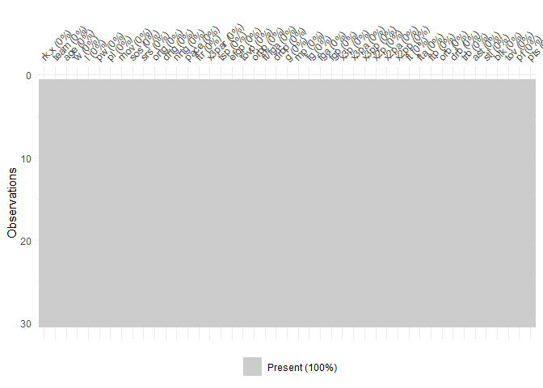<!-- -->


```r
naniar::vis_miss(player)
```

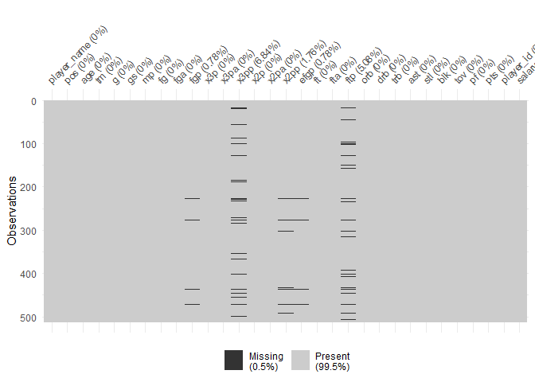<!-- -->

Here, we have identified a number of missing values in our **player** object.
Looking at the above chart, we can see that these are all in various percentage 
columns (**fgp**, **x3pp**, **x2pp**, **efgp** and **ftp**), and after looking at 
the data itself we can see that the cause of these NAs is dividing by zero. So to 
make our analysis simpler down the track, we'll replace these NAs with zeroes.


```r
player[is.na(player)] <- 0 #replaces NAs with 0
naniar::vis_miss(player)
```

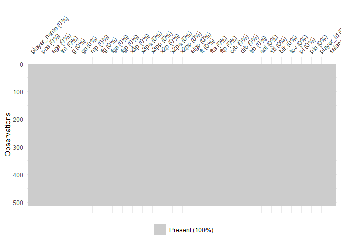<!-- -->

### Check distributions ###

The purpose of this project is to identify the **best players our team can
afford**. In order to achieve this, we first need to answer the question *'what
statistics contribute to wins in basketball?'* Then, we can use the model to
identify players likely to contribute to wins.
Therefore, we will use **wins** as the response variable.

So, we will begin by checking the distribution of the **wins** variable.


```r
ggplot(data = team) +
  geom_histogram(mapping = aes(x = w), colour = "red3", fill = "grey23", bins = 8)
```

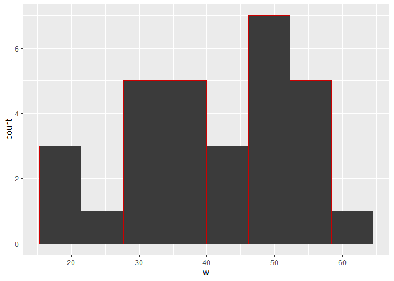<!-- -->

The above looks roughly normal, with  perhaps some slight right skewness. This is likely
the result of the small sample size (there are only 30 observations), and is
considered satisfactory for exploration.

Next, we will check the distribution of all the potential explanatory variables.


```r
distribution <- #builds a table where each variable and value is a unique observation, to enable simultaneous plotting with facet_wrap
  pivot_longer(data = team, cols = c(age:pts), 
               names_to = "variables", 
               values_to = "values")
  ggplot(data = distribution) +
    stat_density(mapping = aes(x = values)) +
    facet_wrap( ~ variables, scales = "free")
```

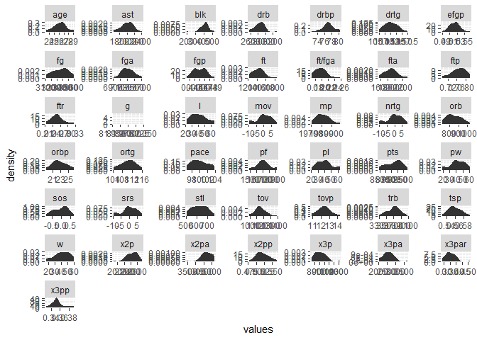<!-- -->

Looking at the above, it can be seen that most variables present as something
resembling a normal distribution, with several clear exceptions.
**Games** is missing, likely due to them all being identical (every team plays 82 
games, so there is no variation of distribution).
**Steals** are essentially flat, which is surprising.
**2-pointers and attempts** and **3-pointers and attempts** skew heavily to the 
right and left, respectively.

### Check relationships between variables ###

As a starting point, we will create a correlation matrix to get an idea of how the 
different team stats relate to one another.


```r
step1 <- cor(team[3:45]) #computes the correlation between all variables selected
```

```
## Warning in cor(team[3:45]): the standard deviation is zero
```

```r
corrplot(step1, tl.cex = 0.5) #builds correlation matrix
```

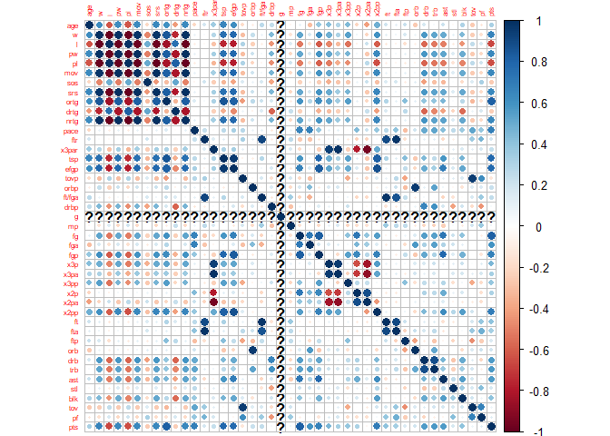<!-- -->

We can use the above matrix to identify stats that correlate strongly with **wins**,
that we may wish to explore in more detail.
We can see that there are strong positive correlations for **True Shooting percentage**, 
**effective field goal percentage**, **defensive rebound percentage**, **field goals**,
**field goal percentage**, **3-pointers**, **3-point attempts**, **3-point percentage**, 
**2-point percentage**, **free throw percentage**, **defensive rebounds**, **total rebounds**, **assists**, **blocks** and (somewhat obviously) **points**.
The only statistics with a moderately strong negative correlation are **turnovers** and 
**turnover percentage**.

We can plot these stats against wins in order to visualise the correlations.


```r
teamcheck <- #places the selected variables and values in individual observations, to allow simultaneous correlation with wins using facet_wrap
  pivot_longer(data = team, cols = c(tsp, efgp, drbp, fg, fgp, x3p, x3pa, x3pp, 
                                     x2pp, ftp, drb, trb, ast, blk, tov, tovp), 
               names_to = "variables", 
               values_to = "values")
  ggplot(data = teamcheck) +
    geom_point(mapping = aes(x = values, y = w)) +
    facet_wrap( ~ variables, scales = "free")
```

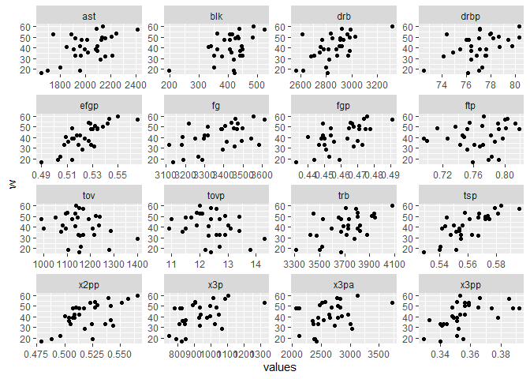<!-- -->

### Justification for data modelling decisions ###

At a glance, our first thoughts are as follows:
**Effective field goal percentage** and **True Shooting percentage** look to be 
the most closely correlated with **wins**. However, on an individual level, 
these numbers could easily be skewed based on team usage (for example, if
a player is particularly good at shooting 3-pointers but is only used inside the
paint, their **efgp** and **tsp** will be lower than they otherwise could have been). 
Since our task is ultimately to identify players, using **x2pp** and **x3pp** 
may be more appropriate, despite their slightly weaker correlations (with the intention 
of our coaching staff could utilise the player more effectively).
We notice that defensive rebounds and total rebounds both correlate well with
**wins**. However, since total rebounds includes all defensive rebounds, using both 
variables would be inappropriate due to collinearity. We'll opt for defensive 
rebounds initially, as it visually appears to correlate marginally better.
Other independent variables to consider are **assists**, **blocks** and 
**turnovers**.

## Data Modelling and Results ##

### Data Modelling

Using this data as a starting point, we can begin building a simple model to 
predict **wins** using the variables identified above (**x2pp**, **x3pp**, **drb**,
**ast**, **blk** and **tov**).


```r
fit1 <- team %>% 
  lm(w ~ x2pp + x3pp + drb + ast + blk + tov, data = .) #builds linear model
```

We can then check the coefficients for the model:


```r
coefs1 <- tidy(fit1, conf.int = TRUE) #check coefficients
coefs1
```

<div data-pagedtable="false">
  <script data-pagedtable-source type="application/json">
{"columns":[{"label":["term"],"name":[1],"type":["chr"],"align":["left"]},{"label":["estimate"],"name":[2],"type":["dbl"],"align":["right"]},{"label":["std.error"],"name":[3],"type":["dbl"],"align":["right"]},{"label":["statistic"],"name":[4],"type":["dbl"],"align":["right"]},{"label":["p.value"],"name":[5],"type":["dbl"],"align":["right"]},{"label":["conf.low"],"name":[6],"type":["dbl"],"align":["right"]},{"label":["conf.high"],"name":[7],"type":["dbl"],"align":["right"]}],"data":[{"1":"(Intercept)","2":"-2.353067e+02","3":"57.04383236","4":"-4.1250159","5":"0.0004122539","6":"-3.533109e+02","7":"-1.173026e+02"},{"1":"x2pp","2":"2.913907e+02","3":"89.28488662","4":"3.2636063","5":"0.0034164305","6":"1.066909e+02","7":"4.760906e+02"},{"1":"x3pp","2":"2.836744e+02","3":"103.20849762","4":"2.7485569","5":"0.0114417930","6":"7.017138e+01","7":"4.971775e+02"},{"1":"drb","2":"2.257460e-02","3":"0.01090726","4":"2.0696850","5":"0.0498954583","6":"1.120633e-05","7":"4.513799e-02"},{"1":"ast","2":"-2.452018e-03","3":"0.01115610","4":"-0.2197916","5":"0.8279724883","6":"-2.553017e-02","7":"2.062614e-02"},{"1":"blk","2":"1.609260e-02","3":"0.02924234","4":"0.5503184","5":"0.5874064741","6":"-4.439979e-02","7":"7.658498e-02"},{"1":"tov","2":"-3.652253e-02","3":"0.01773042","4":"-2.0598793","5":"0.0509012170","6":"-7.320069e-02","7":"1.556432e-04"}],"options":{"columns":{"min":{},"max":[10]},"rows":{"min":[10],"max":[10]},"pages":{}}}
  </script>
</div>
Then, we will also check the r-squared:


```r
summary(fit1) #check r-squared etc
```

```
## 
## Call:
## lm(formula = w ~ x2pp + x3pp + drb + ast + blk + tov, data = .)
## 
## Residuals:
##     Min      1Q  Median      3Q     Max 
## -9.7750 -5.3048 -0.2122  4.8245 12.1538 
## 
## Coefficients:
##               Estimate Std. Error t value Pr(>|t|)    
## (Intercept) -2.353e+02  5.704e+01  -4.125 0.000412 ***
## x2pp         2.914e+02  8.928e+01   3.264 0.003416 ** 
## x3pp         2.837e+02  1.032e+02   2.749 0.011442 *  
## drb          2.258e-02  1.091e-02   2.070 0.049895 *  
## ast         -2.452e-03  1.116e-02  -0.220 0.827972    
## blk          1.609e-02  2.924e-02   0.550 0.587406    
## tov         -3.652e-02  1.773e-02  -2.060 0.050901 .  
## ---
## Signif. codes:  0 '***' 0.001 '**' 0.01 '*' 0.05 '.' 0.1 ' ' 1
## 
## Residual standard error: 7.005 on 23 degrees of freedom
## Multiple R-squared:  0.731,	Adjusted R-squared:  0.6609 
## F-statistic: 10.42 on 6 and 23 DF,  p-value: 1.322e-05
```

The Adjusted R-squared value of **66%** means that the model explains roughly 66%
of the variation in the response variable (**w**).

Finally, we can plot the model:


```r
team %>% 
   mutate(w_hat = predict(fit1, newdata = .)) %>% #creates a predicted wins variables from the model
  ggplot(aes(w_hat, w, label = team)) + 
  geom_point() +
  geom_text(nudge_x=0.1, cex = 2) + 
  geom_smooth(method = lm, se = FALSE)
```

```
## `geom_smooth()` using formula 'y ~ x'
```

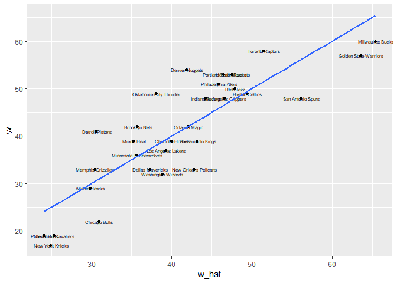<!-- -->

The model looks reasonable, but looking at the coefficients above, we notice two things.

First, while **assists** seemed to be positively correlated with wins in our initial
investigation, the coefficient is now *negative*. This seems odd. 
Second, looking at the P-values, **assists** has a very high value, suggesting
that this prediction is not reliable, anyway. The P-value for **blocks** is also
unacceptably high.

So, we will remove **ast** and **blk** and try again.


```r
fit2 <- team %>%
  lm(w ~ x2pp + x3pp + drb + tov, data = .) #builds new linear model
```

We will then check the coefficients for the model:

```r
coefs1 <- tidy(fit2, conf.int = TRUE) #check coefficients
coefs1
```

<div data-pagedtable="false">
  <script data-pagedtable-source type="application/json">
{"columns":[{"label":["term"],"name":[1],"type":["chr"],"align":["left"]},{"label":["estimate"],"name":[2],"type":["dbl"],"align":["right"]},{"label":["std.error"],"name":[3],"type":["dbl"],"align":["right"]},{"label":["statistic"],"name":[4],"type":["dbl"],"align":["right"]},{"label":["p.value"],"name":[5],"type":["dbl"],"align":["right"]},{"label":["conf.low"],"name":[6],"type":["dbl"],"align":["right"]},{"label":["conf.high"],"name":[7],"type":["dbl"],"align":["right"]}],"data":[{"1":"(Intercept)","2":"-239.53178393","3":"48.749895386","4":"-4.913483","5":"4.662663e-05","6":"-3.399341e+02","7":"-139.12949494"},{"1":"x2pp","2":"299.84093669","3":"70.190287599","4":"4.271829","5":"2.458704e-04","6":"1.552813e+02","7":"444.40054002"},{"1":"x3pp","2":"274.35575630","3":"93.244478245","4":"2.942327","5":"6.932557e-03","6":"8.231516e+01","7":"466.39635408"},{"1":"drb","2":"0.02428096","3":"0.009879144","4":"2.457800","5":"2.125834e-02","6":"3.934479e-03","7":"0.04462743"},{"1":"tov","2":"-0.03664140","3":"0.016769827","4":"-2.184960","5":"3.847686e-02","6":"-7.117951e-02","7":"-0.00210330"}],"options":{"columns":{"min":{},"max":[10]},"rows":{"min":[10],"max":[10]},"pages":{}}}
  </script>
</div>

Next, we will check the r-squared:


```r
summary(fit2) #check r-squared etc
```

```
## 
## Call:
## lm(formula = w ~ x2pp + x3pp + drb + tov, data = .)
## 
## Residuals:
##      Min       1Q   Median       3Q      Max 
## -10.1322  -5.4681   0.0854   4.7187  11.4096 
## 
## Coefficients:
##               Estimate Std. Error t value Pr(>|t|)    
## (Intercept) -2.395e+02  4.875e+01  -4.913 4.66e-05 ***
## x2pp         2.998e+02  7.019e+01   4.272 0.000246 ***
## x3pp         2.744e+02  9.324e+01   2.942 0.006933 ** 
## drb          2.428e-02  9.879e-03   2.458 0.021258 *  
## tov         -3.664e-02  1.677e-02  -2.185 0.038477 *  
## ---
## Signif. codes:  0 '***' 0.001 '**' 0.01 '*' 0.05 '.' 0.1 ' ' 1
## 
## Residual standard error: 6.764 on 25 degrees of freedom
## Multiple R-squared:  0.7274,	Adjusted R-squared:  0.6838 
## F-statistic: 16.68 on 4 and 25 DF,  p-value: 8.867e-07
```

Notice that the Adjusted R-squared value has improved to **68%** by removing those
variables.

Finally, we will plot the new model:

```r
lm_plot <- team %>%
   mutate(w_hat = predict(fit2, newdata = .)) %>% #creates predicted wins variables from model
  ggplot(aes(w_hat, w, label = team)) + 
  geom_point() +
  geom_text(nudge_x= 0.1, cex = 2) + 
  geom_smooth(method = lm, se = FALSE)

lm_plot
```

```
## `geom_smooth()` using formula 'y ~ x'
```

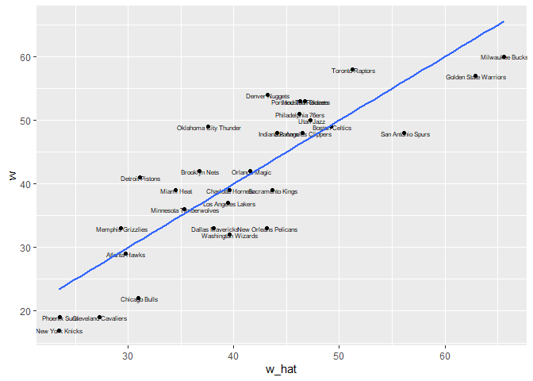<!-- -->

### Assumption Checking ###

First, we will check for multicollinearity. This will be performed visually by 
creating a pairs plot:


```r
pairs(formula = ~ x2pp + x3pp + drb + tov, data = team ) #pairs plot
```

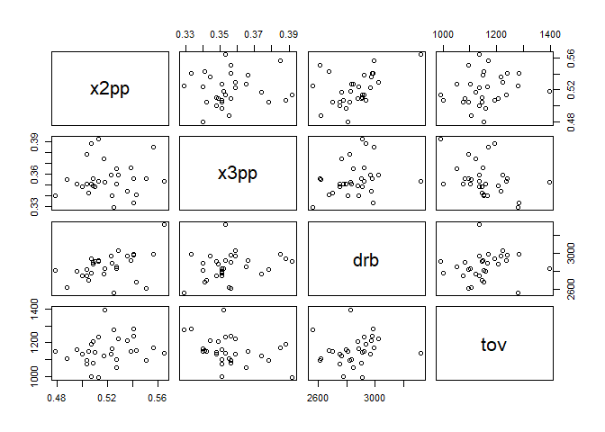<!-- -->

In the plot above, we are looking for the points to be randomly distributed. From
this test, there does not appear to be evidence of multicollinearity. 
For further confirmation, we can also check for multicollineraity by calculating 
the variance inflation factor (VIF).


```r
car::vif(fit2) #VIF calculation
```

```
##     x2pp     x3pp      drb      tov 
## 1.272773 1.293709 1.364803 1.259712
```
A cut-off of 5 is typically recommended, so with all VIFs close to 1, this test
confirms our conclusion that there is no evidence of multicollinearity.
 
Next, we will check for independence of observations. This will be performed by
conducting a Durbin-Watson test, in which the result should ideally be close to
2.


```r
car::durbinWatsonTest(fit2) #Durbin-Watson test
```

```
##  lag Autocorrelation D-W Statistic p-value
##    1       0.2570992      1.399021   0.064
##  Alternative hypothesis: rho != 0
```
We know from our analysis design that each observation is independent (they each
represent totally different teams). This makes the D-W statistic of 1.39 
surprising, but not alarming. It has likely been caused by the data being 
arranged in order of team rank, so this result can be disregarded.

Now, we will check for outliers. This test will be performed by calculating the
standardised residuals.
These are then placed on a plot, looking for residuals greater than 3, or that
stand out relative to the rest of the points.


```r
std_res <- rstandard(fit2) #calculates standardised residuals
points <- 1:length(std_res) #identifies the points

ggplot(data = NULL, aes(x = points, y = std_res)) +
  geom_point() +
  ylim(c(-4,4)) +
  geom_hline(yintercept = c(-3, 3), colour = "red", linetype = "dashed")
```

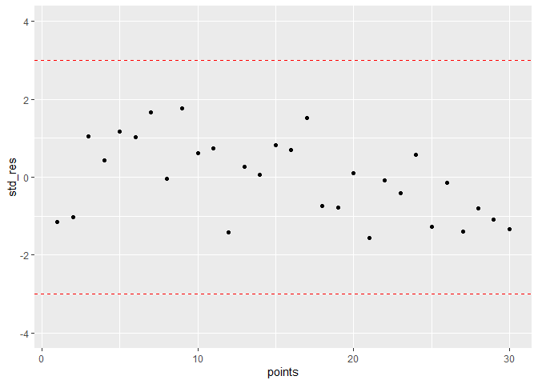<!-- -->

From the above, it can be seen that there are no significant outliers that 
require investigation.

Next, we will check for points of high leverage. Here, we obtain the 'hat 
diagonals', which are values between 0 and 1, where 1 indicates higher leverage.


```r
hats <- hatvalues(fit2) #obtains hat diagonals

ggplot(data = NULL, aes(x = points, y = hats)) +
  geom_point()
```

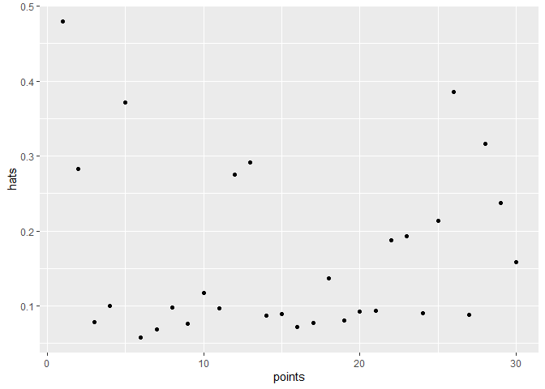<!-- -->

There are no hat values greater than 0.5, however we may wish to investigate those
greater than 0.3, as they appear to stand out more than the others. So, we will
label these points for ease of identification.


```r
hat_labels <- if_else(hats >= 0.3, paste(points), "") #labels points valued >= 0.3

ggplot(data = NULL, aes(x = points, y = hats)) +
  geom_point() +
  geom_text(aes(label = hat_labels), nudge_y = 0.02)
```

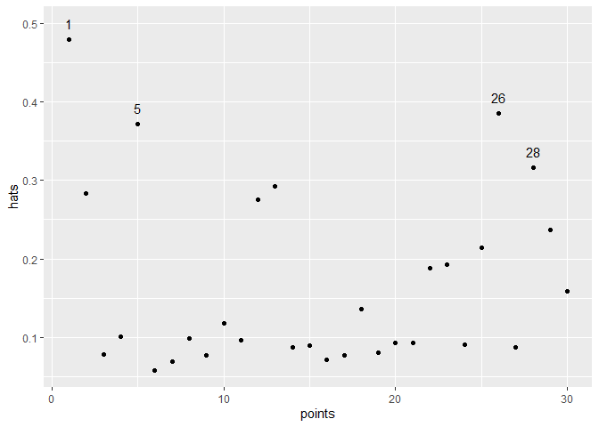<!-- -->

Next, we will look for points of high influence. This is performed using a Cook's 
Distance test, looking for points that stand out from the rest.


```r
cook <- cooks.distance(fit2) #obtains Cook's distance values

ggplot(data = NULL, aes(x = points, y = cook)) +
  geom_point()
```

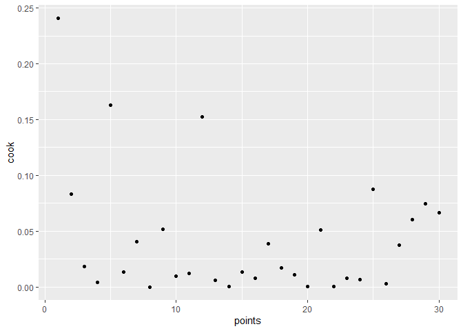<!-- -->
The points above 0.15 seem to be sticking out, so we will label them for further 
investigation.


```r
cook_labels <- if_else(cook >= 0.15, paste(points), "") #creates labels for points valued >= 0.15

ggplot(data = NULL, aes(x = points, y = cook)) +
  geom_point() +
  geom_text(aes(label = cook_labels), nudge_x = 2)
```

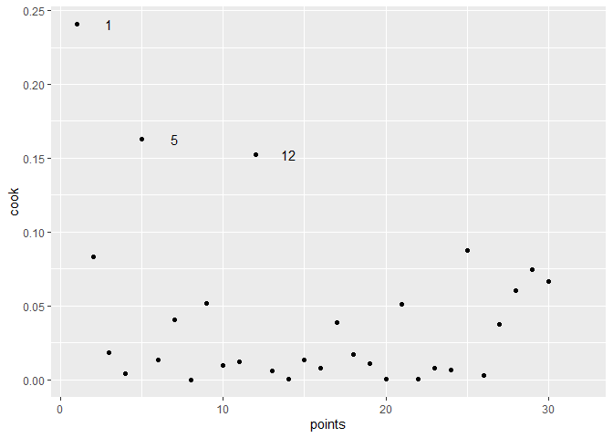<!-- -->

We will test for heteroscedascity by plotting the residuals against the fitted
values.


```r
res <- residuals(fit2) #obtains model residuals
fitted <- predict(fit2) #obtains predictions from model

ggplot(data = NULL, mapping = aes(x = fitted, y = res)) +
  geom_point(colour = "dodgerblue") +
  geom_hline(yintercept = 0, colour = "red", linetype = "dashed") +
  geom_smooth(method = lm, se = FALSE, colour = "magenta")
```

```
## `geom_smooth()` using formula 'y ~ x'
```

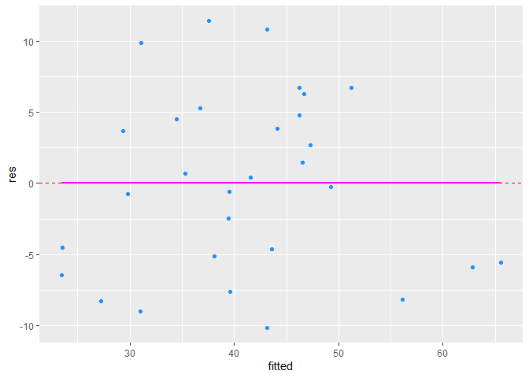<!-- -->
Here, we are looking for the points to be randomly distributed, with no clear
pattern. This appears to be acceptable, though it is difficult to observe with
so few points.

Next, we will check for normality of residuals using a histogram.


```r
ggplot(data = NULL, mapping = aes(x = res)) +
  geom_histogram(colour = "red3", fill = "grey23", binwidth = 2.5)
```

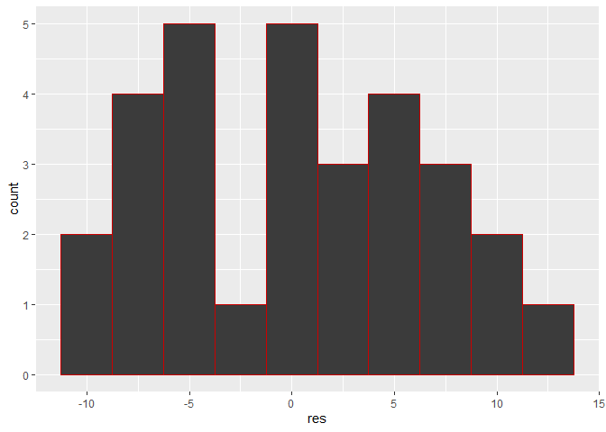<!-- -->

This doesn't look particularly skewed, however the extremely small bin (4th from
the left) is unusual for a strictly normal distribution. To investigate further, we will 
use a qq-plot, too.


```r
ggplot(data = NULL, mapping = aes(sample = res)) +
  stat_qq() + stat_qq_line()
```

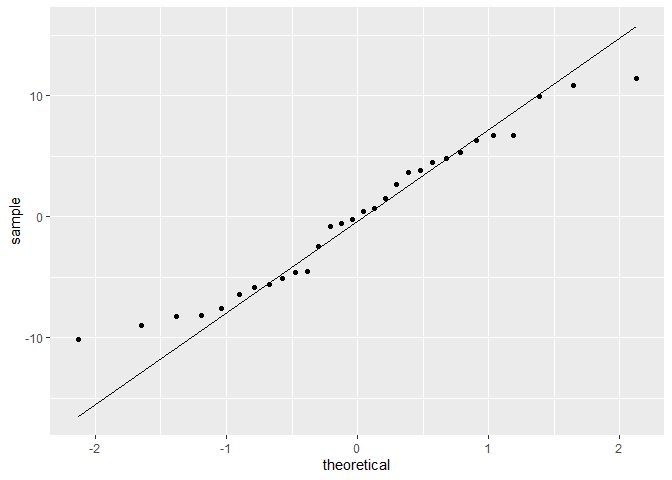<!-- -->

Here, the plot looks generally good, with the majority of points falling roughly
on the reference line.
The  thin tails in the qq-plot may indicate a moderate positive skewness. One possible
solution would be to remove the identified points of high leverage and influence 
(1 & 5) and try again. However, given the extremely small sample size (just 30 points), deleting these points is not appropriate, and collecting more data (for example, from previous 
seasons) may help solve this issue.

We will confirm linearity by creating partial regression plots. Here, we are
looking for linear relationships between each explanatory variable and **wins**.


```r
car::avPlots(fit2) #added-variable plots for the model
```

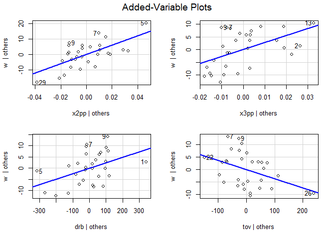<!-- -->

The above plots confirm positive linear relationships between **2-point percentage**, 
**3-point percentage**, **defensive rebounds** and **wins**, and a negative linear 
relationship between **turnovers** and **wins**.

### Model Output and Interpretation of the Model

Having built the model and checked our assumptions, we will again plot the model,
demonstrating that teams with higher predicted wins (**w_hat**), do indeed win
more games (**w**).


```r
lm_plot <- team %>% #plot of predicted wins v wins
   mutate(w_hat = predict(fit2, newdata = .)) %>%
  ggplot(aes(w_hat, w, label = team)) + 
  geom_point() +
  geom_text(nudge_x=0.1, cex = 2) + 
  geom_smooth(method = lm, se = FALSE)

lm_plot
```

```
## `geom_smooth()` using formula 'y ~ x'
```

<!-- -->

The above chart demonstrates that our model successfully predicts wins in the
NBA with satisfactory accuracy. The next step is applying this model in order to 
make player recommendations to the General Manager.

To do this, we must first convert the relevant player stats into per game 
metrics, so we can predict how many wins the team would have if each player were 
exactly like that player. **2-point percentage** and **3-point percentage** are 
both already normalised (since they are percentages), but we will need to convert 
**defensive rebounds** and **turnovers**. To do this, we will divide
each player's totals by minutes played, then multiply that number by 48 (the
length of a game, excluding OT), then multiply by 5 (the number of players on
the court).


```r
players <- player %>% 
  filter(mp >= 1000) %>% # filtering out players with under 1000 minutes
  mutate(drb = ((drb / mp) * 48) * 5, #normalising stats
         tov = ((tov / mp) * 48) * 5)
```

Now, we can find the **predicted wins** for a team made up of that player:


```r
players <- players %>%
  mutate(w_hat = predict(fit2, newdata = .)) #win predictions per player from the model
```

Before proceeding to the recommendations, we will each player's **predicted
wins** within our model are normally distributed, using a histogram:


```r
qplot(w_hat, data = players, binwidth = 3, colour = I("red"))
```

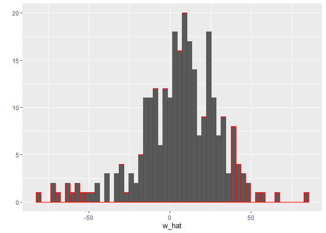<!-- -->
We can see that **predicted wins** for our model are normally distributed.

## Player Recommendations ##

Below are the Top 20 players in our dataset, in order of predicted wins for a team
comprised entirely of that player.


```r
players %>%
  select(player_name, pos, salary, w_hat) %>% #selecting variables to show in list
  arrange(desc(w_hat), salary) %>% #arrange in descending order of predicted wins
  top_n(20) #show top 20
```

```
## Selecting by w_hat
```

<div data-pagedtable="false">
  <script data-pagedtable-source type="application/json">
{"columns":[{"label":["player_name"],"name":[1],"type":["chr"],"align":["left"]},{"label":["pos"],"name":[2],"type":["chr"],"align":["left"]},{"label":["salary"],"name":[3],"type":["dbl"],"align":["right"]},{"label":["w_hat"],"name":[4],"type":["dbl"],"align":["right"]}],"data":[{"1":"Domantas Sabonis","2":"C","3":"2659800","4":"83.94067"},{"1":"Willie Cauley-Stein","2":"C","3":"4696874","4":"65.33259"},{"1":"Thomas Bryant","2":"C","3":"1378242","4":"58.19534"},{"1":"Dwight Powell","2":"C","3":"9631250","4":"54.87994"},{"1":"Joe Harris","2":"SG","3":"8333333","4":"48.97220"},{"1":"Andre Iguodala","2":"SF","3":"16000000","4":"47.78854"},{"1":"Pat Connaughton","2":"SG","3":"1641000","4":"45.68296"},{"1":"Brook Lopez","2":"C","3":"3382000","4":"45.01102"},{"1":"Jake Layman","2":"SF","3":"1544951","4":"44.00762"},{"1":"Doug McDermott","2":"SF","3":"7333334","4":"43.13932"},{"1":"Pascal Siakam","2":"PF","3":"1544951","4":"42.65023"},{"1":"Al Horford","2":"C","3":"28928710","4":"40.88390"},{"1":"Malcolm Brogdon","2":"SG","3":"1544951","4":"40.72976"},{"1":"Karl-Anthony Towns","2":"C","3":"7839435","4":"39.47406"},{"1":"John Collins","2":"PF","3":"2299080","4":"39.16817"},{"1":"Kelly Olynyk","2":"PF","3":"13537527","4":"39.11527"},{"1":"Malik Beasley","2":"SG","3":"1773840","4":"38.92447"},{"1":"Bojan Bogdanovic","2":"SF","3":"10500000","4":"38.60531"},{"1":"Stephen Curry","2":"PG","3":"37457154","4":"37.86382"},{"1":"James Ennis","2":"SF","3":"1621415","4":"37.85512"}],"options":{"columns":{"min":{},"max":[10]},"rows":{"min":[10],"max":[10]},"pages":{}}}
  </script>
</div>

Before proceeding, it is noticeable in the above chart that the four highest
ranked players (and 5 of the Top 10) are all centers. Though it may be tempting
to assume then that centers are the most valuable position in basketball, this 
is instead a function of the position's defensive responsibilities.
With centers spending more of their time defending the rim, it naturally follows
that they accumulate more defensive rebounds than players in other positions.
This can be illustrated visually using a boxplot.


```r
players %>%
  filter(pos == "C" | pos == "PF" | pos == "PG" | pos == "SF" | pos == "SG") %>% #filter out combo positions
ggplot() +
  geom_boxplot(mapping = aes(x = pos, y = drb, fill = pos), colour = "black") +
  labs(title = "Defensive Rebounds by Position", #rename title
       subtitle = "Centers produce more defensive rebounds than other position groups", #rename subtitle
       x = "Position", #rename x-axis
       y = "Defensive Rebounds", #rename y-axis
       fill = "Position") #fill by position
```

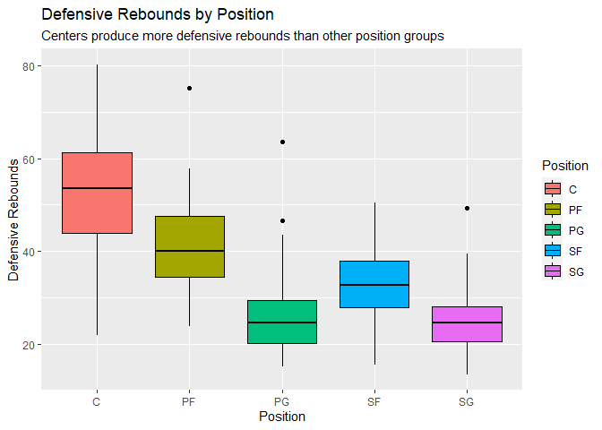<!-- -->

The above chart confirms the effect of positional play on our player valuations,
and justifies our decision to select the best players *per position*, rather
than the highest valued players *overall*.

Returning to our player selections, below is a scatterplot of all the players in
our dataset coloured by position, for you to explore. The higher up a point is 
on the plot, the higher the predicted wins; while salary increases as the points
move to the right.


```r
player_plot <- players %>% #creates a new object for the plot
  ggplot(mapping = aes(x = salary/1000000, y = w_hat, colour = pos, label = player_name)) +
  geom_point() +
  labs(title = "Predicted Wins vs Salary",
       x = "Salary (Millions)",
       y = "Predicted Wins",
       colour = "Position")
ggplotly(player_plot) #creates interactive plot from object
```

```{=html}
<div id="htmlwidget-cb5233e92e4fa649cbe6" style="width:672px;height:480px;" class="plotly html-widget"></div>
<script type="application/json" data-for="htmlwidget-cb5233e92e4fa649cbe6">{"x":{"data":[{"x":[24.157304,2.95584,22.347015,2.03412,8.17584,1.378242,15.793104,4.44684,4.696874,3.62892,25.434263,4.449,6.3,15.170787,25.434262,25.46725,16.9,24.119025,23.491573,6,1.60052,28.92871,21.666667,25.46725,22.8972,19.264603,4.35,1.567007,3.382,14.35775,2.393887,2.27239,1.757429,11.111111,12.917808,9.63125,1.48544,2.6598,17.469565,7.839435,3.294994,16.539326,12.75,24.434262,13.52809,1.544951,1.95276],"y":[-60.4657239442988,-7.59442164474047,-15.3211850522427,-13.5373578998424,-62.3821417457958,58.1953376480176,-44.1772953401758,-33.4944755018471,65.3325947801669,11.8196364345644,16.3292550596892,-52.0932667567503,37.080513714145,13.2043396463253,-37.8043491692316,4.19071340252983,12.9225116786726,6.8308834088954,-37.726530042289,-4.03433769402491,-56.5516025174401,40.8838986122644,16.5295659611302,15.9164182864812,-46.0637399396586,10.4351112027091,26.6227140115505,-19.3235386051786,45.0110152396657,-0.916969973778168,-25.9356498179365,23.7073493490378,-62.8315787040247,-53.7139449214155,-3.58792484889754,54.8799396824312,-30.6144092871768,83.9406692151807,-80.059979759719,39.4740557734033,23.90290982108,17.2332937438105,26.0980796407173,-29.5898564863408,6.883503835322,-71.1285854567088,-73.0737340515421],"text":["salary/1e+06: 24.157304<br />w_hat: -60.465723944<br />pos: C<br />player_name: Steven Adams","salary/1e+06:  2.955840<br />w_hat:  -7.594421645<br />pos: C<br />player_name: Bam Adebayo","salary/1e+06: 22.347015<br />w_hat: -15.321185052<br />pos: C<br />player_name: LaMarcus Aldridge","salary/1e+06:  2.034120<br />w_hat: -13.537357900<br />pos: C<br />player_name: Jarrett Allen","salary/1e+06:  8.175840<br />w_hat: -62.382141746<br />pos: C<br />player_name: Deandre Ayton","salary/1e+06:  1.378242<br />w_hat:  58.195337648<br />pos: C<br />player_name: Thomas Bryant","salary/1e+06: 15.793104<br />w_hat: -44.177295340<br />pos: C<br />player_name: Clint Capela","salary/1e+06:  4.446840<br />w_hat: -33.494475502<br />pos: C<br />player_name: Wendell Carter","salary/1e+06:  4.696874<br />w_hat:  65.332594780<br />pos: C<br />player_name: Willie Cauley-Stein","salary/1e+06:  3.628920<br />w_hat:  11.819636435<br />pos: C<br />player_name: Zach Collins","salary/1e+06: 25.434263<br />w_hat:  16.329255060<br />pos: C<br />player_name: Anthony Davis","salary/1e+06:  4.449000<br />w_hat: -52.093266757<br />pos: C<br />player_name: Ed Davis","salary/1e+06:  6.300000<br />w_hat:  37.080513714<br />pos: C<br />player_name: Dewayne Dedmon","salary/1e+06: 15.170787<br />w_hat:  13.204339646<br />pos: C<br />player_name: Gorgui Dieng","salary/1e+06: 25.434262<br />w_hat: -37.804349169<br />pos: C<br />player_name: Andre Drummond","salary/1e+06: 25.467250<br />w_hat:   4.190713403<br />pos: C<br />player_name: Joel Embiid","salary/1e+06: 16.900000<br />w_hat:  12.922511679<br />pos: C<br />player_name: Derrick Favors","salary/1e+06: 24.119025<br />w_hat:   6.830883409<br />pos: C<br />player_name: Marc Gasol","salary/1e+06: 23.491573<br />w_hat: -37.726530042<br />pos: C<br />player_name: Rudy Gobert","salary/1e+06:  6.000000<br />w_hat:  -4.034337694<br />pos: C<br />player_name: Montrezl Harrell","salary/1e+06:  1.600520<br />w_hat: -56.551602517<br />pos: C<br />player_name: Richaun Holmes","salary/1e+06: 28.928710<br />w_hat:  40.883898612<br />pos: C<br />player_name: Al Horford","salary/1e+06: 21.666667<br />w_hat:  16.529565961<br />pos: C<br />player_name: Serge Ibaka","salary/1e+06: 25.467250<br />w_hat:  15.916418286<br />pos: C<br />player_name: Nikola Jokic","salary/1e+06: 22.897200<br />w_hat: -46.063739940<br />pos: C<br />player_name: DeAndre Jordan","salary/1e+06: 19.264603<br />w_hat:  10.435111203<br />pos: C<br />player_name: Enes Kanter","salary/1e+06:  4.350000<br />w_hat:  26.622714012<br />pos: C<br />player_name: Alex Len","salary/1e+06:  1.567007<br />w_hat: -19.323538605<br />pos: C<br />player_name: Kevon Looney","salary/1e+06:  3.382000<br />w_hat:  45.011015240<br />pos: C<br />player_name: Brook Lopez","salary/1e+06: 14.357750<br />w_hat:  -0.916969974<br />pos: C<br />player_name: Robin Lopez","salary/1e+06:  2.393887<br />w_hat: -25.935649818<br />pos: C<br />player_name: JaVale McGee","salary/1e+06:  2.272390<br />w_hat:  23.707349349<br />pos: C<br />player_name: Larry Nance","salary/1e+06:  1.757429<br />w_hat: -62.831578704<br />pos: C<br />player_name: Nerlens Noel","salary/1e+06: 11.111111<br />w_hat: -53.713944921<br />pos: C<br />player_name: Jusuf Nurkic","salary/1e+06: 12.917808<br />w_hat:  -3.587924849<br />pos: C<br />player_name: Mason Plumlee","salary/1e+06:  9.631250<br />w_hat:  54.879939682<br />pos: C<br />player_name: Dwight Powell","salary/1e+06:  1.485440<br />w_hat: -30.614409287<br />pos: C<br />player_name: Mitchell Robinson","salary/1e+06:  2.659800<br />w_hat:  83.940669215<br />pos: C<br />player_name: Domantas Sabonis","salary/1e+06: 17.469565<br />w_hat: -80.059979760<br />pos: C<br />player_name: Tristan Thompson","salary/1e+06:  7.839435<br />w_hat:  39.474055773<br />pos: C<br />player_name: Karl-Anthony Towns","salary/1e+06:  3.294994<br />w_hat:  23.902909821<br />pos: C<br />player_name: Myles Turner","salary/1e+06: 16.539326<br />w_hat:  17.233293744<br />pos: C<br />player_name: Jonas Valanciunas","salary/1e+06: 12.750000<br />w_hat:  26.098079641<br />pos: C<br />player_name: Nikola Vucevic","salary/1e+06: 24.434262<br />w_hat: -29.589856486<br />pos: C<br />player_name: Hassan Whiteside","salary/1e+06: 13.528090<br />w_hat:   6.883503835<br />pos: C<br />player_name: Cody Zeller","salary/1e+06:  1.544951<br />w_hat: -71.128585457<br />pos: C<br />player_name: Ivica Zubac","salary/1e+06:  1.952760<br />w_hat: -73.073734052<br />pos: C<br />player_name: Ante Zizic"],"type":"scatter","mode":"markers","marker":{"autocolorscale":false,"color":"rgba(248,118,109,1)","opacity":1,"size":5.66929133858268,"symbol":"circle","line":{"width":1.88976377952756,"color":"rgba(248,118,109,1)"}},"hoveron":"points","name":"C","legendgroup":"C","showlegend":true,"xaxis":"x","yaxis":"y","hoverinfo":"text","frame":null},{"x":[6.957105,24.157304,7.31496,7,6.5,15.4,2.393887,2.29908,9.53,10.0872,14,21.590909,8.333333,17.469565,8.066667,2.393887,31.873932,14.8,31.214295,2.16636,12.545455,4.96908,7,5.92272,2.165481,14.4207,13,1.378242,3.74484,1.68984,3.364249,4.53612,29.230769,12.5,5.375,9.173294,5,13.537527,20,2.494346,8.641,4.3205,1.544951,5.75,7.959537,1.621415,14.0875,13.764045,2.52684],"y":[9.68040181945247,23.7281728328564,7.05577912756474,32.6140786842395,32.7355190492606,-8.090221037545,11.5130684222373,39.1681671986592,20.4484131414722,32.5171654005879,24.7745095943311,6.28282630149107,34.9179785616184,3.74064521397748,30.687643670832,31.6531927756632,17.3864224162498,28.4160457394796,14.6945210409669,23.4449429072306,27.5650492008842,2.58447034387059,8.52268908576506,24.9705729526709,30.6902025500924,1.58477297843861,3.53017558446081,32.7341713372988,-29.1139663159185,9.71551002596606,-10.4381096620744,4.06202552917715,17.7666356060273,24.9882401201187,16.3485038358698,-1.93744812447828,16.2704332453301,39.1152728667432,13.4389153323938,9.13369253015554,24.3697016201123,-9.182636490919,42.6502329213897,-12.8831990811024,-0.924258932338753,12.8222914771235,11.513422906185,25.6690509611977,10.7605122372433],"text":["salary/1e+06:  6.957105<br />w_hat:   9.680401819<br />pos: PF<br />player_name: Al-Farouq Aminu","salary/1e+06: 24.157304<br />w_hat:  23.728172833<br />pos: PF<br />player_name: Giannis Antetokounmpo","salary/1e+06:  7.314960<br />w_hat:   7.055779128<br />pos: PF<br />player_name: Marvin Bagley","salary/1e+06:  7.000000<br />w_hat:  32.614078684<br />pos: PF<br />player_name: Davis Bertans","salary/1e+06:  6.500000<br />w_hat:  32.735519049<br />pos: PF<br />player_name: Nemanja Bjelica","salary/1e+06: 15.400000<br />w_hat:  -8.090221038<br />pos: PF<br />player_name: DeMarre Carroll","salary/1e+06:  2.393887<br />w_hat:  11.513068422<br />pos: PF<br />player_name: Vince Carter","salary/1e+06:  2.299080<br />w_hat:  39.168167199<br />pos: PF<br />player_name: John Collins","salary/1e+06:  9.530000<br />w_hat:  20.448413141<br />pos: PF<br />player_name: Jared Dudley","salary/1e+06: 10.087200<br />w_hat:  32.517165401<br />pos: PF<br />player_name: Rudy Gay","salary/1e+06: 14.000000<br />w_hat:  24.774509594<br />pos: PF<br />player_name: Taj Gibson","salary/1e+06: 21.590909<br />w_hat:   6.282826301<br />pos: PF<br />player_name: Aaron Gordon","salary/1e+06:  8.333333<br />w_hat:  34.917978562<br />pos: PF<br />player_name: Jerami Grant","salary/1e+06: 17.469565<br />w_hat:   3.740645214<br />pos: PF<br />player_name: Draymond Green","salary/1e+06:  8.066667<br />w_hat:  30.687643671<br />pos: PF<br />player_name: JaMychal Green","salary/1e+06:  2.393887<br />w_hat:  31.653192776<br />pos: PF<br />player_name: Jeff Green","salary/1e+06: 31.873932<br />w_hat:  17.386422416<br />pos: PF<br />player_name: Blake Griffin","salary/1e+06: 14.800000<br />w_hat:  28.416045739<br />pos: PF<br />player_name: Tobias Harris","salary/1e+06: 31.214295<br />w_hat:  14.694521041<br />pos: PF<br />player_name: Gordon Hayward","salary/1e+06:  2.166360<br />w_hat:  23.444942907<br />pos: PF<br />player_name: Juan Hernangomez","salary/1e+06: 12.545455<br />w_hat:  27.565049201<br />pos: PF<br />player_name: Joe Ingles","salary/1e+06:  4.969080<br />w_hat:   2.584470344<br />pos: PF<br />player_name: Jonathan Isaac","salary/1e+06:  7.000000<br />w_hat:   8.522689086<br />pos: PF<br />player_name: Ersan Ilyasova","salary/1e+06:  5.922720<br />w_hat:  24.970572953<br />pos: PF<br />player_name: Jaren Jackson","salary/1e+06:  2.165481<br />w_hat:  30.690202550<br />pos: PF<br />player_name: Jonas Jerebko","salary/1e+06: 14.420700<br />w_hat:   1.584772978<br />pos: PF<br />player_name: James Johnson","salary/1e+06: 13.000000<br />w_hat:   3.530175584<br />pos: PF<br />player_name: Michael Kidd-Gilchrist","salary/1e+06:  1.378242<br />w_hat:  32.734171337<br />pos: PF<br />player_name: Maxi Kleber","salary/1e+06:  3.744840<br />w_hat: -29.113966316<br />pos: PF<br />player_name: Kevin Knox","salary/1e+06:  1.689840<br />w_hat:   9.715510026<br />pos: PF<br />player_name: Kyle Kuzma","salary/1e+06:  3.364249<br />w_hat: -10.438109662<br />pos: PF<br />player_name: Trey Lyles","salary/1e+06:  4.536120<br />w_hat:   4.062025529<br />pos: PF<br />player_name: Lauri Markkanen","salary/1e+06: 29.230769<br />w_hat:  17.766635606<br />pos: PF<br />player_name: Paul Millsap","salary/1e+06: 12.500000<br />w_hat:  24.988240120<br />pos: PF<br />player_name: Nikola Mirotic","salary/1e+06:  5.375000<br />w_hat:  16.348503836<br />pos: PF<br />player_name: Marcus Morris","salary/1e+06:  9.173294<br />w_hat:  -1.937448124<br />pos: PF<br />player_name: Markieff Morris","salary/1e+06:  5.000000<br />w_hat:  16.270433245<br />pos: PF<br />player_name: Mike Muscala","salary/1e+06: 13.537527<br />w_hat:  39.115272867<br />pos: PF<br />player_name: Kelly Olynyk","salary/1e+06: 20.000000<br />w_hat:  13.438915332<br />pos: PF<br />player_name: Jabari Parker","salary/1e+06:  2.494346<br />w_hat:   9.133692530<br />pos: PF<br />player_name: Bobby Portis","salary/1e+06:  8.641000<br />w_hat:  24.369701620<br />pos: PF<br />player_name: Julius Randle","salary/1e+06:  4.320500<br />w_hat:  -9.182636491<br />pos: PF<br />player_name: Mike Scott","salary/1e+06:  1.544951<br />w_hat:  42.650232921<br />pos: PF<br />player_name: Pascal Siakam","salary/1e+06:  5.750000<br />w_hat: -12.883199081<br />pos: PF<br />player_name: Anthony Tolliver","salary/1e+06:  7.959537<br />w_hat:  -0.924258932<br />pos: PF<br />player_name: PJ Tucker","salary/1e+06:  1.621415<br />w_hat:  12.822291477<br />pos: PF<br />player_name: Noah Vonleh","salary/1e+06: 14.087500<br />w_hat:  11.513422906<br />pos: PF<br />player_name: Marvin Williams","salary/1e+06: 13.764045<br />w_hat:  25.669050961<br />pos: PF<br />player_name: Thaddeus Young","salary/1e+06:  2.526840<br />w_hat:  10.760512237<br />pos: PF<br />player_name: Dario Saric"],"type":"scatter","mode":"markers","marker":{"autocolorscale":false,"color":"rgba(211,146,0,1)","opacity":1,"size":5.66929133858268,"symbol":"circle","line":{"width":1.88976377952756,"color":"rgba(211,146,0,1)"}},"hoveron":"points","name":"PF","legendgroup":"PF","showlegend":true,"xaxis":"x","yaxis":"y","hoverinfo":"text","frame":null},{"x":[24.107258,12.800562],"y":[0.828063284100072,6.6100241535862],"text":["salary/1e+06: 24.107258<br />w_hat:   0.828063284<br />pos: PF-SF<br />player_name: Harrison Barnes","salary/1e+06: 12.800562<br />w_hat:   6.610024154<br />pos: PF-SF<br />player_name: Wilson Chandler"],"type":"scatter","mode":"markers","marker":{"autocolorscale":false,"color":"rgba(147,170,0,1)","opacity":1,"size":5.66929133858268,"symbol":"circle","line":{"width":1.88976377952756,"color":"rgba(147,170,0,1)"}},"hoveron":"points","name":"PF-SF","legendgroup":"PF-SF","showlegend":true,"xaxis":"x","yaxis":"y","hoverinfo":"text","frame":null},{"x":[1.349383,7.25,7.46196,5.027028,15,1.23,1.795015,10,30.521115,1.544951,37.457154,1.656092,4.221,3,5.47092,1.832107,3.37536,30.57,2.393887,1.325531,19,20.099189,1.378242,17.043478,19.24537,2.444052,7.945,27.977689,12.516746,32.7,2.512601,1.60052,1.349383,4.294479,3.4998,5,35.65415,3,9,2.17626,3.050389,14.8,7.019698,3.129187,4.07376,6.43452,3.81996,19,17.868853,8.653847,12,19.1698,35.665,1.66716,2.536898,5.36328],"y":[21.1071278068792,29.1106815039766,-4.57518510663368,-3.87849733907511,25.3182099574784,12.8018620632055,-4.14745329899249,19.6727842746359,5.16390625220504,26.3280531481865,37.8638237813078,10.4212886612715,-10.1336009855694,6.30201213436641,6.59086202502958,9.06790301954198,11.8755071398377,19.4788351844106,-11.6729162654855,-22.6300624750923,10.772309933709,30.3117847351752,-1.18244539889723,0.6984334483619,-1.49365928487118,-16.5833663897936,-14.7245241150112,11.2913735180559,-3.97567089787092,9.77829665138,-13.8416806069927,15.5762264661974,33.5052480035893,-1.92203361267194,3.91337758882424,-24.4048943901836,2.31020234596956,-10.6505350158804,-12.6322949996962,14.5287907928115,-15.5904359089338,-18.2684835378733,5.94365839369641,25.9982423586867,2.46514684812458,-69.5811242650287,-8.58784399004388,-12.6032962259303,-32.8149950021342,-3.5217607378405,6.2411315382895,-5.08769354975555,-15.2852319868999,12.0376153144931,-9.97145215125385,-8.14672843623997],"text":["salary/1e+06:  1.349383<br />w_hat:  21.107127807<br />pos: PG<br />player_name: Ryan Arcidiacono","salary/1e+06:  7.250000<br />w_hat:  29.110681504<br />pos: PG<br />player_name: DJ Augustin","salary/1e+06:  7.461960<br />w_hat:  -4.575185107<br />pos: PG<br />player_name: Lonzo Ball","salary/1e+06:  5.027028<br />w_hat:  -3.878497339<br />pos: PG<br />player_name: Patrick Beverley","salary/1e+06: 15.000000<br />w_hat:  25.318209957<br />pos: PG<br />player_name: Eric Bledsoe","salary/1e+06:  1.230000<br />w_hat:  12.801862063<br />pos: PG<br />player_name: Jalen Brunson","salary/1e+06:  1.795015<br />w_hat:  -4.147453299<br />pos: PG<br />player_name: Trey Burke","salary/1e+06: 10.000000<br />w_hat:  19.672784275<br />pos: PG<br />player_name: Darren Collison","salary/1e+06: 30.521115<br />w_hat:   5.163906252<br />pos: PG<br />player_name: Mike Conley","salary/1e+06:  1.544951<br />w_hat:  26.328053148<br />pos: PG<br />player_name: Quinn Cook","salary/1e+06: 37.457154<br />w_hat:  37.863823781<br />pos: PG<br />player_name: Stephen Curry","salary/1e+06:  1.656092<br />w_hat:  10.421288661<br />pos: PG<br />player_name: Spencer Dinwiddie","salary/1e+06:  4.221000<br />w_hat: -10.133600986<br />pos: PG<br />player_name: Kris Dunn","salary/1e+06:  3.000000<br />w_hat:   6.302012134<br />pos: PG<br />player_name: Yogi Ferrell","salary/1e+06:  5.470920<br />w_hat:   6.590862025<br />pos: PG<br />player_name: De'Aaron Fox","salary/1e+06:  1.832107<br />w_hat:   9.067903020<br />pos: PG<br />player_name: Tim Frazier","salary/1e+06:  3.375360<br />w_hat:  11.875507140<br />pos: PG<br />player_name: Shai Gilgeous-Alexander","salary/1e+06: 30.570000<br />w_hat:  19.478835184<br />pos: PG<br />player_name: James Harden","salary/1e+06:  2.393887<br />w_hat: -11.672916265<br />pos: PG<br />player_name: Devin Harris","salary/1e+06:  1.325531<br />w_hat: -22.630062475<br />pos: PG<br />player_name: Shaquille Harrison","salary/1e+06: 19.000000<br />w_hat:  10.772309934<br />pos: PG<br />player_name: George Hill","salary/1e+06: 20.099189<br />w_hat:  30.311784735<br />pos: PG<br />player_name: Kyrie Irving","salary/1e+06:  1.378242<br />w_hat:  -1.182445399<br />pos: PG<br />player_name: Frank Jackson","salary/1e+06: 17.043478<br />w_hat:   0.698433448<br />pos: PG<br />player_name: Reggie Jackson","salary/1e+06: 19.245370<br />w_hat:  -1.493659285<br />pos: PG<br />player_name: Tyler Johnson","salary/1e+06:  2.444052<br />w_hat: -16.583366390<br />pos: PG<br />player_name: Tyus Jones","salary/1e+06:  7.945000<br />w_hat: -14.724524115<br />pos: PG<br />player_name: Cory Joseph","salary/1e+06: 27.977689<br />w_hat:  11.291373518<br />pos: PG<br />player_name: Damian Lillard","salary/1e+06: 12.516746<br />w_hat:  -3.975670898<br />pos: PG<br />player_name: Jeremy Lin","salary/1e+06: 32.700000<br />w_hat:   9.778296651<br />pos: PG<br />player_name: Kyle Lowry","salary/1e+06:  2.512601<br />w_hat: -13.841680607<br />pos: PG<br />player_name: Shelvin Mack","salary/1e+06:  1.600520<br />w_hat:  15.576226466<br />pos: PG<br />player_name: TJ McConnell","salary/1e+06:  1.349383<br />w_hat:  33.505248004<br />pos: PG<br />player_name: Monte Morris","salary/1e+06:  4.294479<br />w_hat:  -1.922033613<br />pos: PG<br />player_name: Emmanuel Mudiay","salary/1e+06:  3.499800<br />w_hat:   3.913377589<br />pos: PG<br />player_name: Jamal Murray","salary/1e+06:  5.000000<br />w_hat: -24.404894390<br />pos: PG<br />player_name: Tony Parker","salary/1e+06: 35.654150<br />w_hat:   2.310202346<br />pos: PG<br />player_name: Chris Paul","salary/1e+06:  3.000000<br />w_hat: -10.650535016<br />pos: PG<br />player_name: Elfrid Payton","salary/1e+06:  9.000000<br />w_hat: -12.632295000<br />pos: PG<br />player_name: Rajon Rondo","salary/1e+06:  2.176260<br />w_hat:  14.528790793<br />pos: PG<br />player_name: Derrick Rose","salary/1e+06:  3.050389<br />w_hat: -15.590435909<br />pos: PG<br />player_name: Terry Rozier","salary/1e+06: 14.800000<br />w_hat: -18.268483538<br />pos: PG<br />player_name: Ricky Rubio","salary/1e+06:  7.019698<br />w_hat:   5.943658394<br />pos: PG<br />player_name: D'Angelo Russell","salary/1e+06:  3.129187<br />w_hat:  25.998242359<br />pos: PG<br />player_name: Tomas Satoransky","salary/1e+06:  4.073760<br />w_hat:   2.465146848<br />pos: PG<br />player_name: Collin Sexton","salary/1e+06:  6.434520<br />w_hat: -69.581124265<br />pos: PG<br />player_name: Ben Simmons","salary/1e+06:  3.819960<br />w_hat:  -8.587843990<br />pos: PG<br />player_name: Dennis Smith","salary/1e+06: 19.000000<br />w_hat: -12.603296226<br />pos: PG<br />player_name: Jeff Teague","salary/1e+06: 17.868853<br />w_hat: -32.814995002<br />pos: PG<br />player_name: Evan Turner","salary/1e+06:  8.653847<br />w_hat:  -3.521760738<br />pos: PG<br />player_name: Fred VanVleet","salary/1e+06: 12.000000<br />w_hat:   6.241131538<br />pos: PG<br />player_name: Kemba Walker","salary/1e+06: 19.169800<br />w_hat:  -5.087693550<br />pos: PG<br />player_name: John Wall","salary/1e+06: 35.665000<br />w_hat: -15.285231987<br />pos: PG<br />player_name: Russell Westbrook","salary/1e+06:  1.667160<br />w_hat:  12.037615314<br />pos: PG<br />player_name: Derrick White","salary/1e+06:  2.536898<br />w_hat:  -9.971452151<br />pos: PG<br />player_name: Delon Wright","salary/1e+06:  5.363280<br />w_hat:  -8.146728436<br />pos: PG<br />player_name: Trae Young"],"type":"scatter","mode":"markers","marker":{"autocolorscale":false,"color":"rgba(0,186,56,1)","opacity":1,"size":5.66929133858268,"symbol":"circle","line":{"width":1.88976377952756,"color":"rgba(0,186,56,1)"}},"hoveron":"points","name":"PG","legendgroup":"PG","showlegend":true,"xaxis":"x","yaxis":"y","hoverinfo":"text","frame":null},{"x":[8.641,1.95276,15,24,10.5,3.5574,3.20664,10.464092,2,7.305825,30,1.621415,1.544951,21.587579,30.5607,6.5,2.470356,16,5.75712,1.378242,2.80788,35.65415,3.940401,1.512601,1.69,1.544951,23.114066,1.7028,7.333334,1.349383,13,2.205,1.378242,2.775,3.20863,26.011913,10.607143,6.7008,11.75,25.46725,0.838464,3.448926],"y":[8.50506578556593,23.9044051042839,0.324129827077137,23.162667950706,38.6053060208663,16.9370335759021,16.0662316186609,19.9480002360029,20.3861660239044,9.82273897724921,33.5908554816772,37.8551217449206,9.31536031150707,24.9918163901769,11.9307732734322,-20.1077492343188,-57.7322867906273,47.7885419946576,7.32648295389609,-9.23083776233125,20.8268622744286,28.3153275713413,-15.1011747863629,15.3794357901634,10.0362714693832,44.0076193555033,25.277614645057,-9.04451662893422,43.1393189185658,34.5470850856079,9.95898728915553,0.716587433423901,37.5278271066073,2.8999726294914,7.47459770427304,23.5371065674416,26.3213300960253,8.15517049202558,31.0878557665781,-14.156117831985,-13.5500952270581,2.10931165851217],"text":["salary/1e+06:  8.641000<br />w_hat:   8.505065786<br />pos: SF<br />player_name: Kyle Anderson","salary/1e+06:  1.952760<br />w_hat:  23.904405104<br />pos: SF<br />player_name: OG Anunoby","salary/1e+06: 15.000000<br />w_hat:   0.324129827<br />pos: SF<br />player_name: Trevor Ariza","salary/1e+06: 24.000000<br />w_hat:  23.162667951<br />pos: SF<br />player_name: Nicolas Batum","salary/1e+06: 10.500000<br />w_hat:  38.605306021<br />pos: SF<br />player_name: Bojan Bogdanovic","salary/1e+06:  3.557400<br />w_hat:  16.937033576<br />pos: SF<br />player_name: Mikal Bridges","salary/1e+06:  3.206640<br />w_hat:  16.066231619<br />pos: SF<br />player_name: Miles Bridges","salary/1e+06: 10.464092<br />w_hat:  19.948000236<br />pos: SF<br />player_name: Robert Covington","salary/1e+06:  2.000000<br />w_hat:  20.386166024<br />pos: SF<br />player_name: Torrey Craig","salary/1e+06:  7.305825<br />w_hat:   9.822738977<br />pos: SF<br />player_name: Jae Crowder","salary/1e+06: 30.000000<br />w_hat:  33.590855482<br />pos: SF<br />player_name: Kevin Durant","salary/1e+06:  1.621415<br />w_hat:  37.855121745<br />pos: SF<br />player_name: James Ennis","salary/1e+06:  1.544951<br />w_hat:   9.315360312<br />pos: SF<br />player_name: Dorian Finney-Smith","salary/1e+06: 21.587579<br />w_hat:  24.991816390<br />pos: SF<br />player_name: Danilo Gallinari","salary/1e+06: 30.560700<br />w_hat:  11.930773273<br />pos: SF<br />player_name: Paul George","salary/1e+06:  6.500000<br />w_hat: -20.107749234<br />pos: SF<br />player_name: Mario Hezonja","salary/1e+06:  2.470356<br />w_hat: -57.732286791<br />pos: SF<br />player_name: Rondae Hollis-Jefferson","salary/1e+06: 16.000000<br />w_hat:  47.788541995<br />pos: SF<br />player_name: Andre Iguodala","salary/1e+06:  5.757120<br />w_hat:   7.326482954<br />pos: SF<br />player_name: Brandon Ingram","salary/1e+06:  1.378242<br />w_hat:  -9.230837762<br />pos: SF<br />player_name: Wesley Iwundu","salary/1e+06:  2.807880<br />w_hat:  20.826862274<br />pos: SF<br />player_name: Justin Jackson","salary/1e+06: 35.654150<br />w_hat:  28.315327571<br />pos: SF<br />player_name: LeBron James","salary/1e+06:  3.940401<br />w_hat: -15.101174786<br />pos: SF<br />player_name: Stanley Johnson","salary/1e+06:  1.512601<br />w_hat:  15.379435790<br />pos: SF<br />player_name: Derrick Jones","salary/1e+06:  1.690000<br />w_hat:  10.036271469<br />pos: SF<br />player_name: Rodions Kurucs","salary/1e+06:  1.544951<br />w_hat:  44.007619356<br />pos: SF<br />player_name: Jake Layman","salary/1e+06: 23.114066<br />w_hat:  25.277614645<br />pos: SF<br />player_name: Kawhi Leonard","salary/1e+06:  1.702800<br />w_hat:  -9.044516629<br />pos: SF<br />player_name: Caris LeVert","salary/1e+06:  7.333334<br />w_hat:  43.139318919<br />pos: SF<br />player_name: Doug McDermott","salary/1e+06:  1.349383<br />w_hat:  34.547085086<br />pos: SF<br />player_name: Alfonzo McKinnie","salary/1e+06: 13.000000<br />w_hat:   9.958987289<br />pos: SF<br />player_name: Khris Middleton","salary/1e+06:  2.205000<br />w_hat:   0.716587433<br />pos: SF<br />player_name: Darius Miller","salary/1e+06:  1.378242<br />w_hat:  37.527827107<br />pos: SF<br />player_name: Royce O'Neale","salary/1e+06:  2.775000<br />w_hat:   2.899972629<br />pos: SF<br />player_name: Cedi Osman","salary/1e+06:  3.208630<br />w_hat:   7.474597704<br />pos: SF<br />player_name: Kelly Oubre","salary/1e+06: 26.011913<br />w_hat:  23.537106567<br />pos: SF<br />player_name: Otto Porter","salary/1e+06: 10.607143<br />w_hat:  26.321330096<br />pos: SF<br />player_name: Tony Snell","salary/1e+06:  6.700800<br />w_hat:   8.155170492<br />pos: SF<br />player_name: Jayson Tatum","salary/1e+06: 11.750000<br />w_hat:  31.087855767<br />pos: SF<br />player_name: TJ Warren","salary/1e+06: 25.467250<br />w_hat: -14.156117832<br />pos: SF<br />player_name: Andrew Wiggins","salary/1e+06:  0.838464<br />w_hat: -13.550095227<br />pos: SF<br />player_name: Kenrich Williams","salary/1e+06:  3.448926<br />w_hat:   2.109311659<br />pos: SF<br />player_name: Justise Winslow"],"type":"scatter","mode":"markers","marker":{"autocolorscale":false,"color":"rgba(0,193,159,1)","opacity":1,"size":5.66929133858268,"symbol":"circle","line":{"width":1.88976377952756,"color":"rgba(0,193,159,1)"}},"hoveron":"points","name":"SF","legendgroup":"SF","showlegend":true,"xaxis":"x","yaxis":"y","hoverinfo":"text","frame":null},{"x":[19.841627,19.360228],"y":[3.99815161625552,-6.43907043305758],"text":["salary/1e+06: 19.841627<br />w_hat:   3.998151616<br />pos: SF-SG<br />player_name: Jimmy Butler","salary/1e+06: 19.360228<br />w_hat:  -6.439070433<br />pos: SF-SG<br />player_name: Wesley Matthews"],"type":"scatter","mode":"markers","marker":{"autocolorscale":false,"color":"rgba(0,185,227,1)","opacity":1,"size":5.66929133858268,"symbol":"circle","line":{"width":1.88976377952756,"color":"rgba(0,185,227,1)"}},"hoveron":"points","name":"SF-SG","legendgroup":"SF-SG","showlegend":true,"xaxis":"x","yaxis":"y","hoverinfo":"text","frame":null},{"x":[11.830358,18.089888,25.434262,1.77384,6.153846,9,3.314365,12,1.544951,0.838464,5.16996,1.378242,2.5,11.536515,12,12.5,1.641,19.3325,4.698113,2.795,27.739975,6.56904,1.378242,8.653076,12.4,2.11884,3.125,17,7,13.500375,10,1.512601,17.325,16.517857,8.333333,1.65516,3.83376,26.641111,4.5,3.472887,2.25096,6.04152,3.27528,7,19.5,25.759766,1.544951,3.11148,3.44748,8.808685,2.1636,21,9.3672,12.25,9.3672,13.155324,10.5,1.544951,1.70592,11.011234,11.160716,2.161886,4.449,8,18.988725,3.382,2.393887,12.705],"y":[-11.3354749482857,-12.165054382234,21.0490712048531,38.9244704058849,3.08961367733888,-2.15806305087204,10.174852455498,-9.51091067935362,40.7297642728973,-31.4488917598808,13.7628190809732,27.3042179540683,8.88760437173972,-11.1556201358887,18.4466480816299,6.43474765915896,45.6829583603276,-32.9578192874508,-12.9661081343123,22.7586063169649,-48.9770638097621,1.26465400542483,0.00924550643789313,24.6147894611647,-20.4674072864837,28.9052310724939,24.2208257741664,6.33991705508657,-7.2204388691617,8.24423058611249,31.7008271621033,21.8761283316087,-13.6345888941405,-3.74264386001401,48.9722037557814,6.29682108412241,23.8315888859433,11.1076260600409,-11.2579213660216,1.61368045549863,3.18085715299254,-17.1528732230693,14.6317111620054,2.60958053059371,14.0080040931785,15.2184553334598,-7.09885917716034,-0.0508847909574166,-10.8083799763744,30.7212289322242,-23.5885991134912,-4.21161964655456,33.1530707476371,19.9408783900366,-4.17132041694741,4.32911735034447,10.9871051577394,-16.0115799710306,12.2201121635803,-19.0052151334086,13.5296121629412,-5.35749053196024,4.05529562162599,8.67689622922158,25.6715288981769,8.25411015172303,-7.57613004210863,5.18901827788972],"text":["salary/1e+06: 11.830358<br />w_hat: -11.335474948<br />pos: SG<br />player_name: Will Barton","salary/1e+06: 18.089888<br />w_hat: -12.165054382<br />pos: SG<br />player_name: Kent Bazemore","salary/1e+06: 25.434262<br />w_hat:  21.049071205<br />pos: SG<br />player_name: Bradley Beal","salary/1e+06:  1.773840<br />w_hat:  38.924470406<br />pos: SG<br />player_name: Malik Beasley","salary/1e+06:  6.153846<br />w_hat:   3.089613677<br />pos: SG<br />player_name: Marco Belinelli","salary/1e+06:  9.000000<br />w_hat:  -2.158063051<br />pos: SG<br />player_name: Bogdan Bogdanovic","salary/1e+06:  3.314365<br />w_hat:  10.174852455<br />pos: SG<br />player_name: Devin Booker","salary/1e+06: 12.000000<br />w_hat:  -9.510910679<br />pos: SG<br />player_name: Avery Bradley","salary/1e+06:  1.544951<br />w_hat:  40.729764273<br />pos: SG<br />player_name: Malcolm Brogdon","salary/1e+06:  0.838464<br />w_hat: -31.448891760<br />pos: SG<br />player_name: Bruce Brown","salary/1e+06:  5.169960<br />w_hat:  13.762819081<br />pos: SG<br />player_name: Jaylen Brown","salary/1e+06:  1.378242<br />w_hat:  27.304217954<br />pos: SG<br />player_name: Sterling Brown","salary/1e+06:  2.500000<br />w_hat:   8.887604372<br />pos: SG<br />player_name: Reggie Bullock","salary/1e+06: 11.536515<br />w_hat: -11.155620136<br />pos: SG<br />player_name: Alec Burks","salary/1e+06: 12.000000<br />w_hat:  18.446648082<br />pos: SG<br />player_name: Kentavious Caldwell-Pope","salary/1e+06: 12.500000<br />w_hat:   6.434747659<br />pos: SG<br />player_name: Jordan Clarkson","salary/1e+06:  1.641000<br />w_hat:  45.682958360<br />pos: SG<br />player_name: Pat Connaughton","salary/1e+06: 19.332500<br />w_hat: -32.957819287<br />pos: SG<br />player_name: Allen Crabbe","salary/1e+06:  4.698113<br />w_hat: -12.966108134<br />pos: SG<br />player_name: Jamal Crawford","salary/1e+06:  2.795000<br />w_hat:  22.758606317<br />pos: SG<br />player_name: Seth Curry","salary/1e+06: 27.739975<br />w_hat: -48.977063810<br />pos: SG<br />player_name: DeMar DeRozan","salary/1e+06:  6.569040<br />w_hat:   1.264654005<br />pos: SG<br />player_name: Luka Doncic","salary/1e+06:  1.378242<br />w_hat:   0.009245506<br />pos: SG<br />player_name: Damyean Dotson","salary/1e+06:  8.653076<br />w_hat:  24.614789461<br />pos: SG<br />player_name: Wayne Ellington","salary/1e+06: 12.400000<br />w_hat: -20.467407286<br />pos: SG<br />player_name: Tyreke Evans","salary/1e+06:  2.118840<br />w_hat:  28.905231072<br />pos: SG<br />player_name: Terrance Ferguson","salary/1e+06:  3.125000<br />w_hat:  24.220825774<br />pos: SG<br />player_name: Bryn Forbes","salary/1e+06: 17.000000<br />w_hat:   6.339917055<br />pos: SG<br />player_name: Evan Fournier","salary/1e+06:  7.000000<br />w_hat:  -7.220438869<br />pos: SG<br />player_name: Langston Galloway","salary/1e+06: 13.500375<br />w_hat:   8.244230586<br />pos: SG<br />player_name: Eric Gordon","salary/1e+06: 10.000000<br />w_hat:  31.700827162<br />pos: SG<br />player_name: Danny Green","salary/1e+06:  1.512601<br />w_hat:  21.876128332<br />pos: SG<br />player_name: Gerald Green","salary/1e+06: 17.325000<br />w_hat: -13.634588894<br />pos: SG<br />player_name: Tim Hardaway","salary/1e+06: 16.517857<br />w_hat:  -3.742643860<br />pos: SG<br />player_name: Gary Harris","salary/1e+06:  8.333333<br />w_hat:  48.972203756<br />pos: SG<br />player_name: Joe Harris","salary/1e+06:  1.655160<br />w_hat:   6.296821084<br />pos: SG<br />player_name: Josh Hart","salary/1e+06:  3.833760<br />w_hat:  23.831588886<br />pos: SG<br />player_name: Buddy Hield","salary/1e+06: 26.641111<br />w_hat:  11.107626060<br />pos: SG<br />player_name: Jrue Holiday","salary/1e+06:  4.500000<br />w_hat: -11.257921366<br />pos: SG<br />player_name: Justin Holiday","salary/1e+06:  3.472887<br />w_hat:   1.613680455<br />pos: SG<br />player_name: Rodney Hood","salary/1e+06:  2.250960<br />w_hat:   3.180857153<br />pos: SG<br />player_name: Kevin Huerter","salary/1e+06:  6.041520<br />w_hat: -17.152873223<br />pos: SG<br />player_name: Josh Jackson","salary/1e+06:  3.275280<br />w_hat:  14.631711162<br />pos: SG<br />player_name: Luke Kennard","salary/1e+06:  7.000000<br />w_hat:   2.609580531<br />pos: SG<br />player_name: Jeremy Lamb","salary/1e+06: 19.500000<br />w_hat:  14.008004093<br />pos: SG<br />player_name: Zach LaVine","salary/1e+06: 25.759766<br />w_hat:  15.218455333<br />pos: SG<br />player_name: CJ McCollum","salary/1e+06:  1.544951<br />w_hat:  -7.098859177<br />pos: SG<br />player_name: Rodney McGruder","salary/1e+06:  3.111480<br />w_hat:  -0.050884791<br />pos: SG<br />player_name: Donovan Mitchell","salary/1e+06:  3.447480<br />w_hat: -10.808379976<br />pos: SG<br />player_name: Malik Monk","salary/1e+06:  8.808685<br />w_hat:  30.721228932<br />pos: SG<br />player_name: E'Twaun Moore","salary/1e+06:  2.163600<br />w_hat: -23.588599113<br />pos: SG<br />player_name: Josh Okogie","salary/1e+06: 21.000000<br />w_hat:  -4.211619647<br />pos: SG<br />player_name: Victor Oladipo","salary/1e+06:  9.367200<br />w_hat:  33.153070748<br />pos: SG<br />player_name: Norman Powell","salary/1e+06: 12.250000<br />w_hat:  19.940878390<br />pos: SG<br />player_name: JJ Redick","salary/1e+06:  9.367200<br />w_hat:  -4.171320417<br />pos: SG<br />player_name: Josh Richardson","salary/1e+06: 13.155324<br />w_hat:   4.329117350<br />pos: SG<br />player_name: Austin Rivers","salary/1e+06: 10.500000<br />w_hat:  10.987105158<br />pos: SG<br />player_name: Terrence Ross","salary/1e+06:  1.544951<br />w_hat: -16.011579971<br />pos: SG<br />player_name: Wayne Selden","salary/1e+06:  1.705920<br />w_hat:  12.220112164<br />pos: SG<br />player_name: Landry Shamet","salary/1e+06: 11.011234<br />w_hat: -19.005215133<br />pos: SG<br />player_name: Iman Shumpert","salary/1e+06: 11.160716<br />w_hat:  13.529612163<br />pos: SG<br />player_name: Marcus Smart","salary/1e+06:  2.161886<br />w_hat:  -5.357490532<br />pos: SG<br />player_name: Nik Stauskas","salary/1e+06:  4.449000<br />w_hat:   4.055295622<br />pos: SG<br />player_name: Lance Stephenson","salary/1e+06:  8.000000<br />w_hat:   8.676896229<br />pos: SG<br />player_name: Garrett Temple","salary/1e+06: 18.988725<br />w_hat:  25.671528898<br />pos: SG<br />player_name: Klay Thompson","salary/1e+06:  3.382000<br />w_hat:   8.254110152<br />pos: SG<br />player_name: Allonzo Trier","salary/1e+06:  2.393887<br />w_hat:  -7.576130042<br />pos: SG<br />player_name: Dwyane Wade","salary/1e+06: 12.705000<br />w_hat:   5.189018278<br />pos: SG<br />player_name: Dion Waiters"],"type":"scatter","mode":"markers","marker":{"autocolorscale":false,"color":"rgba(97,156,255,1)","opacity":1,"size":5.66929133858268,"symbol":"circle","line":{"width":1.88976377952756,"color":"rgba(97,156,255,1)"}},"hoveron":"points","name":"SG","legendgroup":"SG","showlegend":true,"xaxis":"x","yaxis":"y","hoverinfo":"text","frame":null},{"x":[7.56],"y":[9.6925948466999],"text":"salary/1e+06:  7.560000<br />w_hat:   9.692594847<br />pos: SG-PF<br />player_name: Kyle Korver","type":"scatter","mode":"markers","marker":{"autocolorscale":false,"color":"rgba(219,114,251,1)","opacity":1,"size":5.66929133858268,"symbol":"circle","line":{"width":1.88976377952756,"color":"rgba(219,114,251,1)"}},"hoveron":"points","name":"SG-PF","legendgroup":"SG-PF","showlegend":true,"xaxis":"x","yaxis":"y","hoverinfo":"text","frame":null},{"x":[6],"y":[-37.7178102336129],"text":"salary/1e+06:  6.000000<br />w_hat: -37.717810234<br />pos: SG-SF<br />player_name: Jonathon Simmons","type":"scatter","mode":"markers","marker":{"autocolorscale":false,"color":"rgba(255,97,195,1)","opacity":1,"size":5.66929133858268,"symbol":"circle","line":{"width":1.88976377952756,"color":"rgba(255,97,195,1)"}},"hoveron":"points","name":"SG-SF","legendgroup":"SG-SF","showlegend":true,"xaxis":"x","yaxis":"y","hoverinfo":"text","frame":null}],"layout":{"margin":{"t":43.7625570776256,"r":7.30593607305936,"b":40.1826484018265,"l":43.1050228310502},"plot_bgcolor":"rgba(235,235,235,1)","paper_bgcolor":"rgba(255,255,255,1)","font":{"color":"rgba(0,0,0,1)","family":"","size":14.6118721461187},"title":{"text":"Predicted Wins vs Salary","font":{"color":"rgba(0,0,0,1)","family":"","size":17.5342465753425},"x":0,"xref":"paper"},"xaxis":{"domain":[0,1],"automargin":true,"type":"linear","autorange":false,"range":[-0.9924705,39.2880885],"tickmode":"array","ticktext":["0","10","20","30"],"tickvals":[0,10,20,30],"categoryorder":"array","categoryarray":["0","10","20","30"],"nticks":null,"ticks":"outside","tickcolor":"rgba(51,51,51,1)","ticklen":3.65296803652968,"tickwidth":0.66417600664176,"showticklabels":true,"tickfont":{"color":"rgba(77,77,77,1)","family":"","size":11.689497716895},"tickangle":-0,"showline":false,"linecolor":null,"linewidth":0,"showgrid":true,"gridcolor":"rgba(255,255,255,1)","gridwidth":0.66417600664176,"zeroline":false,"anchor":"y","title":{"text":"Salary (Millions)","font":{"color":"rgba(0,0,0,1)","family":"","size":14.6118721461187}},"hoverformat":".2f"},"yaxis":{"domain":[0,1],"automargin":true,"type":"linear","autorange":false,"range":[-88.260012208464,92.1407016639257],"tickmode":"array","ticktext":["-50","0","50"],"tickvals":[-50,0,50],"categoryorder":"array","categoryarray":["-50","0","50"],"nticks":null,"ticks":"outside","tickcolor":"rgba(51,51,51,1)","ticklen":3.65296803652968,"tickwidth":0.66417600664176,"showticklabels":true,"tickfont":{"color":"rgba(77,77,77,1)","family":"","size":11.689497716895},"tickangle":-0,"showline":false,"linecolor":null,"linewidth":0,"showgrid":true,"gridcolor":"rgba(255,255,255,1)","gridwidth":0.66417600664176,"zeroline":false,"anchor":"x","title":{"text":"Predicted Wins","font":{"color":"rgba(0,0,0,1)","family":"","size":14.6118721461187}},"hoverformat":".2f"},"shapes":[{"type":"rect","fillcolor":null,"line":{"color":null,"width":0,"linetype":[]},"yref":"paper","xref":"paper","x0":0,"x1":1,"y0":0,"y1":1}],"showlegend":true,"legend":{"bgcolor":"rgba(255,255,255,1)","bordercolor":"transparent","borderwidth":1.88976377952756,"font":{"color":"rgba(0,0,0,1)","family":"","size":11.689497716895},"y":0.93503937007874},"annotations":[{"text":"Position","x":1.02,"y":1,"showarrow":false,"ax":0,"ay":0,"font":{"color":"rgba(0,0,0,1)","family":"","size":14.6118721461187},"xref":"paper","yref":"paper","textangle":-0,"xanchor":"left","yanchor":"bottom","legendTitle":true}],"hovermode":"closest","barmode":"relative"},"config":{"doubleClick":"reset","showSendToCloud":false},"source":"A","attrs":{"3a5426b332a6":{"x":{},"y":{},"colour":{},"label":{},"type":"scatter"}},"cur_data":"3a5426b332a6","visdat":{"3a5426b332a6":["function (y) ","x"]},"highlight":{"on":"plotly_click","persistent":false,"dynamic":false,"selectize":false,"opacityDim":0.2,"selected":{"opacity":1},"debounce":0},"shinyEvents":["plotly_hover","plotly_click","plotly_selected","plotly_relayout","plotly_brushed","plotly_brushing","plotly_clickannotation","plotly_doubleclick","plotly_deselect","plotly_afterplot","plotly_sunburstclick"],"base_url":"https://plot.ly"},"evals":[],"jsHooks":[]}</script>
```

For simplification, we have identified the players in each position group with
the highest predicted wins, and identified them on the chart below.


```r
best_in_nba <- players %>% #create object with best player in each position
  group_by(pos) %>%
  filter(row_number(desc(w_hat)) == 1) #selects the player ranked 1st per position in predicted wins

players %>%
  ggplot(mapping = aes(x = salary/1000000, y = w_hat, colour = pos)) +
  geom_point() +
  labs(title = "The Players with the Most Predicted Wins per Position",
       x = "Salary (Millions)", 
       y = "Predicted Wins",
       colour = "Position") +
  geom_text_repel(mapping = aes(label = player_name), data = best_in_nba) #adds labels for best players per position
```

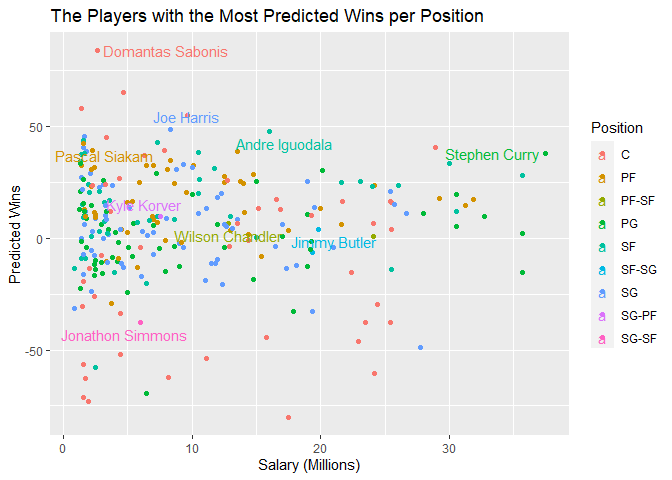<!-- -->

From the above, it can be seen that the best players identified by our model are:

* C = **Domantas Sabonis (IND)** - $2,659,800
* PF = **Pascal Siakam (TOR)** - $1,544,951
* SF = **Andre Iguodala (GSW)** - $16,000,000
* SG = **Joe Harris (BRK)** - $8,333,333
* PG = **Stephen Curry (GSW)** - $37,457,154

**TOTAL - $65,995,238**

However, we must now return to the original task - to select the best five 
starting players *the team can afford*.

With a budget of **$118 million**, acquiring the above starting side would leave
just **$52,004,762** to fill the remaining **10** roster positions. While we're
not concerned with identifying who specifically these players should be, we
nonetheless need to confirm that this would be *possible*.

To test this, we'll perform a search for players whose salary is *less than* 
**$5,200,476** (1/10th of our remaining budget). However, in order to be 
competitive, we need to ensure that the bench is of a reasonable standard. So,
we will further narrow down our search to players who are above average for their
position in predicted wins. Doing so will ensure that even if our starters are 
off the court, the team will remain competitive.

Below is a count of the number of players per position who fit this description.


```r
players %>%
  group_by(pos) %>% #group by position
  filter(w_hat >= mean(w_hat) & salary <= 5200476) %>% #only show players with above average predicted wins AND salary under 5200476
  summarise(Count = n()) #counts number of players per position who meet requirements
```

<div data-pagedtable="false">
  <script data-pagedtable-source type="application/json">
{"columns":[{"label":["pos"],"name":[1],"type":["chr"],"align":["left"]},{"label":["Count"],"name":[2],"type":["int"],"align":["right"]}],"data":[{"1":"C","2":"8"},{"1":"PF","2":"7"},{"1":"PG","2":"14"},{"1":"SF","2":"10"},{"1":"SG","2":"16"}],"options":{"columns":{"min":{},"max":[10]},"rows":{"min":[10],"max":[10]},"pages":{}}}
  </script>
</div>

Since we only require **2** players per position in order to fill our bench, I
am satisfied that there are sufficient affordable bench options to conclude that 
the best starting players identified *are* affordable.

So, our final recommendation is that:

* C = **Domantas Sabonis (IND)** - $2,659,800
* PF = **Pascal Siakam (TOR)** - $1,544,951
* SF = **Andre Iguodala (GSW)** - $16,000,000
* SG = **Joe Harris (BRK)** - $8,333,333
* PG = **Stephen Curry (GSW)** - $37,457,154

are **the best five starting players our team can afford**.

## Summary ##

This project developed a model for predicting wins in the NBA and applied this
model to individual players, in order to identify **the best five starting 
players our team can afford**.

Key findings identified through the development of the model include:

* Positive correlations between **2-point percentage**, **3-point percentage** 
and **defensive rebounds** with wins;

* A negative correlation between **turnovers** and wins;

* Although **assists** and **blocks** appeared to be positively correlated
during initial investigations, further analysis showed that these statistics 
were not reliable for predicting wins.

In order to successfully answer the question asked of me by the General Manager
- to identify **the best five starting players our team can afford** - I broke
down the question into two parts: who are the best five starting players, and 
can we afford them?
 
To identify **the best starting players**, the player statistics were normalised
to represent their per-game contribution if an entire team were comprised 
exclusively of that player. Then, the players were fitted into the model, with
each player allocated a number of **predicted wins** for a team comprised
exclusively of that player.

In order to determine **if we can afford them**, I deducted their salary from 
the total team budget ($118 million), leaving our remaining budget for filling 
out the bench. Then, I counted all the players identified as above average for their
position according to our model, whose salary is less than or equal to 1/10th
of our bench budget. This process showed that it would be possible to fill our
bench exclusively with above average players, *after* signing the best five 
players identified.

The five players recommended to the General Manager are:

* C = **Domantas Sabonis (IND)** - $2,659,800
* PF = **Pascal Siakam (TOR)** - $1,544,951
* SF = **Andre Iguodala (GSW)** - $16,000,000
* SG = **Joe Harris (BRK)** - $8,333,333
* PG = **Stephen Curry (GSW)** - $37,457,154

During the process, several limitations were identified. First, the Adjusted
R-squared value indicates that our model explains approximately 68% of the 
variation in wins. Interpreted differently though, that means that **32%** of
the variation is *not accounted for* in this model.

Second, the model over-values centers, due to their high contribution to 
defensive rebounds.  Though I do not believe this significantly affected the 
player selections (since players were compared within their own position groups), 
it would need to be considered if creating a metric for determining the 
*absolute value* of each player *independent of position*.

Third, in much the same as way as defensive rebounds are impacted by position,
turnovers are likely impacted by a player's involvement within their team's 
offense. While we were able to normalise this statistic based on minutes
played, ideally I would prefer to calculate a turnovers 'per touch' or 'per 
pass', in order to ensure that players who are the focal point of their team's 
offense are not disadvantaged in the model (as an aside, given Stephen Curry's high 
contribution to his team, his relatively low number of turnovers is particularly
impressive).

## Epilogue ##

**Domantas Sabonis** would go on to become a two-time NBA All-Star in 2020 and 
2021. (4)

After winning a championship in 2019 with the Raptors, **Pascal Siakam** became 
an NBA All-Star in 2020. (5)

In 2020, **Andre Iguodola** became the 10th player in history to reach six
straight NBA Finals. (6)

**Joe Harris** went on set the Brooklyn Nets franchise record for the fastest
player to sink 100 3-pointers in a season in 2020. (7)

In 2021, **Stephen Curry** became an NBA All-Star for the seventh time. (8)

## Reference List ##

1. Golliver B. NBA sets salary cap, free agency start date for 2020-21 season. 
Washington Post [internet]. 2020 November 10 [cited 2021 May 8]. Available from:
https://www.washingtonpost.com/sports/2020/11/10/sports-nba-salary-cap/

2. Low Key NBA [internet]. Basketball Positions - NBA & NCAA Position Numbers 1-5; 
2019 May 6 [cited 2021 May 8]. Available from: https://lowkeynba.com/basketball-positions-and-nba-basketball-position-numbers/

3. University of Canberra Website [internet]. Canberra: University of Canberra; 
2021. Data Description - Reproducible Data Analysis Project; c2021 [cited 2021 May 8].
Available from: https://unicanberra.instructure.com/courses/9531/pages/data-description-reproducible-data-analysis-project

4. Basketball Reference [internet]. Domantas Sabonis; c2021[cited 2021 May 8]. 
Available from: https://www.basketball-reference.com/players/s/sabondo01.html

5. Basketball Reference [internet]. Pascal Siakam; c2021[cited 2021 May 8]. Available from:
https://www.basketball-reference.com/players/s/siakapa01.html

6. Kelapire R. Andre Iguodala joins elite company with sixth straight trip to NBA
Finals. SBNation[internet]. 2020 September 27 [cited 2021 May 8]. Available from:
https://www.azdesertswarm.com/basketball/2020/9/27/21459282/andre-iguodala-nba-finals-six-straight-streak-heat-celtics-lakers-arizona-wildcats-nba

7. Friar N. Joe Harris becomes fastest Nets player to 100 3-pointers made in a 
season. Nets Wire[internet]. 2021 February 18 [cited 2021 May 8]. Available from:
https://netswire.usatoday.com/2021/02/18/joe-harris-becomes-fastest-nets-player-to-100-3-pointers-made-in-a-season/

8. Basketball Reference [internet]. Stephen Curry; c2021[cited 2021 May 8]. Available from: 
https://www.basketball-reference.com/players/c/curryst01.html

